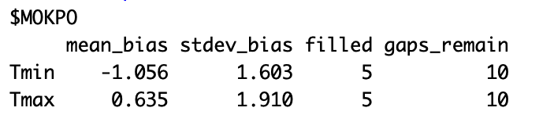
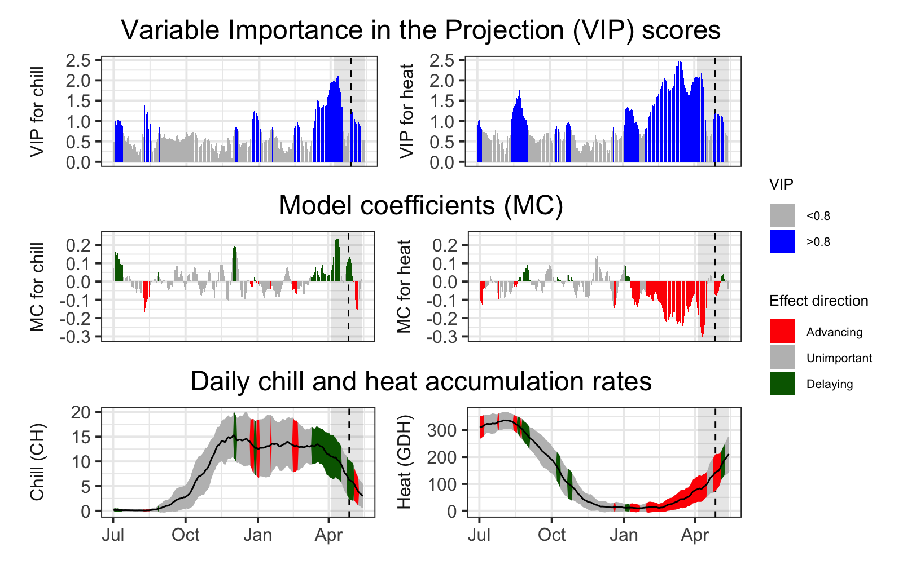

```{r setup, include=FALSE}
knitr::opts_chunk$set(
    tidy = FALSE, # cleaner code printing
    size = "small", # smaller code
    
    fig.path = "figures/", #graphics location

    cache=TRUE
    )
```

```{r Import Libraries, echo=FALSE}
library(chillR)
library(ggplot2)
library(reshape2)
library(tidyr)
library(kableExtra)
library(RMAWGEN)
library(dplyr)
library(tidyverse)
library(knitr)
library(ggpmisc)
library(patchwork)
library(purrr)
#install_github("EduardoFernandezC/dormancyR")
library(dormancyR)
library(colorRamps)
library(gganimate)
library(devtools)
library(pander)

```

# Introduction 

```{r, echo=FALSE, out.width="49%",out.height="20%",fig.cap= "chillR_hexSticker", fig.show='hold',fig.align='center'}

knitr::include_graphics('KR_image/chillR_hexSticker.png')

```


This a Sang Hyo Moon's Logbook related to the class 'Tree phenology analysis with R' in winter semseter 2023/2024. My main reason of taking this class was to know using R. However, I learned not only using R but how I can using data of Tree phenology analysis and climate change in R. 


Without this lecture to use package 'chillR' is quite challenging. This package contains lot of information. However, to run 'chillR' we need lot of effort and time because of bunch of large data sets. Although, I really enjoyed to use new package in R and struggled many times to run some codes. At the end it worked!.  

I used Rmarkdown to make this document. 
This Logbook contains exercises of each chapter. 

# tools 

In this Class we learned how to use the Package 'ChillR' and I improved to use Git, GitHub and Rmarkdown. 

```{r, echo=FALSE, out.width="20%",out.height="10%",fig.cap= "Git, GitHub", fig.show='hold',fig.align='center'}

knitr::include_graphics('KR_image/Picture10.png')

```


```{r, echo=FALSE, out.width="20%",out.height="10%",fig.cap= "Rmarkdown & knitr", fig.show='hold',fig.align='center'}

knitr::include_graphics('KR_image/Picture12.png')
knitr::include_graphics('KR_image/Picture13.png')
```

# **tree dormancy**


## Put yourself in the place of a breeder who wants to calculate the temperature requirements of a newly released cultivar. Which method will you use to calculate the chilling and forcing periods? Please justify your answer.

There is two method that we can use to calculate the temperature requirements. First, there is empirical method during the winter, which use shoots, that 7 to 10 days in growth chamber stay and are evaluated about growth ability. If buds haven't grown yet, then we need to repeat this again. If buds have grown, then we have date of dormancy overcome. The second method is statistically. With long phenological data and temperature record as input data, we can analyze statistically. As results we have date of dormancy outcome.

At Endo-dormancy period ,which is  before date of dormancy overcome, occurs chilling accumulation. After date of dormancy overcome, is called Eco-dormancy. At that period occurs heat accumulation.


## Which are the advantages (2) of the BBCH scale compared with earlies scales?
- Applicable for mono- and dicotyledon species
- worldwide standard

## Classify the following phenological stages of sweet cherry according to the BBCH scale:Phenological stages of cherry

```{r, echo=FALSE, out.width="70%", fig.cap= "Phenological stages of cherry", fig.show='hold',fig.align='center'}
knitr::include_graphics('pictures/3-1.png')

```

1. Inflorescence enclosed by light green scales: 54
2. full flowering: 65 
3. fruit ripe for picking: 87


# **Climate change and impact projection**


## List the main drivers of climate change at the decade to century scale, and briefly explain the mechanism through which the currently most important driver affects our climate.

- Sun: warms Earth through solar radiation -\> recent climate change it explains only a small fraction of current climate variability. 
- Aerosols: major climate drivers in industrial centers. -\>  related to human emissions. 
- Clouds: can have both cooling and heating effects, depends on the type of cloud -\> an effect is very complex
- Ozone: Surface/tropospheric ozone (bad ozone, smog), stratospheric ozone (good ozone, blocks UV-B) however with Green House Gas -\> warming effect / Ozone was destroyed by CFCs and has been recovering since 1993
- Surface albedo: REflection of radiation by the land surface. light surfaces cuases more reflection and dark surfaces less. Deforestration and drying raise albedo because of cooling effect. 
  - feedback loop-accelerates : warming -\> less ice/snow -\> lower albedo -\> less heat reflection -\> warming
- Green House Gas: Major driver of climate change, atmospheric gases that absorb long-wave radiation (traps heat)-\> warming effect : CO~2~, NH~2~,N~2~O, 

- Long term drivers: 
  - trends in solar activity (star life cycle)
  - ocean currents/continents constelltations
  - plants vs.animals (hypothetical): imbalance of CO~2~ (heating due to higher CO~2~)-\> flipping between "Snowball Earth" and "Greenhouse Earth"
  - volcanic and meteorite activity
  - Milankovic cycles (variation in tilt, eccentricity, precession of Earth's orbit)

## Explain briefly what is special about temperature dynamics of recent decades, and why we have good reasons to be concerned.


## What does the abbreviation ‘RCP’ stand for, how are RCPs defined, and what is their role in projecting future climates?

## Briefly describe the 4 climate impact projection methods described in the fourth video.

# Winter chill projections
## Exercises on past chill projections

Please document all results of the following assignments in your learning logbook.

### Sketch out three data access and processing challenges that had to be overcome in order to produce chill projections with state-of-the-art methodology.
- equipment and infrastructure limitations for processing large amounts of data
- some locations lack high-resolution climate data sets, therefore estimations (with a margin of error) about neighboring locations having data available would need to be made
- form in which the data is available (particularly for very large data); raster data requires further processes to be rendered usable.


### Outline, in your understanding, the basic steps that are necessary to make such projections.
- 1. Understanding Context and System in a location 
- 2. Formulating Research Question
- 3. Selecting Climate Model and Projection Ensembles
- 4. Data Acquisition
- 5. Interpolating/Estimating Gaps
- 6. Data Processing with Chosen Model
- 7. Comparison with Existing Projections/Observations
- 8. Conclusion
- 9. Expression of Uncertainties and Errors

# **Manual chill analysis**
chilling period: end of dormancy 


### Write a basic function that calculates warm hours (>25°C)
```{r, eval=FALSE}
library(knitr)
library(pander)
library(kableExtra)
library(chillR)
library(tidyverse)
```

```{r}
 

Year<-c(2000:2010)
Temps<-c(20:30)
randomdataset<-data.frame(Year, Temps)

##function creation, assigning of threshold to variable
WarmHours<- function(randomdataset)
    {
      threshold_warm<- 25
      randomdataset[,"Warm_year"]<- randomdataset$Temps>threshold_warm
      return(randomdataset)
 }

RandomWarmHours<-WarmHours(randomdataset)

write.csv(RandomWarmHours, "KR_data/WarmHours.csv", row.names = FALSE)
```

```{r}

RandomWarmHours<-read_tab("KR_data/WarmHours.csv")
WarmHours<-read_tab("KR_data/WarmHours.csv")
kable(head(WarmHours)) %>%
kable_styling("striped", position = "center",font_size = 10)
```


### Apply this function to the Winters_hours_gaps dataset

```{r, eval=FALSE}

hourtemps<- Winters_hours_gaps[,c("Year", "Month", "Day", "Hour", "Temp")]

WarmHours2<- function(hourtemps)
    {
      threshold_warm<- 25
      hourtemps[,"Warm_Hour"]<- hourtemps$Temp>threshold_warm
      return(hourtemps)
    }

write.csv(WarmHours2(hourtemps),"KR_data/WarmHours2.csv", row.names = FALSE)
```

```{r}
WarmHours2<-read_tab("KR_data/WarmHours2.csv")
 kable(head(WarmHours2)) %>%
      kable_styling("striped", position = "left",font_size = 10)
```

### Extend this function, so that it can take start and end dates as inputs and sums up warm hours between these dates


# Chill models
## Exercises on chill models

Please document all results of the following assignments in your learning logbook.

### Run the chilling() function on the Winters_hours_gap dataset
```{r}
library(chillR)
chill_7_1<-chilling(make_JDay(Winters_hours_gaps),Start_JDay = 90, End_JDay = 100)

write.csv(chill_7_1, "KR_data/chill_7_1.csv", row.names = FALSE)
```

```{r}
chill_7_1<-read_tab("KR_data/chill_7_1.csv")
kable(head(chill_7_1)) %>%
  kable_styling("striped", position = "left",font_size = 10)
```


### Create your own temperature-weighting chill model using the step_model() function

```{r}
df<-data.frame(
  lower= c(-1000, 2.4, 3.5, 4.8, 6.3, 7.5, 9.1),
  upper= c(2.4, 3.5, 4.8, 6.3, 7.5,9.1, 1000),
  weight=c(0, 2, 1, 2, 1, 0.5, 0))

kable(df) %>%
  kable_styling("striped", position = "left", font_size = 10)

```

```{r}
custom<- function(x) step_model(x, df)

##sample values for first 100 rows from the Winters_hours_gaps dataset)
custom(Winters_hours_gaps$Temp)[1:100]

write.csv(custom(Winters_hours_gaps$Temp), "KR_data/custom.csv", row.names = FALSE)

```
### Run this model on the Winters_hours_gaps dataset using the tempResponse() function.

```{r}
output<-tempResponse(make_JDay(Winters_hours_gaps),
                     Start_JDay = 90, End_JDay = 100,
                     models=list(custom=custom))

kable(output) %>%
  kable_styling("striped", position = "left", font_size = 10)
```

# Making hourly temperatures

## Exercises on hourly temperatures

Please document all results of the following assignments in your
learning logbook.

### Choose a location of interest, find out its latitude and produce plots of daily sunrise, sunset and daylength

GWANGJU 35.126 126.809

```{r}
GWANGJU_Days <- daylength(latitude = 35.126, JDay = 1:365)

GWANGJU_Days_df <-
  data.frame(
    JDay = 1:365,
    Sunrise = GWANGJU_Days$Sunrise,
    Sunset = GWANGJU_Days$Sunset,
    Daylength = GWANGJU_Days$Daylength
  )

GWANGJU_Days_df <- pivot_longer(GWANGJU_Days_df,cols=c(Sunrise:Daylength))

ggplot(GWANGJU_Days_df, aes(JDay, value)) +
  geom_line(lwd = 1.5) +
  facet_grid(cols = vars(name)) +
  ylab("Time of Day / Daylength (Hours)") +
  theme_bw(base_size = 20)

```

location=c(126.809, 35.126), time_interval=c(1990,2020))

### Produce an hourly dataset, based on idealized daily curves, for the KA_weather dataset (included in chillR)

```{r}
#require(chillR)

KA_weather_stacked <- stack_hourly_temps(KA_weather, latitude=54.32)

write.csv(KA_weather_stacked, "KR_data/KA_weather_stacked.csv", row.names = FALSE)

```

```{r}
#require(kableExtra)

KA_weather_stacked<-read_tab("KR_data/KA_weather_stacked.csv")

kable(head(KA_weather_stacked)) %>%
  kable_styling("striped", position = "left",font_size = 10)
```

### Produce empirical temperature curve parameters for the Winters_hours_gaps dataset, and use them to predict hourly values from daily temperatures (this is very similar to the example above, but please make sure you understand what’s going on)

```{r}
#library(chillR)
#library(ggplot2)

coeffs <- Empirical_daily_temperature_curve(Winters_hours_gaps)
Winters_daily <-
  make_all_day_table(Winters_hours_gaps, input_timestep = "hour")
Winters_hours <- Empirical_hourly_temperatures(Winters_daily, coeffs)


#require(reshape2)

Winters_hours <- Winters_hours[, c("Year", "Month", "Day", "Hour", "Temp")]
colnames(Winters_hours)[ncol(Winters_hours)] <- "Temp_empirical"
Winters_ideal <-
  stack_hourly_temps(Winters_daily, latitude = 38.5)$hourtemps
Winters_ideal <- Winters_ideal[, c("Year", "Month", "Day", "Hour", "Temp")]
colnames(Winters_ideal)[ncol(Winters_ideal)] <- "Temp_ideal"

```

#Some useful tools in R \## on useful R tools

Please document all results of the following assignments in your
learning logbook.

### Based on the Winters_hours_gaps dataset, use magrittr pipes and functions of the tidyverse to accomplish the following:

-   Convert the dataset into a tibble
-   Select only the top 10 rows of the dataset
-   Convert the tibble to a long format, with separate rows for
    Temp_gaps and Temp
-   Use ggplot2 to plot Temp_gaps and Temp as facets (point or line
    plot)
-   Convert the dataset back to the wide format
-   Select only the following columns: Year, Month, Day and Temp
-   Sort the dataset by the Temp column, in descending order \### For
    the Winter_hours_gaps dataset, write a for loop to convert all
    temperatures (Temp column) to degrees Fahrenheit \### Execute the
    same operation with a function from the apply family \### Now use
    the tidyverse function mutate to achieve the same outcome \###
    Voluntary: consider taking a look at the instruction materials on
    all these functions, which I linked above, as well as at other
    sources on the internet. There’s a lot more to discover here, with
    lots of potential for making your coding more elegant and easier -
    and possibly even more fun!

# Getting temperature data

## Exercises on getting temperature data

Please document all results of the following assignments in your
learning logbook.

### Choose a location of interest and find the 25 closest weather stations using the handle_gsod function

GWANGJU location=c(126.809,35.126)

```{r}
GWANGJU_list<-handle_gsod(action="list_stations",
                          location=c(126.809, 35.126),
                          time_interval=c(1990,2020))

#require(kableExtra)

kable(head(GWANGJU_list,15)) %>%
  kable_styling("striped", position = "left", font_size = 8)

```


### Download weather data for the most promising station on the list

```{r, eval=FALSE}

weather_GWANGJU<-handle_gsod(action="download_weather",
                     location=GWANGJU_list$chillR_code[2],
                     time_interval=c(1990,2020))
```

```{r}
weather_GWANGJU<-read.csv("KR_data/GWANGJU_raw_weather.csv")
weather_GWANGJU[1:20,]

```

### Convert the weather data into chillR format

```{r}
#cleaned_weather_GWANGJU<-handle_gsod(weather_GWANGJU)
#kable(cleaned_weather_GWANGJU[[1]][1:20,], caption = 'cleaned_weather_GWANGJU') %>%
  #kable_styling("striped", position = "left", font_size = 10)


```

```{r,eval=FALSE}

write.csv(GWANGJU_list,"KR_data/GWANGJU_station_list.csv",row.names=FALSE)
write.csv(weather_GWANGJU[[1]],"KR_data/GWANGJU_raw_weather.csv",row.names=FALSE)
write.csv(cleaned_weather_GWANGJU[[1]],"KR_data/GWANGJU_chillR_weather.csv",row.names=FALSE)
```

# Filling gaps in temperature records

## Gaps

## Exercises on filling gaps

Please document all results of the following assignments in your
learning logbook.

You already downloaded some weather data in the exercises for the
Getting temperatures lesson. You can keep working with this.

```{r,eval=FALSE}
#from previous data
GWANGJU<-read.csv("KR_data/GWANGJU_chillR_weather.csv")
```

### Use chillR functions to find out how many gaps you have in this dataset (even if you have none, please still follow all further steps)

```{r ,eval=FALSE}

#checking for gaps using fix_weather function
GWANGJU_QC<-fix_weather(GWANGJU)$QC
write.csv(GWANGJU_QC, "KR_data/GWANGJU_QC.csv", row.names = FALSE)

##saving and downloading the needed columns
GWANGJU_weather<-GWANGJU[,c("Year","Month", "Day", "Tmax", "Tmin")]

write.csv(GWANGJU_weather, "KR_data/GWANGJU_weather.csv", row.names = FALSE)

```

```{r,}
GWANGJU_QC<-read_tab("KR_data/GWANGJU_QC.csv")

kable(GWANGJU_QC, caption="Quality control summary produced by fix_weather(), with only winter days interpolated") %>%
kable_styling("striped", position = "left", font_size = 10)
```

5 missing days

```{r,eval=FALSE}
#library(kableExtra)
GWANGJU_weather<-read_tab("KR_data/GWANGJU_weather.csv")

kable(head(GWANGJU_weather,10)) %>%
  kable_styling("striped", position = "left", font_size = 10)
```


### Create a list of the 25 closest weather stations using the handle_gsod function

```{r}
GWANGJU_list<-handle_gsod(action="list_stations",
                          location=c(126.809, 35.126),
                          time_interval=c(1990,2020))

kable(GWANGJU_list) %>%
  kable_styling("striped", position = "left", font_size = 8)

```

### Identify suitable weather stations for patching gaps

I will work with the position 8,9 and 15 for patching gaps

8:JEONJU 9:MOKPO 15:SUNCHEON

### Download weather data for promising stations, convert them to chillR format and compile them in a list

```{r}
GWANGJU_patch_weather<-
      handle_gsod(action = "download_weather",
                  location = as.character(GWANGJU_list$chillR_code[c(8,9,15)]),
                  time_interval = c(1990,2020)) %>%
  handle_gsod()


```

### Use the patch_daily_temperatures function to fill gaps

```{r, eval=FALSE}
GWANGJU_patched <- patch_daily_temperatures(weather = GWANGJU,
                                    patch_weather = GWANGJU_patch_weather)


save_temperature_scenarios(GWANGJU_patched,"KR_data/", "GWANGJU_patched")

#GWANGJU_patched[[2]]

GWANGJU_patched$statistics[[1]]
GWANGJU_patched$statistics[[2]]
GWANGJU_patched$statistics[[3]]

```

```{r}
knitr::include_graphics('KR_image/chunk30_1.jpeg')
knitr::include_graphics('KR_image/chunk30_2.jpeg')
knitr::include_graphics('KR_image/chunk30_2.jpeg')
```
### !!!!check!!!!!

the Data from all positions look good. So it is not necessary to cap the
mean_bias at 1 °C and the stdev_bias at 2°C.????

By the data from JEONJU, 1 gaps for Tmin and 1 gaps for Tmax were able
to be filled. There were 10 gaps remain for each of Tmin and Tmax. By
the Data from MOKPO,I was able to filled no gaps for both Tmin and Tmax.
There were 4 gaps remain for both Tmin and Tmax, respectively. By the
data from SUNCHEON, I was able to filled 0 gaps for both Tmin and Tmax.
There were 4 gaps remain for Tmin and also for Tmax.

### Investigate the results - have all gaps been filled?

```{r, eval=FALSE}
#library(chillR)

GWANGJU_patched<-read.csv("KR_data/GWANGJU_patched_1_weather.csv")

GWANGJU_post_patch_stats<-fix_weather(GWANGJU_patched)$QC

write.csv(GWANGJU_post_patch_stats, "KR_data/GWANGJU_post_patchstats.csv", row.names = FALSE)
```

```{r}
#library(kableExtra)

GWANGJU_post_patch_stats<-read_tab("KR_data/GWANGJU_post_patchstats.csv")

kable(head(GWANGJU_post_patch_stats)) %>%
 kable_styling("striped", position = "left", font_size = 10)
```

There are 4 days missing after the patching. It seems safe to use linear
interpolation for such a short gap.

```{r, eval=FALSE}
GWANGJU_post_patch_stats <- fix_weather(GWANGJU_patched)$QC


write.csv(GWANGJU_post_patch_stats, "KR_data/GWANGJU_post_patchstats.csv", row.names = FALSE)

```

### If necessary, repeat until you have a dataset you can work with in further analyses


```{r, eval=FALSE}
GWANGJU_weather2<-fix_weather(GWANGJU_patched)

write.csv(GWANGJU_weather2$weather, "KR_data/GWANGJU_patched2.csv", row.names = FALSE)

GWANGJU_weather<-GWANGJU_weather2$weather[c("Year","Month", "Day", "Tmin", "Tmax")]
kable(head(GWANGJU_weather),) %>%
  kable_styling("striped", position = "left", font_size = 10)

GWANGJU_weather <- round(GWANGJU_weather, digits = 1)

write.csv(GWANGJU_weather, "KR_data/GWANGJU_weather.csv", row.names = FALSE)

```

```{r echo=FALSE}
knitr::include_graphics('KR_image/chunk35_1.jpeg')
```

# Generating temperature scenarios

-   wather generator: random data (like a dice) from a virtual
    collection
-   Risk assessment:
-   LARS-WG: not that easy to use
-   RMAWAGEN: little complicate, but after few day using, then it works
    good.

if generator not work then we need to install old one. - How to use
weather generator

## Exercises on temperature generation

Please document all results of the following assignments in your
learning logbook.

### For the location you chose for your earlier analyses, use chillR’s weather generator to produce 100 years of synthetic temperature data.

The location where I choose location=c(126.809,35.126)

```{r, eval=FALSE}
#from the fixed weather
GWANGJU_weather<-read.csv("KR_data/GWANGJU_weather.csv")

GWANGJU_weather <- round(GWANGJU_weather, digits = 1)

GWANGJU_Temp <- temperature_generation(GWANGJU_weather,
                         years=c(1998,2005),
                         sim_years = c(2001,2100))

GWANGJU_Temperatures<-cbind(GWANGJU_weather[
       which(GWANGJU_weather$Year %in% 1998:2005),] ,Data_source="observed")
     
GWANGJU_Temperatures<-rbind(GWANGJU_Temperatures,
                         cbind(GWANGJU_Temp[[1]][,c("Year","Month","Day","Tmin","Tmax")],
                               Data_source="simulated"))

GWANGJU_Temperatures[,"Date"]<-as.Date(ISOdate(2000, GWANGJU_Temperatures$Month, GWANGJU_Temperatures$Day))

```

plots Tmin and Tmax: observated and simulated
the geom_smooth function of ggplot removed much of the noise in the dataset.

```{r, eval=FALSE}
ggplot(data=GWANGJU_Temperatures,
       aes(Date,Tmin)) +
  geom_smooth(aes(colour = factor(Year))) +
  facet_wrap(vars(Data_source)) +
  theme_bw(base_size = 20) +
  theme(legend.position = "none") +
  scale_x_date(date_labels = "%b")

ggplot(data=GWANGJU_Temperatures,
       aes(Date,Tmax)) +
  geom_smooth(aes(colour = factor(Year))) +
  facet_wrap(vars(Data_source)) +
  theme_bw(base_size = 20) +
  theme(legend.position = "none") +
  scale_x_date(date_labels = "%b")
```

```{r echo=FALSE,out.width="49%",out.height="20%",fig.cap= "compare the generated data with the observed records: Tmin & Tmax", fig.show='hold',fig.align='center'}
knitr::include_graphics('KR_image/chunk38_Tmin.png')

```


### Calculate winter chill (in Chill Portions) for your synthetic weather, and illustrate your results as histograms and cumulative distributions.

```{r, eval=FALSE}


GWANGJU_chill_observed<-chilling(
   stack_hourly_temps(
     GWANGJU_Temperatures[which(GWANGJU_Temperatures$Data_source=="observed"),],
     latitude = 35.126),
    Start_JDay = 305,
    End_JDay = 59)
     
GWANGJU_chill_simulated<-chilling(
       stack_hourly_temps(
         GWANGJU_Temperatures[which(GWANGJU_Temperatures$Data_source=="simulated"),],
         latitude = 35.126),
       Start_JDay = 305,
       End_JDay = 59)
     
GWANGJU_chill_comparison<-cbind(GWANGJU_chill_observed ,Data_source="observed")
GWANGJU_chill_comparison<-rbind(GWANGJU_chill_comparison,
                             cbind(GWANGJU_chill_simulated ,Data_source="simulated"))
     
GWANGJU_chill_comparison_full_seasons<-GWANGJU_chill_comparison[
       which(GWANGJU_chill_comparison$Perc_complete==100),]

    ggplot(GWANGJU_chill_comparison_full_seasons, aes(x=Chill_portions)) + 
      geom_histogram(binwidth=1,aes(fill = factor(Data_source))) +
      theme_bw(base_size = 20) +
      labs(fill = "Data source") +
      xlab("Chill accumulation (Chill Portions)") +
      ylab("Frequency")


GWANGJU_chill_simulations<-GWANGJU_chill_comparison_full_seasons[
      which(GWANGJU_chill_comparison_full_seasons$Data_source=="simulated"),]

    ggplot(GWANGJU_chill_simulations, aes(x=Chill_portions)) +
      stat_ecdf(geom = "step",lwd=1.5,col="blue") +
      ylab("Cumulative probability") +
      xlab("Chill accumulation (in Chill Portions)") +
      theme_bw(base_size = 20)

write.csv(GWANGJU_chill_comparison_full_seasons,"KR_data/GWANGJU_chill_comparison_full_seasons.csv", row.names = FALSE)

```

```{r echo=FALSE,out.width="49%",out.height="20%",fig.cap= "plots of the Cumulative Chilling and Cumulative Probability", fig.show='hold',fig.align='center'}
knitr::include_graphics('KR_image/chunk40_CP.png')

```

```{r, eval=FALSE}
#library(knitr)
#library(kableExtra)
GWANGJU_chill_comparison_full_seasons<-read_tab("KR_data/GWANGJU_chill_comparison_full_seasons.csv")

kable(head(GWANGJU_chill_comparison_full_seasons)) %>%
      kable_styling("striped", position = "left", font_size = 10)
```

```{r}
knitr::include_graphics('KR_image/chunk42_1.jpeg')
```

```{r, eval=FALSE}
#amount of chill that is exceeded in 90% of all years
    quantile(GWANGJU_chill_simulations$Chill_portions, 0.1)
      ##  10% 
     ##   73.56582 

#chill at 50% confidence interval (25th and 75th percentile)
    quantile(GWANGJU_chill_simulations$Chill_portions, c(0.25,0.75))
       ##  25%       75% 
       ##  75.92765  78.96615
```

### Produce similar plots for the number of freezing hours (\<0°C) in April (or October, if your site is in the Southern Hemisphere) for your location of interest.

check lecture 7 to change it.

```{r, eval=FALSE}

GWANGJU_weather<-read.csv("KR_data/GWANGJU_weather.csv")

GWANGJU_weather <- round(GWANGJU_weather, digits = 1)

GWANGJU_Temp <- temperature_generation(GWANGJU_weather,
                         years=c(1998,2005),
                         sim_years = c(2001,2100))   


GWANGJU_Temperatures<-cbind(GWANGJU_weather[
       which(GWANGJU_weather$Year %in% 1998:2005),] ,Data_source="observed")
     
GWANGJU_Temperatures<-rbind(GWANGJU_Temperatures,
                         cbind(GWANGJU_Temp[[1]][,c("Year","Month","Day","Tmin","Tmax")],
                               Data_source="simulated"))

GWANGJU_Temperatures[,"Date"]<-as.Date(ISOdate(2000, GWANGJU_Temperatures$Month, GWANGJU_Temperatures$Day))


df<-data.frame(
  lower= c(-1000, 0),
  upper= c(    0, 1000),
  weight=c(    1, 0))

freezing_hours<-function(x) step_model(x,df)

freezing_hours(c(1,2,4,5,-10))

GWANGJU_chill_observed <- GWANGJU_Temperatures %>%
  filter(Data_source == "observed") %>%
  stack_hourly_temps(latitude = 35.126) %>%
  tempResponse(Start_JDay = 305,
               End_JDay = 59,
               models=list(Frost = freezing_hours,
                           Chill_portions = Dynamic_Model,
                           GDH = GDH))


####


GWANGJU_chill_simulated <- GWANGJU_Temperatures %>%
  filter(Data_source == "simulated") %>%
  stack_hourly_temps(latitude = 35.126) %>%
  tempResponse(Start_JDay = 305,
               End_JDay = 59,
               models=list(Frost = freezing_hours,
                           Chill_portions = Dynamic_Model,
                           GDH = GDH))

GWANGJU_chill_comparison <-
  cbind(GWANGJU_chill_observed,
        Data_source = "observed") %>%
  rbind(cbind(GWANGJU_chill_simulated,
              Data_source = "simulated"))

GWANGJU_chill_comparison_full_seasons <-
  GWANGJU_chill_comparison %>%
  filter(Perc_complete == 100)


ggplot(GWANGJU_chill_comparison_full_seasons,
       aes(x=Chill_portions)) + 
  geom_histogram(binwidth = 1,
                 aes(fill = factor(Data_source))) +
  theme_bw(base_size = 10) +
  labs(fill = "Data source") +
  xlab("Chill accumulation (Chill Portions)") +
  ylab("Frequency")

ggplot(GWANGJU_chill_comparison_full_seasons,
       aes(x=Frost)) + 
  geom_histogram(binwidth = 25,
                 aes(fill = factor(Data_source))) +
  theme_bw(base_size = 10) +
  labs(fill = "Data source") +
  xlab("Frost incidence during winter (hours)") +
  ylab("Frequency")

GWANGJU_chill_simulations <-
  GWANGJU_chill_comparison_full_seasons %>%
  filter(Data_source == "simulated")
  
ggplot(GWANGJU_chill_simulations,
       aes(x = Chill_portions)) +
  stat_ecdf(geom = "step",
            lwd = 1.5,
            col = "blue") +
  ylab("Cumulative probability") +
  xlab("Chill accumulation (in Chill Portions)") +
  theme_bw(base_size = 20)

ggplot(GWANGJU_chill_simulations,
       aes(x = Frost)) +
  stat_ecdf(geom = "step",
            lwd = 1.5,
            col = "blue") +
  ylab("Cumulative probability") +
  xlab("Frost incidence during winter (hours)") +
  theme_bw(base_size = 20)


```

```{r, echo=FALSE, out.width="49%",out.height="20%",fig.cap= "plots of the Cumulative Freezing (sum of Freezing hours <0°C) in April and Cumulative Probability", fig.show='hold',fig.align='center'}

knitr::include_graphics(c('KR_image/chunk42_chillPortion.jpeg','KR_image/chunk42_Frost.jpeg'))
knitr::include_graphics(c('KR_image/chunk42_ChillPortion-step.jpeg','KR_image/chunk42_Frost-step.jpeg'))


```


```{r,eval=FALSE}
# Here's the amount of chill that is exceeded in 90% of all years.
quantile(GWANGJU_chill_simulations$Chill_portions,0.1)
       #10% 
       #74.09957 


# and here's the 50% confidence interval (25th to 75th percentile)
quantile(GWANGJU_chill_simulations$Chill_portions, c(0.25,0.75))
  #25%      75% 
  #75.89585 79.50969 

```

# Saving and loading data 

# historic temperature scenarios

## Exercises on generating historic temperature scenarios

Please document all results of the following assignments in your
learning logbook.

### For the location you chose for previous exercises, produce historic temperature scenarios representing several years of the historic record (your choice).

the new station GWANGJU location=c(126.900,35.167) 9.46km away from the
station that I chosed before. the new station has more data.

make a data for patching

```{r, eval=FALSE}

# download weather station list for the vicinity of Bonn
GWANGJU_list <- handle_gsod(action = "list_stations",
                            location=c(126.809,35.126))
```

MOKPO is 51.9 km away from the GWANGJU station. However, it is the
nearest station with a available data.

```{r, eval=FALSE}
# download weather data for GWANGJU and convert it to chillR format
GWANGJU_weather <- handle_gsod(action = "download_weather",
                            location = GWANGJU_list$chillR_code[2],
                            time_interval = c(1973,2019)) %>%
  handle_gsod()

# check record for missing data: 15 days missing
fix_weather(GWANGJU_weather$'GWANGJU')$QC

# download weather data for the patching and convert it to chillR format
Mokpo_patch_weather<-
      handle_gsod(action = "download_weather",
                  location = as.character(GWANGJU_list$chillR_code[c(8)]),
                  time_interval = c(1973,2019)) %>%
  handle_gsod()

## this data.frame is too long. So it will now show here. 
```

```{r, eval=FALSE}
# (incidentally almost all gaps are for years covered by the Mokpo_patch_weather dataset )

GWANGJU_patched_14 <- patch_daily_temperatures(
                                      weather = GWANGJU_weather$'GWANGJU',
                                      patch_weather = Mokpo_patch_weather)

fix_weather(GWANGJU_patched_14)$QC


save_temperature_scenarios(GWANGJU_patched_14,"KR_data/", "GWANGJU_patched_14")

```

```{r}

#head(fix_weather(GWANGJU_patched_14)$QC)


#GWANGJU_patched_14$statistics


```

5 days are filled and there are still 10 days missing here, out of 47
years -

```{r, eval=FALSE}


# let's simply interpolate these gaps now

GWANGJU<-fix_weather(GWANGJU_patched_14)

GWANGJU_temps<-GWANGJU$weather
write.csv(GWANGJU_temps,
          "KR_data/GWANGJU_temps.csv")

GWANGJU_scenario_1980 <- temperature_scenario_from_records(weather = GWANGJU_temps,
                                                   year = 1980)

GWANGJU_scenario_1980$'1980'$data


GWANGJU_temps_1980 <- temperature_generation(weather = GWANGJU_temps,
                                     years = c(1973,2019),
                                     sim_years = c(2001,2100),
                                     temperature_scenario = GWANGJU_scenario_1980)
                                     # just index... not real data.: relative time scenario. difference compare to 1996. 
                                     

GWANGJU_scenario_1996 <- temperature_scenario_from_records(weather = GWANGJU_temps,
                                                   year = 1996)
GWANGJU_scenario_1996$'1996'$data

relative_scenario <- temperature_scenario_baseline_adjustment(
  baseline = GWANGJU_scenario_1996,
  temperature_scenario = GWANGJU_scenario_1980)
# it shows the difference between 1980 & 1996
#usually for scientific works we need more than 30 years datas

GWANGJU_temps_1980<-temperature_generation(weather = GWANGJU_temps,
                                   years = c(1973,2019),
                                   sim_years = c(2001,2100),
                                   temperature_scenario = relative_scenario)


```

```{r}

#GWANGJU_scenario_1980
knitr::include_graphics('KR_image/chunk52_GWANGJU_scenario_1980.jpeg')
#GWANGJU_scenario_1996


```
### Produce chill distributions for these scenarios and plot them.

```{r, eval=FALSE}
#require(chillR)
#require(ggplot2)
#require(reshape2)
#require(kableExtra)

GWANGJU_all_past_scenarios <- temperature_scenario_from_records(
  weather = GWANGJU_temps,
  year = c(1980,
           1990,
           2000,
           2010))

GWANGJU_adjusted_scenarios <- temperature_scenario_baseline_adjustment(
  baseline = GWANGJU_scenario_1996,
  temperature_scenario = GWANGJU_all_past_scenarios)

GWANGJU_all_past_scenario_temps <- temperature_generation(
  weather = GWANGJU_temps,
  years = c(1973,2019),
  sim_years = c(2001,2100),
  temperature_scenario = GWANGJU_adjusted_scenarios)


#it will save in a 4 folders but once we call the file as "GWANGJU_hist_scenarios", then all of them comes together 
save_temperature_scenarios(GWANGJU_all_past_scenario_temps, "KR_data", "GWANGJU_hist_scenarios")

frost_model <- function(x)
  step_model(x,
             data.frame(
               lower=c(-1000,0),
               upper=c(0,1000),
               weight=c(1,0)))

models1 <- list(Chill_Portions = Dynamic_Model,
               GDH = GDH,
               Frost_H = frost_model)

GWANGJU_chill_hist_scenario_list <-
  GWANGJU_all_past_scenario_temps %>%
  tempResponse_daily_list(
    latitude = 35.167,
    Start_JDay = 305,
    End_JDay = 59,
    models = models1)

GWANGJU_chill_hist_scenario_list <- lapply(GWANGJU_chill_hist_scenario_list,
                                   function(x) x %>%
                                     filter(Perc_complete == 100))

save_temperature_scenarios(GWANGJU_chill_hist_scenario_list, "KR_data","GWANGJU_hist_chill_305_59")


scenarios <- names(GWANGJU_chill_hist_scenario_list)[1:4]

GWANGJU_all_scenarios <- GWANGJU_chill_hist_scenario_list[[scenarios[1]]] %>%
  mutate(scenario = as.numeric(scenarios[1]))

for (sc in scenarios[2:4])
 GWANGJU_all_scenarios <- GWANGJU_all_scenarios %>%
  rbind(GWANGJU_chill_hist_scenario_list[[sc]] %>%
          cbind(
            scenario=as.numeric(sc))
        ) %>%
  filter(Perc_complete == 100)


# Let's compute the actual 'observed' chill for comparison
GWANGJU_actual_chill <- tempResponse_daily_list(GWANGJU_temps,
                                        latitude=35.127,
                                        Start_JDay = 305,
                                        End_JDay = 59,
                                        models=models1)[[1]] %>%
  filter(Perc_complete == 100)


ggplot(data = GWANGJU_all_scenarios,
       aes(scenario,
           Chill_Portions,
           fill = factor(scenario))) +
  geom_violin() +
  ylab("Chill accumulation (Chill Portions)") +
  xlab("Scenario year") +
  theme_bw(base_size = 15) +
  ylim(c(0,90)) +
  geom_point(data = GWANGJU_actual_chill,
             aes(End_year,
                 Chill_Portions,
                 fill = "blue"),
             col = "blue",
             show.legend = FALSE) +
  scale_fill_discrete(name = "Scenario",
                      breaks = unique(GWANGJU_all_scenarios$scenario)) 

write.csv(GWANGJU_actual_chill,"KR_data/GWANGJU_observed_chill_305_59.csv", row.names = FALSE)

GWANGJU_temperature_means <- 
  data.frame(Year = min(GWANGJU_temps$Year):max(GWANGJU_temps$Year),
             Tmin = aggregate(GWANGJU_temps$Tmin,
                              FUN = "mean",
                              by = list(GWANGJU_temps$Year))[,2],
             Tmax=aggregate(GWANGJU_temps$Tmax,
                            FUN = "mean",
                            by = list(GWANGJU_temps$Year))[,2]) %>%
  mutate(runn_mean_Tmin = runn_mean(Tmin,15),
         runn_mean_Tmax = runn_mean(Tmax,15))


GWANGJU_Tmin_regression <- lm(Tmin~Year,
                      GWANGJU_temperature_means)

GWANGJU_Tmax_regression <- lm(Tmax~Year,
                      GWANGJU_temperature_means)

GWANGJU_temperature_means <- GWANGJU_temperature_means %>%
  mutate(regression_Tmin = GWANGJU_Tmin_regression$coefficients[1]+
           GWANGJU_Tmin_regression$coefficients[2]*GWANGJU_temperature_means$Year,
         regression_Tmax = GWANGJU_Tmax_regression$coefficients[1]+
           GWANGJU_Tmax_regression$coefficients[2]*GWANGJU_temperature_means$Year
  )


ggplot(GWANGJU_temperature_means,
       aes(Year,
           Tmin)) + 
  geom_point() + 
  geom_line(data = GWANGJU_temperature_means,
            aes(Year,
                runn_mean_Tmin),
            lwd = 2,
            col = "blue") + 
  geom_line(data = GWANGJU_temperature_means,
            aes(Year,
                regression_Tmin),
            lwd = 2,
            col = "red") +
  theme_bw(base_size = 15) +
  ylab("Mean monthly minimum temperature (°C)")

ggplot(GWANGJU_temperature_means,
       aes(Year,
           Tmax)) + 
  geom_point() + 
  geom_line(data = GWANGJU_temperature_means,
            aes(Year,
                runn_mean_Tmax),
            lwd = 2,
            col = "blue") + 
  geom_line(data = GWANGJU_temperature_means,
            aes(Year, 
                regression_Tmax),
            lwd = 2,
            col = "red") +
  theme_bw(base_size = 15) +
  ylab("Mean monthly maximum temperature (°C)")


```


```{r}
knitr::include_graphics('KR_image/chunk51_GWANGJU_all_scenarios.png')
knitr::include_graphics('KR_image/chunk51_regression_Tmin.png')

```
# future temperature scenarios

CMIP6: lastly updated - they are came from scenarios contained in the
Special Report on Emission Scenarios (SRES) (2000): used not that much
anymore - Representative Concentration Pathways (RCPs): currently
recommended, technically used - Shared Socioeconomic Pathways (SSPs).
(2021): Eike use this

## Exercises on future temperature scenarios

Please document all results of the following assignments in your
learning logbook.

### Briefly describe the differences between the RCPs and the SSPs (you may have to follow some of the links provided above).

-   briefly...

# Making CMPI6 scenario

## Exercises on generating CMIP6 temperature scenarios

Please document all results of the following assignments in your
learning logbook.

### Analyze the historic and future impact of climate change on two agroclimatic metrics of your choice, for the location you’ve chosen for your earlier analyses.

Creating change scenarios from our climate data

```{r, eval=FALSE}
#library(chillR)
#library(kableExtra)
#library(tidyverse)
#library(ecmwfr)
#library(RMAWGEN)


GWANGJU_temps <- read_tab("KR_data/GWANGJU_temps.csv")

location=c(126.900,35.167)

area <- c(37, 126, 35, 127)

#user: user ID from Copernicus climate 
#key: from the ID I will get
#ecmwfr: European Centre for Medium-Range Weather Forecasts
#we can only start from 2015, which it started before
#inthe cmip6_downloaded file there is blacklist.txt, which shows scenarios not is not working

download_cmip6_ecmwfr(
  scenarios = 'ssp126',
  area =  area,
  user = '269601',
  key = '0b082782-deda-4eab-87e0-06d7f2c7fa4f',
  model = 'default',
  frequency = 'monthly',
  variable = c('Tmin', 'Tmax'),
  year_start = 2015,
  year_end = 2100,
  path_download = "cmip6_downloaded"
  )


#ssp scenario 2.6, 4.5, 7.0, 8.5

download_cmip6_ecmwfr(
  scenarios = c("historical", "ssp126", "ssp245", "ssp370", "ssp585"),
  area = area,
  user = '269601',
  key = '0b082782-deda-4eab-87e0-06d7f2c7fa4f',
  model = 'default',
  frequency = 'monthly',
  variable = c('Tmin', 'Tmax'),
  year_start = 2015,
  year_end = 2100,
  path_download = "cmip6_downloaded"
  )

#2015 all simulated data. it will give us the data is not changed and shows past data too. 


download_baseline_cmip6_ecmwfr(
  area = area,
  user = '269601',
  key = '0b082782-deda-4eab-87e0-06d7f2c7fa4f',
  model = 'match_downloaded',
  frequency = 'monthly',
  variable = c('Tmin', 'Tmax'),
  year_start = 1986,
  year_end = 2014,
  month = 1:12,
  path_download = "cmip6_downloaded"
  )


#1986is baseline 
```

```{r, eval=FALSE}

GWANGJU_station <- data.frame(
  station_name = c("GWANGJU"),
  longitude = c(126.900),
  latitude = c(35.167))


GWANGJU_extracted <- extract_cmip6_data(stations = GWANGJU_station,
                                     variable = c("Tmin", "Tmax"),
                                     download_path = "cmip6_downloaded/37_126_35_127",
                                     keep_downloaded = TRUE)


head(GWANGJU_extracted$`ssp126_AWI-CM-1-1-MR`)


GWANGJU_change_scenarios <- gen_rel_change_scenario(GWANGJU_extracted) #if the temperature changed from the baseline
head(GWANGJU_change_scenarios)


write.csv(GWANGJU_change_scenarios, "KR_data/GWANGJU_all_change_scenarios.csv", row.names = FALSE)
#save this is important! that we don't have to runs all again. 

GWANGJU_change_scenarios <- read.csv("KR_data/GWANGJU_all_change_scenarios.csv")
#2000 reference year.: 2050 compare to 2000
head(GWANGJU_change_scenarios)


GWANGJU_temps_1996 <- temperature_scenario_from_records(GWANGJU_temps,1996)
GWANGJU_temps_2000 <- temperature_scenario_from_records(GWANGJU_temps,2000)
GWANGJU_temps_1996
GWANGJU_temps_2000


base <- temperature_scenario_baseline_adjustment(GWANGJU_temps_1996,GWANGJU_temps_2000)

base

#scenario list


GWANGJU_scen_list <- convert_scen_information(GWANGJU_change_scenarios, 
                                      give_structure = FALSE)
scen_frame <- convert_scen_information(GWANGJU_scen_list)


GWANGJU_adjusted_list <- temperature_scenario_baseline_adjustment(base,GWANGJU_scen_list,
                                              temperature_check_args=
                                                list(scenario_check_thresholds = c(-5, 15)))

#more that 5 degree cooling or 15 degree warmer than it will find it 


```

temperature generation process

```{r, eval=FALSE}

GWANGJU_temps<-read_tab("KR_data/GWANGJU_temps.csv")

temps_GWANGJU <- temperature_generation(GWANGJU_temps, years = c(1973, 2019), 
                                sim_years = c(2001, 2100), 
                                temperature_scenario = GWANGJU_adjusted_list, 
                                temperature_check_args=list(
                                  scenario_check_thresholds = c(-5, 15)))

# important the baseline download


save_temperature_scenarios(temps_GWANGJU,"KR_data/GWANGJU_future_climate",
                           "GWANGJU_futuretemps")

```

```{r, eval=FALSE}
#library(kableExtra)
#library(chillR)
#library(tidyverse)
#library(ggpmisc)
#library(patchwork)

temps_GWANGJU <- load_temperature_scenarios("KR_data/GWANGJU_future_climate",
                                                  "GWANGJU_futuretemps_")


# now we have temepratrue scenarios
frost_model <- function(x)
  step_model(x,
             data.frame(
               lower=c(-1000,0),
               upper=c(0,1000),
               weight=c(1,0)))

models <- list(Chill_Portions = Dynamic_Model,
               GDH = GDH,
               Frost_H = frost_model)


chill_future_scenario_list_GWANGJU <- tempResponse_daily_list(
                                                    temps_GWANGJU,
                                                    latitude =  35.167,
                                                    Start_JDay = 305,
                                                    End_JDay = 59,
                                                    models = models)

chill_future_scenario_list_GWANGJU <- lapply(chill_future_scenario_list_GWANGJU,
                                       function(x) x %>%
                                         filter(Perc_complete == 100))


save_temperature_scenarios(chill_future_scenario_list_GWANGJU,
                           "KR_data/GWANGJU_future_climate",
                           "GWANGJU_futurechill_305_59")


```


```{r, eval=FALSE}
chill_future_scenario_list_GWANGJU <- load_temperature_scenarios("KR_data/GWANGJU_future_climate","GWANGJU_futurechill_305_59")


chill_hist_scenario_list_GWANGJU<-load_temperature_scenarios("KR_data","GWANGJU_hist_chill_305_59")
observed_chill_GWANGJU <- read_tab("KR_data/GWANGJU_observed_chill_305_59.csv")

# prepare for plotting 
chills_GWANGJU <- make_climate_scenario(
  chill_hist_scenario_list_GWANGJU,
  caption = "Historic",
  historic_data = observed_chill_GWANGJU,
  time_series = TRUE)

plot_climate_scenarios(
  climate_scenario_list = chills_GWANGJU,
  metric = "Chill_Portions",
  metric_label = "Chill (Chill Portions)")


SSPs <- c("ssp126", "ssp245", "ssp585")
Times <- c(2050, 2085)

list_ssp <- 
  strsplit(names(chill_future_scenario_list_GWANGJU), '\\.') %>%
  map(2) %>%
  unlist()

list_gcm <-
  strsplit(names(chill_future_scenario_list_GWANGJU), '\\.') %>%
  map(3) %>%
  unlist()

list_time <-
  strsplit(names(chill_future_scenario_list_GWANGJU), '\\.') %>%
  map(4) %>%
  unlist()


for(SSP in SSPs)
  for(Time in Times)
    {
    
    # find all scenarios for the ssp and time
    GWANGJU_chill <- chill_future_scenario_list_GWANGJU[list_ssp == SSP & list_time == Time]
    names(GWANGJU_chill) <- list_gcm[list_ssp == SSP & list_time == Time]
    if(SSP == "ssp126") SSPcaption <- "SSP1"
    if(SSP == "ssp245") SSPcaption <- "SSP2"
    if(SSP == "ssp585") SSPcaption <- "SSP5"    
    if(Time == "2050") Time_caption <- "2050"
    if(Time == "2085") Time_caption <- "2085"
    chills_GWANGJU <- GWANGJU_chill %>% 
      make_climate_scenario(
        caption = c(SSPcaption,
                    Time_caption),
        add_to = chills_GWANGJU)
}


info_chill <-
  plot_climate_scenarios(
    climate_scenario_list = chills_GWANGJU,
    metric = "Chill_Portions",
    metric_label = "Chill (Chill Portions)",
    texcex = 1.5)

info_heat <-
  plot_climate_scenarios(
    climate_scenario_list = chills_GWANGJU,
    metric = "GDH",
    metric_label = "Heat (Growing Degree Hours)",
    texcex = 1.5)

 info_frost <- 
   plot_climate_scenarios(  
     climate_scenario_list = chills_GWANGJU,
     metric="Frost_H",
     metric_label="Frost incidence (hours)",
     texcex=1.5)


## info_chill[[2]]

kable(info_chill[[2]])  %>%
  kable_styling("striped", position = "left",font_size = 10)

```


```{r, echo=FALSE}
knitr::include_graphics('KR_image/chunk58_Historic.png')

knitr::include_graphics('KR_image/chunk58_GDH.png')
knitr::include_graphics('KR_image/chunk58_Frost_H.png')
knitr::include_graphics('KR_image/chunk58_info_chilll.jpeg')

```

**Chill
Portions-** the Swabian Orchard Paradise will not have to worry about
not being able to grow their trees up to 2090, it seems, even with
RCP8.5 projection.

**Heat (GDH)**- per the projection, it will become warmer, thus can give
opportunity for farmers to venture into more diverse tree species that
require higher GDH in the future.

**Frost hours**- hours of frost is projected to decline, which is also
good because less frost damage to flowers during critical times.

In general, these plots come in agreement with what we are expecting:
that the location (which is in Germany) will be more fit for production-
this was in line with what lecturers from other courses were saying.
Global North will be benefiting more from climate change than the Global
South.

# Plotting future scenario

## Exercises on plotting future projections

Please document all results of the following assignments in your
learning logbook.

### Produce similar plots for the weather station you selected for earlier exercises.


```{r, eval=FALSE}
chill_future_scenario_list_GWANGJU <- load_temperature_scenarios("KR_data/GWANGJU_future_climate","GWANGJU_futurechill_305")


chill_hist_scenario_list_GWANGJU<-load_temperature_scenarios("KR_data","GWANGJU_hist_chill_305_59")
observed_chill_GWANGJU <- read_tab("KR_data/GWANGJU_observed_chill_305_59.csv")
#observed chill = actual chill


chills_GWANGJU <- make_climate_scenario(
  chill_hist_scenario_list_GWANGJU,
  caption = "Historic",
  historic_data = observed_chill_GWANGJU,
  time_series = TRUE)


SSPs <- c("ssp126", "ssp245", "ssp585")
Times <- c(2050, 2085)

list_ssp <- 
  strsplit(names(chill_future_scenario_list_GWANGJU), '\\.') %>%
  map(2) %>%
  unlist()

list_gcm <-
  strsplit(names(chill_future_scenario_list_GWANGJU), '\\.') %>%
  map(3) %>%
  unlist()

list_time <-
  strsplit(names(chill_future_scenario_list_GWANGJU), '\\.') %>%
  map(4) %>%
  unlist()


for(SSP in SSPs)
  for(Time in Times)
    {
    
    # find all scenarios for the ssp and time
    GWANGJU_chill <- chill_future_scenario_list_GWANGJU[list_ssp == SSP & list_time == Time]
    names(GWANGJU_chill) <- list_gcm[list_ssp == SSP & list_time == Time]
    if(SSP == "ssp126") SSPcaption <- "SSP1"
    if(SSP == "ssp245") SSPcaption <- "SSP2"
    if(SSP == "ssp585") SSPcaption <- "SSP5"    
    if(Time == "2050") Time_caption <- "2050"
    if(Time == "2085") Time_caption <- "2085"
    chills_GWANGJU <- GWANGJU_chill %>% 
      make_climate_scenario(
        caption = c(SSPcaption,
                    Time_caption),
        add_to = chills_GWANGJU)
}

plot_climate_scenarios(
  climate_scenario_list = chills_GWANGJU,
  metric = "Chill_Portions",
  metric_label = "Chill (Chill Portions)",
  texcex = 1)


# We'll first process the past scenarios (element 1 of the chills list).
# Within the data element, we have a list of multiple data.frames for
# the various past scenarios.
# Using a 'for' loop, we cycle through all these data.frames.

for(nam in names(chills_GWANGJU[[1]]$data))
  {
   # Extract the data frame.
   ch <- chills_GWANGJU[[1]]$data[[nam]]
   # Add columns for the new information we have to add and fill them.
   ch[,"GCM"] <- "none"
   ch[,"SSP"] <- "none"
   ch[,"Year"] <- as.numeric(nam)
   
   # Now check if this is the first time we've gone through this loop.
   # If this is the first time, the ch data.frame becomes the output
   # object (past_simulated).
   # If it is not the first time ('else'), we add the current data.frame
   # to the 'past_simulated' object
  if(nam == names(chills_GWANGJU[[1]]$data)[1])
    past_simulated <- ch else
      past_simulated <- rbind(past_simulated,
                              ch)
  }

# We add another column called 'Scenario' and label all rows as 'Historic' 
past_simulated["Scenario"] <- "Historic"

head(past_simulated)

# We'll want to add the historic observation too, so let's simplify the
# pointer to this information for easier use later

past_observed <- chills_GWANGJU[[1]][["historic_data"]]


head(past_observed)


# Extract future data


for(i in 2:length(chills_GWANGJU))
  for(nam in names(chills_GWANGJU[[i]]$data))
    {ch <- chills_GWANGJU[[i]]$data[[nam]]
     ch[,"GCM"] <- nam
     ch[,"SSP"] <- chills_GWANGJU[[i]]$caption[1]
     ch[,"Year"] <- chills_GWANGJU[[i]]$caption[2]
     if(i == 2 & nam == names(chills_GWANGJU[[i]]$data)[1])
       future_data <- ch else
         future_data <- rbind(future_data,ch)
    
  }

for(i in 2:length(chills_GWANGJU)) {
  for(nam in names(chills_GWANGJU[[i]]$data)[!is.na(names(chills_GWANGJU[[i]]$data))]) {
    ch <- chills_GWANGJU[[i]]$data[[nam]]
    ch[,"GCM"] <- nam
    ch[,"SSP"] <- chills_GWANGJU[[i]]$caption[1]
    ch[,"Year"] <- chills_GWANGJU[[i]]$caption[2]
    if(i == 2 & nam == names(chills_GWANGJU[[i]]$data)[1])
      future_data <- ch else
        future_data <- rbind(future_data,ch)
  }
}


head(future_data) #long dataset


metric <- "GDH" #this can be changed to what I want to see (like Chill_Portions,Frost_H ect.)
axis_label <- "Heat (in GDH)"

```
```{r echo=FALSE}
knitr::include_graphics('KR_image/chunk60_CP.png')
```


```{r, eval=FALSE}
plot_scenarios_gg <- function(past_observed,
                              past_simulated,
                              future_data,
                              metric,
                              axis_label)
{
  rng <- range(past_observed[[metric]], #get extreme values for the axis scale
               past_simulated[[metric]],
               future_data[[metric]])  
  past_plot <- ggplot() +
    geom_boxplot(data = past_simulated,
                 aes_string("as.numeric(Year)",
                            metric,
                            group="Year"),
                 fill="skyblue") +
    scale_y_continuous(limits = c(0, 
                                  round(round(1.1*rng[2])))) +
    labs(x = "Year", y = axis_label) +
    facet_grid(~ Scenario) +
    theme_bw(base_size = 15) +  
    theme(strip.background = element_blank(),
          strip.text = element_text(face = "bold"),
          axis.text.x = element_text(angle=45, 
                                     hjust=1)) +
    geom_point(data = past_observed,
               aes_string("End_year",
                          metric),
               col="blue")
  
  future_plot_list <- list()
  
  for(y in c(2050,
             2085))
  {
    future_plot_list[[which(y == c(2050,2085))]] <-
      ggplot(data = future_data[which(future_data$Year==y),]) +
      geom_boxplot(aes_string("GCM", 
                              metric, 
                              fill="GCM")) +
      facet_wrap(vars(SSP)) +
      scale_x_discrete(labels = NULL,
                       expand = expansion(add = 1)) +
      scale_y_continuous(limits = c(0, 
                                    round(round(1.1*rng[2])))) +
      geom_text_npc(aes(npcx = "center",
                        npcy = "top",
                        label = Year),
                    size = 5) +
      theme_bw(base_size = 15) +
      theme(axis.ticks.y = element_blank(),
            axis.text = element_blank(),
            axis.title = element_blank(),
            legend.position = "bottom",
            legend.margin = margin(0,
                                   0, 
                                   0, 
                                   0, 
                                   "cm"),
            legend.background = element_rect(),
            strip.background = element_blank(),
            strip.text = element_text(face = "bold"),
            legend.box.spacing = unit(0, "cm"),
            plot.subtitle = element_text(hjust = 0.5,
                                         vjust = -1,
                                         size = 15 * 1.05,
                                         face = "bold")) 
  }
  
  plot <- (past_plot +
             future_plot_list +
             plot_layout(guides = "collect",
                         widths = c(1,rep(1.8,length(future_plot_list))))
           ) & theme(legend.position = "bottom",
                     legend.text = element_text(size=8),
                     legend.title = element_text(size=10),
                     axis.title.x=element_blank())
  plot
  
}


plot_scenarios_gg(past_observed=past_observed,
                  past_simulated=past_simulated,
                  future_data=future_data,
                  metric="GDH",
                  axis_label="Heat (in Growing Degree Hours)")
plot_scenarios_gg(past_observed=past_observed,
                  past_simulated=past_simulated,
                  future_data=future_data,
                  metric="Chill_Portions",
                  axis_label="Chill (in Chill Portions)")
plot_scenarios_gg(past_observed=past_observed,
                  past_simulated=past_simulated,
                  future_data=future_data,
                  metric="Frost_H",
                  axis_label="Frost duration (in hours)")


# use ggsave for the adjustable format for a paper 
#ggsave("data/__, width= 10, height =5, dpi = 600) # dpi resolution 

```

```{r, echo=FALSE}


knitr::include_graphics('KR_image/chunk61_Frost_H.png')
```


# !!!!! Chill model comparison

## Exercises on chill model comparison

Please document all results of the following assignments in your
learning logbook.

### Perform a similar analysis for the location you’ve chosen for your exercises.

the past and future temperature scenarios for GWANGJU 35.167
GWANGJU_Temps

```{r, eval=FALSE}

SSPs <- c("ssp126", "ssp245", "ssp585")
Times <- c(2050, 2085)

hourly_models <- list(Chilling_units = chilling_units,
     Low_chill = low_chill_model,
     Modified_Utah = modified_utah_model,
     North_Carolina = north_carolina_model,
     Positive_Utah = positive_utah_model,
     Chilling_Hours = Chilling_Hours,
     Utah_Chill_Units = Utah_Model,
     Chill_Portions = Dynamic_Model)

daily_models <- list(Rate_of_Chill = rate_of_chill,
                     Chill_Days = chill_days,
                     Exponential_Chill = exponential_chill,
                     Triangular_Chill_Haninnen = triangular_chill_1,
                     Triangular_Chill_Legave = triangular_chill_2)

metrics <- c(names(daily_models),
             names(hourly_models))

model_labels = c("Rate of Chill",
                 "Chill Days",
                 "Exponential Chill",
                 "Triangular Chill (Häninnen)",
                 "Triangular Chill (Legave)",
                 "Chilling Units",
                 "Low-Chill Chill Units",
                 "Modified Utah Chill Units",
                 "North Carolina Chill Units",
                 "Positive Utah Chill Units",
                 "Chilling Hours",
                 "Utah Chill Units",
                 "Chill Portions")

data.frame(Metric=model_labels,'Function name'=metrics)


GWANGJU_temps <- read_tab("KR_data/GWANGJU_temps.csv")

GWANGJU_Temps <- load_temperature_scenarios("KR_data",
                                    "GWANGJU_hist_scenarios")
```

```{r, eval=FALSE}
Start_JDay <- 305
End_JDay <- 59

daily_models_past_scenarios <- 
  tempResponse_list_daily(GWANGJU_Temps,
                          Start_JDay = Start_JDay,
                          End_JDay = End_JDay,
                          models=daily_models)

daily_models_past_scenarios <- lapply(
  daily_models_past_scenarios,
  function(x) x[which(x$Perc_complete>90),])

hourly_models_past_scenarios<-
  tempResponse_daily_list(GWANGJU_Temps,
                          latitude = 35.167,
                          Start_JDay = Start_JDay,
                          End_JDay = End_JDay,
                          models = hourly_models,
                          misstolerance = 10)

past_scenarios <- daily_models_past_scenarios

past_scenarios <- lapply(
  names(past_scenarios),
  function(x)
    cbind(past_scenarios[[x]],
          hourly_models_past_scenarios[[x]][,names(hourly_models)]))

names(past_scenarios) <- names(daily_models_past_scenarios)

daily_models_observed <- 
  tempResponse_daily(GWANGJU_temps,
                     Start_JDay = Start_JDay,
                     End_JDay = End_JDay,
                     models = daily_models)

daily_models_observed <-
  daily_models_observed[which(daily_models_observed$Perc_complete>90),]

hourly_models_observed <- 
  tempResponse_daily_list(GWANGJU_temps,
                          latitude=35.167,
                          Start_JDay = Start_JDay,
                          End_JDay = End_JDay,
                          models = hourly_models,
                          misstolerance = 10)

past_observed <- cbind(
  daily_models_observed,
  hourly_models_observed[[1]][,names(hourly_models)])

save_temperature_scenarios(past_scenarios,
                           "KR_data/GWANGJU_future_climate",
                           "GWANGJU_multichill_305_59_historic")
write.csv(past_observed,
          "KR_data/GWANGJU_future_climate/GWANGJU_multichill_305_59_observed.csv",
          row.names=FALSE)
```

```{r}

```


```{r echo=FALSE}

```


```{r, eval=FALSE}
GWANGJU_future_temps <- load_temperature_scenarios("KR_data/GWANGJU_future_climate","GWANGJU_future_")

SSPs <- c("ssp126", "ssp245", "ssp585")
Times <- c(2050, 2085)


list_ssp <- 
  strsplit(names(GWANGJU_future_temps), '\\.') %>%
  map(2) %>%
  unlist()

list_gcm <-
  strsplit(names(GWANGJU_future_temps), '\\.') %>%
  map(3) %>%
  unlist()

list_time <-
  strsplit(names(GWANGJU_future_temps), '\\.') %>%
  map(4) %>%
  unlist()


for(SSP in SSPs)
  for(Time in Times)
    {
    GWANGJU_Temps <- GWANGJU_future_temps[list_ssp == SSP & list_time == Time]
    names(GWANGJU_Temps) <- list_gcm[list_ssp == SSP & list_time == Time]
    daily_models_future_scenarios <- tempResponse_list_daily(
      GWANGJU_Temps,
      Start_JDay = Start_JDay,
      End_JDay = End_JDay,
      models = daily_models)
    daily_models_future_scenarios<-lapply(
      daily_models_future_scenarios,
      function(x) x[which(x$Perc_complete>90),])
    hourly_models_future_scenarios<-
      tempResponse_daily_list(
        GWANGJU_Temps,
        latitude = 35.167,
        Start_JDay = Start_JDay,
        End_JDay = End_JDay,
        models=hourly_models,
        misstolerance = 10)

    future_scenarios <- daily_models_future_scenarios
    
    future_scenarios <- lapply(
      names(future_scenarios),
      function(x)
        cbind(future_scenarios[[x]],
              hourly_models_future_scenarios[[x]][,names(hourly_models)]))
    names(future_scenarios)<-names(daily_models_future_scenarios)
    
    chill<-future_scenarios
    
    save_temperature_scenarios(
      chill,
      "KR_data/GWANGJU_future_climate",
      paste0("GWANGJU_multichill_305_59_",Time,"_",SSP))
}


```

produce chill scenarios

```{r, eval=FALSE}
chill_past_scenarios <- load_temperature_scenarios(
  "KR_data/GWANGJU_future_climate",
  "GWANGJU_multichill_305_59_historic")

chill_observed <- read_tab("KR_data/GWANGJU_future_climate/GWANGJU_multichill_305_59_observed.csv")


chills <- make_climate_scenario(chill_past_scenarios,
                                caption = "Historic",
                                historic_data = chill_observed,
                                time_series = TRUE)

for(SSP in SSPs)
  for(Time in Times)
    {
    chill <- load_temperature_scenarios(
      "KR_data/GWANGJU_future_climate",
      paste0("GWANGJU_multichill_305_59_",Time,"_",SSP))
    if(SSP == "ssp126") SSPcaption <- "SSP1"
    if(SSP == "ssp245") SSPcaption <- "SSP2"
    if(SSP == "ssp585") SSPcaption <- "SSP5"    
    if(Time == "2050") Time_caption <- "2050"
    if(Time == "2085") Time_caption <- "2085"
    chills <- make_climate_scenario(chill,
                                    caption = c(SSPcaption,
                                                Time_caption),
                                    add_to = chills)
}
```

make a heat map of Safe Winter Chill

```{r, eval=FALSE}
for(i in 1:length(chills))
   {ch <- chills[[i]]
   if(ch$caption[1] == "Historic")
     {GCMs <- rep("none",length(names(ch$data)))
      SSPs <- rep("none",length(names(ch$data)))
      Years <- as.numeric(ch$labels)
      Scenario <- rep("Historic",
                      length(names(ch$data)))} else
                        {GCMs <- names(ch$data)
                        SSPs <- rep(ch$caption[1],
                                    length(names(ch$data)))
                        Years <- rep(as.numeric(ch$caption[2]),
                                     length(names(ch$data)))
                        Scenario <- rep("Future",
                                        length(names(ch$data)))}
   for(nam in names(ch$data))
     {for(met in metrics)
       {temp_res <-
         data.frame(Metric = met,
                    GCM = GCMs[which(nam == names(ch$data))],
                    SSP = SSPs[which(nam == names(ch$data))],
                    Year = Years[which(nam == names(ch$data))],
                    Result = quantile(ch$data[[nam]][,met],0.1), 
                    Scenario = Scenario[which(nam == names(ch$data))])
       if(i == 1 & nam == names(ch$data)[1] & met == metrics[1])
         results <- temp_res else
           results <- rbind(results,
                            temp_res)
         }
     }
   }

for(met in metrics)
  results[which(results$Metric == met),"SWC"] <-
    results[which(results$Metric == met),"Result"]/
      results[which(results$Metric == met & results$Year == 1980),
              "Result"]-1
```

capture the full range of Safe Winter Chill change values to make a
first heat map plot

```{r, eval=FALSE}
rng = range(results$SWC)

p_future <- ggplot(results[which(!results$GCM == "none"),],
                   aes(GCM,
                       y = factor(Metric,
                                  levels = metrics),
                       fill = SWC)) +
  geom_tile()

p_future

p_future <-
  p_future +
  facet_grid(SSP ~ Year) 

p_future
```

```{r, echo=FALSE}
knitr::include_graphics('KR_image/chunk70_p_future1.png')


```

add diferent color

```{r, eval=FALSE}
library(colorRamps)
p_future <-
  p_future +
  scale_fill_gradientn(colours = matlab.like(15),
                       labels = scales::percent,
                       limits = rng)

p_future

p_future <-
  p_future  +
  theme(axis.text.x = element_text(angle = 75, 
                                   hjust = 1,
                                   vjust = 1)) +
  labs(fill = "Change in\nSafe Winter Chill\nsince 1975") +
  scale_y_discrete(labels = model_labels) +
  ylab("Chill metric")

p_future
```

```{r, echo=FALSE}
knitr::include_graphics('KR_image/chunk71_p_future1.png')
knitr::include_graphics('KR_image/chunk71_p_future2.png')
```
the plot of past scenarios

```{r, eval=FALSE}
p_past<-
  ggplot(results[which(results$GCM == "none"),],
         aes(Year,
             y = factor(Metric, 
                        levels=metrics),
             fill = SWC)) +
  geom_tile()

p_past<-
  p_past +
  theme_bw(base_size = 15) +
  theme(axis.text = element_text(size = 8))

p_past<-
  p_past +
  scale_fill_gradientn(colours = matlab.like(15),
                       labels = scales::percent,
                       limits = rng)

p_past<-
  p_past +
  scale_x_continuous(position = "top") 

p_past<-
  p_past +
  labs(fill = "Change in\nSafe Winter Chill\nsince 1975") +
  scale_y_discrete(labels = model_labels) +
  ylab("Chill metric")

p_past
```

```{r, echo=FALSE}
knitr::include_graphics('KR_image/chunk72_p_past.png')
```
combine the plots

```{r, eval=FALSE}
chill_comp_plot<-
  (p_past +
     p_future +
     plot_layout(guides = "collect",
                 nrow = 2,
                 heights = c(1,3))) &
  theme(legend.position = "right",
        strip.background = element_blank(),
        strip.text = element_text(face = "bold"))

chill_comp_plot
```

```{r, echo=FALSE}
knitr::include_graphics('KR_image/chunk73_chill_comp_plot.png')
```

### Make a heat map illustrating past and future changes in Safe Winter Chill, relative to a past scenario, for the 13 chill models used here

### Produce an animated line plot of your results (summarizing Safe Winter Chill across all the GCMs).

# Simple phenology analysis

## Exercises on simple phenology analysis

Please document all results of the following assignments in your
learning logbook.

We’re not going to practice any of the analyses we’ve seen in this
lesson, because I don’t find them particularly useful…

### Provide a brief narrative describing what p-hacking is, and why this is a problematic approach to data analysis.

In regression fitting, a p-value lower than 0.05 means that the null
hypothesis can be rejected (thus there is a significant difference).
p-hacking is when researchers handling huge data try out numerous
statistical analyses to find and fit patterns or trends that are
'significant'. These published "cherry-picked" correlations can mislead
future research, impede scientific progress, and misguide people by
attributing results with the wrong parameters.

### Provide a sketch of your causal understanding of the relationship between temperature and bloom dates.

Bloom dates\<-f(chilling, forcing), which are temperature-dependent.
Hence, more heating means less chill and more forcing; this leads to
earlier bloom. Specifically, due to the increase in temperatures in
autumn-winter, the blooming schedules get impaired, a phenomenon
supported by the earlier bloom of Japanese pear investigated by Tominaga
et al in 2022. The researchers speculate that the lack of chilling
(warmer temperatures) caused metabolic and physiological changes leading
to earlier bloom dates or 'flowering disorder'.

### What do we need to know to build a process-based model from this?

From the previous lessons, I learned that process-based models are the
most complex models where lots of parameters need to be considered. I
also remember that there should be a point at which we draw the line
because considering too many factors can multiply errors too; thus we
need a moderate number of variables. We need to consider chill and heat
accumulation to build the model.

# Delineating temperature response phases with PLS regression

-   PLS (projection to latent structures): the damage level is
    correlated with the reflection.
-   21.3: correlation with a flowering. higher temp earlier blooming
    date.
-   approx method.
-   the dataset from defferent cultivars show the same patterns
-   with datasets, we don't have to visit in orchard. but modeling...
-   Important: always keep in mind that we’re using PLS with a very
    small dataset and we should not place too much emphasis on
    individual characteristics of the emerging model coefficient
    patterns#

## Exercises on chill model comparison

Please document all results of the following assignments in your
learning logbook.

### Briefly explain why you shouldn’t take the results of a PLS regression analysis between temperature and phenology at face value. What do you need in addition in order to make sense of such outputs?

We must not over-interpret PLS regression analysis (temperature and
phenology) results because this cannot prove anything on its own. It is
comparable to finding patterns in the walls of the bathroom and
interpreting them as meaningful images. To make sense of things, we must
interpret trends side by side with concrete, proven, and scientific
basis-- in this case, the ecological theories. Ecological theories can
be used to set expectations, then PLS analysis can be used to support or
challenge the ideas.

### Replicate the PLS analysis for the Roter Boskoop dataset that you used in a previous lesson.

### Write down your thoughts on why we’re not seeing the temperature response pattern we may have expected. What happened to the chill response?

From the plot, between mid February to April- advancing bloom dates due
to high heat accumulation was observed (clear forcing period; almost
same trend with the example given for this chapter. Chilling period is
not clear, as what was observed in Alexander Lucas pear dataset in
Klein-Altendorf. One reason for unclear chilling response is due to
cooler climatic conditions--this blurs the relationship between
temperature changes and chill accumulation. Klein-Altendorf was one
example of a cold location, maybe the Roter-Boskoop data was also
captured in a relatively cooler location.

# Successes and limitations of PLS regression analysis

## Exercises on chill model comparison

Please document all results of the following assignments in your
learning logbook.

### Briefly explain in what climatic settings we can expect PLS regression to detect the chilling phase - and in what settings this probably won’t work.

In settings with relatively warm temperatures (in the case of the given
examples, Davis), chilling period can be clearly detected by PLS; in
relatively cooler settings (e.g. Klein-Alterdorf, Beijing), chill
accumulation and temperature relationship is not monotonic, so results
can be fuzzy.

### How could we overcome this problem?

Conversion of temperatures to daily rate of chill accumulation. In
Chapter 20, this was achieved by using chillR models, particularly with
Dynamic Model.

# PLS regression with agroclimatic metrics

## Exercises on chill model comparison

Please document all results of the following assignments in your
learning logbook.

### Repeat the PLS_chill_force procedure for the ‘Roter Boskoop’ dataset. Include plots of daily chill and heat accumulation.

```{r, eval=FALSE}
library(chillR)
library(kableExtra)
library(tidyverse)
library(ggplot2)

temps_hourly <- read_tab("KR_data/TMaxTMin1958-2019_patched.csv") %>%
  stack_hourly_temps(latitude = 50.6)


head(temps_hourly$hourtemps)


daychill <- daily_chill(hourtemps = temps_hourly,
                        running_mean = 1,
                        models = list(
                          Chilling_Hours = Chilling_Hours,
                          Utah_Chill_Units = Utah_Model,
                          Chill_Portions = Dynamic_Model,
                          GDH = GDH)
                        )

head(daychill$daily_chill)


dc <- make_daily_chill_plot2(daychill,
                             metrics = c("Chill_Portions"),
                             cumulative = FALSE,
                             startdate = 300,
                             enddate = 30,
                             focusyears = c(2008), 
                             metriclabels = "Chill Portions")
##we still see the gap 


#cumulative option: true out the season 
#if we use na.rm=true, in sd 

dc <- make_daily_chill_plot2(daychill,
                             metrics = c("Chill_Portions"),
                             cumulative = TRUE, 
                             startdate = 300,
                             enddate = 30,
                             focusyears = c(2008),
                             metriclabels = "Chill Portions")


#we can also add more years 
dc <- make_daily_chill_plot2(daychill,
                             metrics = c("Chill_Portions"),
                             cumulative = TRUE, 
                             startdate = 300,
                             enddate = 30,
                             focusyears = c(2008,2018),
                             metriclabels = "Chill Portions")


Roter_first <- read_tab("KR_data/Roter_Boskoop_bloom_1958_2019.csv") %>%
  select(Pheno_year, First_bloom) %>%
  mutate(Year = as.numeric(substr(First_bloom, 1, 4)), #select with substring comment 
         Month = as.numeric(substr(First_bloom, 5, 6)),
         Day = as.numeric(substr(First_bloom, 7, 8))) %>%
  make_JDay() %>%
  select(Pheno_year, 
         JDay) %>%
  rename(Year = Pheno_year, #rename the columns 
         pheno = JDay)


plscf <- PLS_chill_force(daily_chill_obj = daychill,
                         bio_data_frame = Roter_first,
                         split_month = 6,
                         chill_models = "Chill_Portions", #we can add multiple models
                         heat_models = "GDH") #name of heat model 

head(plscf$Chill_Portions$GDH$PLS_summary)


plot_PLS(plscf,
         PLS_results_path = "data/plscf_outputs")


plscf <- PLS_chill_force(daily_chill_obj = daychill,
                         bio_data_frame=Roter_first,
                         split_month = 6,
                         chill_models = "Chill_Portions",
                         heat_models = "GDH",
                         runn_means = 11) # a running mean filter. This usually enhances the clarity of results

plot_PLS(plscf,
         PLS_results_path = "KR_data/plscf_outputs_11days")


```

```{r echo=FALSE}


##add more years

```

### Run PLS_chill_force analyses for all three major chill models. Delineate your best estimates of chilling and forcing phases for all of them.

```{r, eval=FALSE}

#chilling phase in light blue rectangle as background and force phase in red 
#grey rectangle shows bluming days 


#chilling phase in light blue rectangle as background and force phase in red 
#grey rectangle shows bluming days 
plot_PLS(plscf,
         PLS_results_path = "data/plscf_outputs_11days_periods",
         add_chill = c(-48,62),
         add_heat = c(-5,105.5))


#work only with the result table 
PLS_gg <- plscf$Chill_Portions$GDH$PLS_summary %>%
  mutate(Month = trunc(Date/100),
         Day = Date - Month * 100,
         Date = ISOdate(2002,
                        Month,
                        Day))

PLS_gg[PLS_gg$JDay <= 0,"Date"]<-
  ISOdate(2001,
          PLS_gg$Month[PLS_gg$JDay <= 0],
          PLS_gg$Day[PLS_gg$JDay <= 0])

PLS_gg <- PLS_gg %>%
  mutate(VIP_importance = VIP >= 0.8,
         VIP_Coeff = factor(sign(Coef) * VIP_importance)) #sign(Coef): ±1, *VIP_importance true = 1, 

chill_start_JDay <- -48
chill_end_JDay <- 62
heat_start_JDay <- -5
heat_end_JDay <- 105.5

chill_start_date <- ISOdate(2001,#normal R day
                            12,
                            31) + chill_start_JDay * 24 * 3600 #(chill start day= 62)*24 (time of second)*3600(days))
chill_end_date <- ISOdate(2001,
                          12,
                          31) + chill_end_JDay * 24 * 3600
heat_start_date <- ISOdate(2001,
                           12,
                           31) + heat_start_JDay * 24 * 3600
heat_end_date <- ISOdate(2001,
                         12,
                         31) + heat_end_JDay * 24 * 3600


library(ggplot2)

temp_plot <- ggplot(PLS_gg,
                    x = Date) +
  annotate("rect", 
           xmin = chill_start_date,
           xmax = chill_end_date,
           ymin = -Inf,
           ymax = Inf,
           alpha = .1, #indicator about transparancy of something
           fill = "blue") +
  annotate("rect",
           xmin = heat_start_date,
           xmax = heat_end_date,
           ymin = -Inf,
           ymax = Inf,
           alpha = .1,
           fill = "red") +
  annotate("rect",
           xmin = ISOdate(2001,
                          12,
                          31) +
             min(plscf$pheno$pheno,
                 na.rm = TRUE) * 24 * 3600,
           xmax = ISOdate(2001,
                          12,
                          31) +
             max(plscf$pheno$pheno,
                 na.rm = TRUE) * 24 * 3600,
           ymin = -Inf,
           ymax = Inf,
           alpha = .1,
           fill = "black") +
  geom_vline(xintercept = ISOdate(2001,
                                  12,
                                  31) +
               median(plscf$pheno$pheno,
                      na.rm = TRUE) * 24 * 3600,
             linetype = "dashed") +
  geom_ribbon(aes(x = Date,
                  ymin = MetricMean - MetricStdev , #MetricMean & MetricStdev <-  from the Summary data
                  ymax = MetricMean + MetricStdev),
              fill="grey") +
  geom_ribbon(aes(x = Date,
                  ymin = MetricMean - MetricStdev * (VIP_Coeff == -1), #if the VIP Coeff is -1: then shows red bar from min to max
                  ymax = MetricMean + MetricStdev * (VIP_Coeff == -1)),
              fill = "red") +
  geom_ribbon(aes(x = Date,
                  ymin = MetricMean - MetricStdev * (VIP_Coeff == 1), #only shows the positive ones 
                  ymax = MetricMean + MetricStdev * (VIP_Coeff == 1)),
              fill = "dark green") +
  geom_line(aes(x = Date,
                y = MetricMean ))

temp_plot

temp_plot <- temp_plot +
  facet_wrap(vars(Type), #type variable
             scales = "free_y", #free_y means choose own scale
             strip.position = "left",
             labeller = #change the label for two different plots
               labeller(Type = as_labeller(
               c(Chill = "Chill (CP)", 
                 Heat = "Heat (GDH)")))) +
  ggtitle("Daily chill and heat accumulation rates") +
  theme_bw(base_size = 15) + 
  theme(strip.background = element_blank(), #change color of lable 
        strip.placement = "outside", # and put the lable outside of a plot 
        strip.text.y = element_text(size =12),
        plot.title = element_text(hjust = 0.5),
        axis.title.y = element_blank() 
        )

temp_plot


VIP_plot<- ggplot(PLS_gg,
                  aes(x = Date,
                      y = VIP)) +
  annotate("rect",
           xmin = chill_start_date,
           xmax = chill_end_date,
           ymin = -Inf,
           ymax = Inf,
           alpha = .1,
           fill = "blue") +
  annotate("rect",
           xmin = heat_start_date,
           xmax = heat_end_date,
           ymin = -Inf,
           ymax = Inf,
           alpha = .1,
           fill = "red") +
  annotate("rect",
           xmin = ISOdate(2001,
                          12,
                          31) +
             min(plscf$pheno$pheno,
                 na.rm = TRUE) * 24 * 3600,
           xmax = ISOdate(2001,
                          12,
                          31) +
             max(plscf$pheno$pheno,
                 na.rm = TRUE) * 24 * 3600,
           ymin = -Inf,
           ymax = Inf,
           alpha = .1,
           fill = "black") +
  geom_vline(xintercept = ISOdate(2001,
                                  12,
                                  31) +
               median(plscf$pheno$pheno,
                      na.rm = TRUE) * 24 * 3600,
             linetype = "dashed") +
  geom_bar(stat = 'identity',
           aes(fill = VIP > 0.8))

VIP_plot

VIP_plot <- VIP_plot + 
  facet_wrap(vars(Type),
             scales = "free",
             strip.position = "left",
             labeller = 
               labeller(Type = as_labeller(
                 c(Chill = "VIP for chill",
                   Heat = "VIP for heat")))) +
  scale_y_continuous(
    limits = c(0,
               max(plscf$Chill_Portions$GDH$PLS_summary$VIP))) +
  ggtitle("Variable Importance in the Projection (VIP) scores") +
  theme_bw(base_size = 15) + 
  theme(strip.background = element_blank(),
        strip.placement = "outside",
        strip.text.y = element_text(size = 12),
        plot.title = element_text(hjust = 0.5),
        axis.title.y = element_blank()
        )
  
VIP_plot

VIP_plot <- VIP_plot +
  scale_fill_manual(name = "VIP", 
                    labels = c("<0.8", ">0.8"), #change the legend and color
                    values = c("FALSE" = "grey",
                               "TRUE" = "blue")) +
  theme(axis.text.x = element_blank(),
        axis.ticks.x = element_blank(),
        axis.title.x = element_blank(),
        axis.title.y = element_blank())

VIP_plot

coeff_plot <- ggplot(PLS_gg,
                     aes(x = Date,
                         y = Coef)) +
  annotate("rect",
           xmin = chill_start_date,
           xmax = chill_end_date,
           ymin = -Inf,
           ymax = Inf,
           alpha = .1,
           fill = "blue") +
  annotate("rect",
           xmin = heat_start_date,
           xmax = heat_end_date,
           ymin = -Inf,
           ymax = Inf,
           alpha = .1,
           fill = "red") +
  annotate("rect",
           xmin = ISOdate(2001,
                          12,
                          31) +
             min(plscf$pheno$pheno,
                 na.rm=TRUE) * 24 * 3600,
           xmax = ISOdate(2001,
                          12,
                          31) +
             max(plscf$pheno$pheno,
                 na.rm = TRUE) * 24 * 3600,
           ymin = -Inf,
           ymax = Inf,
           alpha = .1,
           fill = "black") +
  geom_vline(xintercept = ISOdate(2001,
                                  12,
                                  31) +
               median(plscf$pheno$pheno,
                      na.rm = TRUE) * 24 * 3600,
             linetype = "dashed") +
  geom_bar(stat = 'identity',
           aes(fill = VIP_Coeff))

coeff_plot

coeff_plot <- coeff_plot +
  facet_wrap(vars(Type),
             scales = "free",
             strip.position = "left",
             labeller =
               labeller(
                 Type = as_labeller(
                   c(Chill = "MC for chill",
                     Heat = "MC for heat")))) +
  scale_y_continuous(
    limits = c(min(plscf$Chill_Portions$GDH$PLS_summary$Coef),
               max(plscf$Chill_Portions$GDH$PLS_summary$Coef))) +
  ggtitle("Model coefficients (MC)") +
  theme_bw(base_size = 15) + 
  theme(strip.background = element_blank(),
        strip.placement = "outside",
        strip.text.y = element_text(size = 12),
        plot.title = element_text(hjust = 0.5),
        axis.title.y = element_blank()
        )
  
coeff_plot 

coeff_plot <- coeff_plot +  
  scale_fill_manual(name="Effect direction", #change the name of lagend and label and values
                    labels = c("Advancing",
                               "Unimportant",
                               "Delaying"), 
                    values = c("-1" = "red",
                               "0" = "grey",
                               "1" = "dark green")) +
  ylab("PLS coefficient") +
  theme(axis.text.x = element_blank(),
        axis.ticks.x = element_blank(),
        axis.title.x = element_blank(),
        axis.title.y = element_blank())

coeff_plot


library(patchwork)
#combine 
plot<- (VIP_plot +
          coeff_plot +
          temp_plot +
          plot_layout(ncol = 1,
            guides = "collect")
        ) & theme(legend.position = "right",
                  legend.text = element_text(size = 8),
                  legend.title = element_text(size = 10),
                  axis.title.x = element_blank()) #remove the date under 

plot


```

```{r, echo=FALSE}
knitr::include_graphics('KR_image/chunk70_PLS_chill_force.png')
```
### Plot results for all three analyses, including shaded plot areas for the chilling and forcing periods you estimated.

```{r, eval=FALSE}


plot_PLS_chill_force <- function(plscf,
                                 chill_metric = "Chill_Portions",
                                 heat_metric = "GDH",
                                 chill_label = "CP",
                                 heat_label = "GDH",
                                 chill_phase = c(-48, 62),
                                 heat_phase = c(-5, 105.5)) #they are the only input 
{
  # and we need to chagne the chill metric so that we can use flexiable 
  PLS_gg <- plscf[[chill_metric]][[heat_metric]]$PLS_summary %>%
    mutate(Month = trunc(Date/100),
           Day = Date - Month * 100,
           Date = ISOdate(2002,
                          Month,
                          Day))
  
  PLS_gg[PLS_gg$JDay <= 0,"Date"]<-
    ISOdate(2001,
            PLS_gg$Month[PLS_gg$JDay <= 0],
            PLS_gg$Day[PLS_gg$JDay <= 0])
  
  PLS_gg <- PLS_gg %>%
    mutate(VIP_importance = VIP >= 0.8,
           VIP_Coeff = factor(sign(Coef) * VIP_importance))
  
  #and we need to change the chill date and ... 
  chill_start_date <- ISOdate(2001,
                              12,
                              31) + chill_phase[1] * 24 * 3600
  chill_end_date <- ISOdate(2001,
                            12,
                            31) + chill_phase[2] * 24 * 3600
  heat_start_date <- ISOdate(2001,
                             12,
                             31) + heat_phase[1] * 24 * 3600
  heat_end_date <- ISOdate(2001,
                           12,
                           31) + heat_phase[2] * 24 * 3600


  temp_plot <- ggplot(PLS_gg) +
    annotate("rect",
             xmin = chill_start_date,
             xmax = chill_end_date,
             ymin = -Inf,
             ymax = Inf,
             alpha = .1,
             fill = "blue") +
    annotate("rect",
             xmin = heat_start_date,
             xmax = heat_end_date,
             ymin = -Inf,
             ymax = Inf,
             alpha = .1,
             fill = "red") +
    annotate("rect",
             xmin = ISOdate(2001,
                            12,
                            31) +
               min(plscf$pheno$pheno,
                   na.rm = TRUE) * 24 * 3600,
             xmax = ISOdate(2001,
                            12,
                            31) +
               max(plscf$pheno$pheno,
                   na.rm = TRUE) * 24 * 3600,
             ymin = -Inf,
             ymax = Inf,
             alpha = .1,
             fill = "black") +
    geom_vline(xintercept = ISOdate(2001,
                                    12,
                                    31) +
                 median(plscf$pheno$pheno,
                        na.rm=TRUE) * 24 * 3600,
               linetype = "dashed") +
    geom_ribbon(aes(x = Date,
                    ymin = MetricMean - MetricStdev ,
                    ymax = MetricMean + MetricStdev ),
                fill = "grey") +
    geom_ribbon(aes(x = Date,
                    ymin = MetricMean - MetricStdev * (VIP_Coeff == -1),
                    ymax = MetricMean + MetricStdev * (VIP_Coeff == -1)),
                fill = "red") +
    geom_ribbon(aes(x = Date,
                    ymin = MetricMean - MetricStdev * (VIP_Coeff == 1),
                    ymax = MetricMean + MetricStdev * (VIP_Coeff == 1)),
                fill = "dark green") +
    geom_line(aes(x = Date,
                  y = MetricMean)) +
    facet_wrap(vars(Type),
               scales = "free_y",
               strip.position = "left",
               labeller = 
                 labeller(
                   Type =
                     as_labeller(c(Chill = paste0("Chill (",
                                                  chill_label,
                                                  ")"),
                                   Heat = paste0("Heat (",
                                                 heat_label,
                                                 ")"))))) +
    ggtitle("Daily chill and heat accumulation rates") +
    theme_bw(base_size = 15) + 
    theme(strip.background = element_blank(),
          strip.placement = "outside",
          strip.text.y = element_text(size = 12),
          plot.title = element_text(hjust = 0.5),
          axis.title.y = element_blank()
          )
  
  VIP_plot <- ggplot(PLS_gg,
                     aes(x = Date,
                         y = VIP)) +
    annotate("rect",
             xmin = chill_start_date,
             xmax = chill_end_date,
             ymin = -Inf,
             ymax = Inf,
             alpha = .1,
             fill = "blue") +
    annotate("rect",
             xmin = heat_start_date,
             xmax = heat_end_date,
             ymin = -Inf,
             ymax = Inf,
             alpha = .1,
             fill = "red") +
    annotate("rect",
             xmin = ISOdate(2001,
                            12,
                            31) + min(plscf$pheno$pheno,
                                      na.rm = TRUE) * 24 * 3600,
             xmax = ISOdate(2001,
                            12,
                            31) + max(plscf$pheno$pheno,
                                      na.rm = TRUE) * 24 * 3600,
             ymin = -Inf,
             ymax = Inf,
             alpha = .1,
             fill = "black") +
    geom_vline(xintercept = ISOdate(2001,
                                    12,
                                    31) + median(plscf$pheno$pheno,
                                                 na.rm = TRUE) * 24 * 3600,
               linetype = "dashed") +
    geom_bar(stat = 'identity',
             aes(fill = VIP>0.8)) +
    facet_wrap(vars(Type), 
               scales = "free",
               strip.position = "left",
               labeller = 
                 labeller(
                   Type = as_labeller(c(Chill="VIP for chill",
                                        Heat="VIP for heat")))) +
    scale_y_continuous(
      limits=c(0,
               max(plscf[[chill_metric]][[heat_metric]]$PLS_summary$VIP))) +
    ggtitle("Variable Importance in the Projection (VIP) scores") +
    theme_bw(base_size = 15) + 
    theme(strip.background = element_blank(),
          strip.placement = "outside",
          strip.text.y = element_text(size = 12),
          plot.title = element_text(hjust = 0.5),
          axis.title.y = element_blank()
          ) +
    scale_fill_manual(name = "VIP", 
                      labels = c("<0.8", ">0.8"), 
                      values = c("FALSE" = "grey",
                                 "TRUE" = "blue")) +
    theme(axis.text.x = element_blank(),
          axis.ticks.x = element_blank(),
          axis.title.x = element_blank(),
          axis.title.y = element_blank())
  
  coeff_plot <- ggplot(PLS_gg,
                       aes(x = Date,
                           y = Coef)) +
    annotate("rect",
             xmin = chill_start_date,
             xmax = chill_end_date,
             ymin = -Inf,
             ymax = Inf,
             alpha = .1,
             fill = "blue") +
    annotate("rect",
             xmin = heat_start_date,
             xmax = heat_end_date,
             ymin = -Inf,
             ymax = Inf,
             alpha = .1,
             fill = "red") +
    annotate("rect",
             xmin = ISOdate(2001,
                            12,
                            31) + min(plscf$pheno$pheno,
                                      na.rm = TRUE) * 24 * 3600,
             xmax = ISOdate(2001,
                            12,
                            31) + max(plscf$pheno$pheno,
                                      na.rm = TRUE) * 24 * 3600,
             ymin = -Inf,
             ymax = Inf,
             alpha = .1,
             fill = "black") +
    geom_vline(xintercept = ISOdate(2001,
                                    12,
                                    31) + median(plscf$pheno$pheno,
                                                 na.rm = TRUE) * 24 * 3600,
               linetype = "dashed") +
    geom_bar(stat = 'identity',
             aes(fill = VIP_Coeff)) +
    facet_wrap(vars(Type),
               scales = "free",
               strip.position = "left",
               labeller =
                 labeller(
                   Type = as_labeller(c(Chill = "MC for chill",
                                        Heat = "MC for heat")))) +
    scale_y_continuous(
      limits = c(min(plscf[[chill_metric]][[heat_metric]]$PLS_summary$Coef),
                 max(plscf[[chill_metric]][[heat_metric]]$PLS_summary$Coef))) +
    ggtitle("Model coefficients (MC)") +
    theme_bw(base_size = 15) + 
    theme(strip.background = element_blank(),
          strip.placement = "outside",
          strip.text.y = element_text(size = 12),
          plot.title = element_text(hjust = 0.5),
          axis.title.y = element_blank()
          ) +
    scale_fill_manual(name="Effect direction", 
                      labels = c("Advancing",
                                 "Unimportant",
                                 "Delaying"), 
                      values = c("-1" = "red",
                                 "0" = "grey",
                                 "1" = "dark green")) +
    ylab("PLS coefficient") +
    theme(axis.text.x = element_blank(),
          axis.ticks.x = element_blank(),
          axis.title.x = element_blank(),
          axis.title.y = element_blank())
  
  library(patchwork)
  
  plot <- (VIP_plot +
             coeff_plot +
             temp_plot +
             plot_layout(ncol=1,
                         guides = "collect")
           ) & theme(legend.position = "right",
                     legend.text = element_text(size = 8),
                     legend.title = element_text(size = 10),
                     axis.title.x = element_blank())

plot

}

plot_PLS_chill_force(plscf)


daychill <- daily_chill(hourtemps = temps_hourly,
                        running_mean = 11,
                        models = list(Chilling_Hours = Chilling_Hours,
                                      Utah_Chill_Units = Utah_Model,
                                      Chill_Portions = Dynamic_Model,
                                      GDH = GDH)
                        )

plscf <- PLS_chill_force(daily_chill_obj = daychill,
                         bio_data_frame = Roter_first,
                         split_month = 6,
                         chill_models = c("Chilling_Hours",
                                          "Utah_Chill_Units",
                                          "Chill_Portions"),
                       heat_models = c("GDH"))

#chill metric: different model 

##shaded plot (CH)
plot_PLS_chill_force(plscf,
                     chill_metric = "Chilling_Hours",
                     heat_metric = "GDH",
                     chill_label = "CH",
                     heat_label = "GDH",
                     chill_phase = c(0,0),
                     heat_phase = c(0,0))
##shaded plot (CU)
plot_PLS_chill_force(plscf,
                     chill_metric = "Utah_Chill_Units",
                     heat_metric = "GDH",
                     chill_label = "CU",
                     heat_label = "GDH",
                     chill_phase = c(0,0),
                     heat_phase = c(0,0))
##shaded plot (CP)
plot_PLS_chill_force(plscf,
                     chill_metric = "Chilling_Hours",
                     heat_metric = "GDH",
                     chill_label = "CP",
                     heat_label = "GDH",
                     chill_phase = c(0,0),
                     heat_phase = c(0,0))
```

```{r, echo=FALSE}
#shaded plot (CH)

#shaded plot (CU)

#shaded plot (CP)

```

# Examples of PLS regression with agroclimatic metrics

in lecture what kind of chilling and forcing period where we see where
is it worked and where not california tunesia and why did it work and
why not.

## on examples of PLS regression with agroclimatic metrics

Please document all results of the following assignments in your
learning logbook.

### Look across all the PLS results presented above. Can you detect a pattern in where chilling and forcing periods could be delineated clearly, and where this attempt failed?

In cold conditions (Beijing), it is very hard to delineate chilling
period from the graphs, but forcing period is clear.

       
In slightly warmer conditions like Klein-Altendorf, it was still difficult to see the chilling period still.

In warmer conditions, delineating chilling period may be easy due to very strong relationships (high VIP and consistently very low model coefficients), they seem to not agree with expected range of dates (extends beyond normal). As conditions get warmer, chilling periods get easier to spot and get longer, while forcing gets harder to delineate.

Based on this, PLS may not be that useful in extreme conditions (very cold and very warm). We saw that the graphs gave confusing trends and sometimes outrageous results compared to expected. Chilling periods are hard to see in colder conditions, and forcing periods are hard to delineate in warmer settings.


### Think about possible reasons for the success or failure of PLS analysis based on agroclimatic metrics. Write down your thoughts.

Can you think about possible reasons for the success or failure of PLS
analysis based on agroclimatic metrics (if so, write down your
thoughts)?

In moderate climates (adequate heat and chill during the right time),
the chilling and forcing pperiods are easy to delineate using PLS
analysis. This might be because they just get enough chill and hit to
fulfill in their development stages, so the trends look clear (hits
dates we expect based on theory). I think extreme cold and warm settings
tend to make things uninterpretable for PLS analysis because there are
many possible significant processes, effects ,and relationships arising
which are not considered in the models.

# Why PLS doesn’t always work

## Exercises on expected PLS responsiveness

Please document all results of the following assignments in your
learning logbook.

### Produce chill and heat model sensitivity plots for the location you focused on in previous exercises.

```{r, eval=FALSE}
#library(chillR)
#library(dplyr)
#library(purrr)

#make a function first: particular temp condition. how much chilling we get. 
#how much variation we pick up in the model

#run with function 

Chill_model_sensitivity<-
  function(latitude,
           temp_models = list(Dynamic_Model = Dynamic_Model,
                              GDH = GDH),
           month_range = c(10, 11, 12, 1, 2, 3),
           Tmins = c(-10:20),
           Tmaxs = c(-5:30))
  {
  mins <- NA
  maxs <- NA
  metrics <- as.list(rep(NA,
                         length(temp_models)))
  names(metrics) <- names(temp_models)
  month <- NA
 
  for(mon in month_range)
    {
    days_month <-
      as.numeric(difftime( ISOdate(2002,
                                   mon+1,
                                   1),
                           ISOdate(2002,
                                   mon,
                                   1) ))
    if(mon == 12) days_month <- 31
    weather <- 
      make_all_day_table(data.frame(Year = c(2001, 2002),
                                    Month = c(mon, mon),
                                    Day = c(1, days_month),
                                    Tmin = c(0, 0),
                                    Tmax = c(0, 0)))

    
    for(tmin in Tmins)
      for(tmax in Tmaxs)
        if(tmax >= tmin)
          {
          hourtemps <- weather %>%
            mutate(Tmin = tmin,
                   Tmax = tmax) %>%
            stack_hourly_temps(
              latitude = latitude) %>%
            pluck("hourtemps",
                  "Temp")
          
          for(tm in 1:length(temp_models))
            metrics[[tm]] <- 
              c(metrics[[tm]],
                do.call(temp_models[[tm]],
                        list(hourtemps))[length(hourtemps)]/
                              (length(hourtemps)/24))
          
          mins <- c(mins, tmin)
          maxs <- c(maxs, tmax)
          month <- c(month, mon)
        }
    }
  results <- cbind(data.frame(Month = month,
                              Tmin = mins,
                              Tmax = maxs),
                   as.data.frame(metrics))
  
  results <- results[!is.na(results$Month),]
}


Chill_sensitivity_temps <-
  function(chill_model_sensitivity_table,
           temperatures,
           temp_model,
           month_range = c(10, 11, 12, 1, 2, 3),
           Tmins = c(-10:20),
           Tmaxs = c(-5:30),
           legend_label = "Chill/day (CP)")
{
#  library(ggplot2)
#  library(colorRamps)

  cmst <- chill_model_sensitivity_table
  cmst <- cmst[which(cmst$Month %in% month_range),]
  cmst$Month_names <- factor(cmst$Month,
                             levels = month_range,
                             labels = month.name[month_range])  
  
  DM_sensitivity<-
    ggplot(cmst,
           aes_string(x = "Tmin",
                      y = "Tmax",
                      fill = temp_model)) +
    geom_tile() +
    scale_fill_gradientn(colours = alpha(matlab.like(15),
                                         alpha = .5),
                         name = legend_label) +
    xlim(Tmins[1],
         Tmins[length(Tmins)]) +
    ylim(Tmaxs[1],
         Tmaxs[length(Tmaxs)])
  
  temperatures<-
    temperatures[which(temperatures$Month %in% month_range),]
  
  temperatures[which(temperatures$Tmax < temperatures$Tmin),
               c("Tmax", 
                 "Tmin")] <- NA
  
  temperatures$Month_names <-
    factor(temperatures$Month,
           levels = month_range,
           labels = month.name[month_range])  
  
  DM_sensitivity +
    geom_point(data = temperatures,
               aes(x = Tmin,
                   y = Tmax,
                   fill = NULL,
                   color = "Temperature"),
               size = 0.2) +
    facet_wrap(vars(Month_names)) +
    scale_color_manual(values = "black",
                       labels = "Daily temperature \nextremes (°C)",
                       name = "Observed at site" ) +
    guides(fill = guide_colorbar(order = 1),
           color = guide_legend(order = 2)) +
    ylab("Tmax (°C)") +
    xlab("Tmin (°C)") + 
    theme_bw(base_size = 15)

}
  


Model_sensitivities_GWANGJU <-
  Chill_model_sensitivity(latitude = 35.167,
                          temp_models = list(Dynamic_Model = Dynamic_Model,
                                             GDH = GDH),
                          month_range = c(10:12, 1:5))

write.csv(Model_sensitivities_GWANGJU,
          "KR_data/Model_sensitivities_GWANGJU.csv",
          row.names = FALSE)


Model_sensitivities_GWANGJU <- read.csv("KR_data/Model_sensitivities_GWANGJU.csv")
GWANGJU_weather<-read_tab("KR_data/GWANGJU_weather.csv")


Chill_sensitivity_temps(Model_sensitivities_GWANGJU,
                        GWANGJU_weather,
                        temp_model = "Dynamic_Model",
                        month_range = c(10, 11, 12, 1, 2, 3),
                        legend_label = "Chill per day \n(Chill Portions)") +
  ggtitle("Chill model sensitivity at GWANGJU, South Korea")


Chill_sensitivity_temps(Model_sensitivities_GWANGJU,
                        GWANGJU_weather,
                        temp_model = "GDH",
                        month_range = c(12, 1:5),
                        legend_label = "Heat per day \n(GDH)") +
  ggtitle("Heat model sensitivity at GWANGJU, South Korea")

```


###!!! CHECK !

         
January and February show the most variation which makes it suitable for PLS analysis, but all the other months seem to have most days within the optimal chilling conditions.
```{r, echo=FALSE}

```

The GDH model sensitivity plot above shows good variation which makes it clear why it was very easy to spot the forcing period in the PLS analysis.


# Evaluating PLS outputs

## Exercises on evaluating PLS regression results

Please document all results of the following assignments in your
learning logbook.

### Reproduce the analysis for the ‘Roter Boskoop’ dataset.

1.excersice with the apple data set: TmaxTmean...

```{r, eval=FALSE}


pheno_trend_ggplot <- function(temps,
                               pheno,
                               chill_phase,
                               heat_phase,
                               phenology_stage = "Bloom")
{
  library(fields)
  library(reshape2)
  library(metR)
  library(ggplot2)
  library(colorRamps)
  
  # first, a sub-function (function defined within a function) to
  # compute the temperature means
  
  mean_temp_period <- function(temps,
                               start_JDay,
                               end_JDay, 
                               end_season = end_JDay)
    { temps_JDay <- make_JDay(temps) %>%
      mutate(Season = Year)

    if(start_JDay > end_season)
      temps_JDay$Season[which(temps_JDay$JDay >= start_JDay)] <-
        temps_JDay$Year[which(temps_JDay$JDay >= start_JDay)]+1
    
    if(start_JDay > end_season)
      sub_temps <- subset(temps_JDay,
                          JDay <= end_JDay | JDay >= start_JDay)
    
    if(start_JDay <= end_JDay)
      sub_temps <- subset(temps_JDay,
                          JDay <= end_JDay & JDay >= start_JDay)
    
    mean_temps <- aggregate(sub_temps[,
                                      c("Tmin",
                                        "Tmax")],
                            by = list(sub_temps$Season),
                            FUN = function(x) mean(x,
                                                   na.rm = TRUE))
    mean_temps[, "n_days"] <- aggregate(sub_temps[,
                                                  "Tmin"],
                                        by = list(sub_temps$Season),
                                        FUN = length)[,2]
    
    mean_temps[,"Tmean"] <- (mean_temps$Tmin + mean_temps$Tmax) / 2
    mean_temps <- mean_temps[, c(1, 4, 2, 3, 5)]
    colnames(mean_temps)[1] <- "End_year"
    return(mean_temps)
    }
  
  mean_temp_chill <- mean_temp_period(temps = temps,
                                      start_JDay = chill_phase[1],
                                      end_JDay = chill_phase[2],
                                      end_season = heat_phase[2])
  
  mean_temp_heat <- mean_temp_period(temps = temps,
                                     start_JDay = heat_phase[1],
                                     end_JDay = heat_phase[2],
                                     end_season = heat_phase[2])
  
  mean_temp_chill <-
    mean_temp_chill[which(mean_temp_chill$n_days >= 
                            max(mean_temp_chill$n_days)-1),]
  mean_temp_heat <-
    mean_temp_heat[which(mean_temp_heat$n_days >= 
                           max(mean_temp_heat$n_days)-1),]
  mean_chill <- mean_temp_chill[, c("End_year",
                                    "Tmean")]
  colnames(mean_chill)[2] <- "Tmean_chill"
  mean_heat<-mean_temp_heat[,c("End_year",
                               "Tmean")]
  colnames(mean_heat)[2] <- "Tmean_heat"
  phase_Tmeans <- merge(mean_chill,
                        mean_heat,
                        by = "End_year")
  
  colnames(pheno) <- c("End_year",
                       "pheno")
  Tmeans_pheno <- merge(phase_Tmeans,
                        pheno, 
                        by="End_year")
  
  # Kriging interpolation
  k <- Krig(x = as.matrix(Tmeans_pheno[,c("Tmean_chill",
                                          "Tmean_heat")]),
            Y = Tmeans_pheno$pheno)
  pred <- predictSurface(k)
  colnames(pred$z) <- pred$y
  rownames(pred$z) <- pred$x
  melted <- melt(pred$z)
  colnames(melted) <- c("Tmean_chill",
                        "Tmean_heat",
                        "value")
  
  ggplot(melted,
         aes(x = Tmean_chill,
             y = Tmean_heat,
             z = value)) +
    geom_contour_fill(bins = 60) +
    scale_fill_gradientn(colours = alpha(matlab.like(15)),
                         name = paste(phenology_stage,
                                      "date \n(day of the year)")) +
    geom_contour(col = "black") + #contour labels 
    geom_text_contour(stroke = 0.2) +
    geom_point(data = Tmeans_pheno,
               aes(x = Tmean_chill,
                   y = Tmean_heat,
                   z = NULL),
               size = 0.7)  +
    ylab(expression(paste("Forcing phase ", #labels
                          T[mean],
                          " (",
                          degree,
                          "C)"))) +
    xlab(expression(paste("Chilling phase ",
                          T[mean],
                          " (",
                          degree,
                          "C)"))) +
    theme_bw(base_size = 15)
}

#homework: own data


chill_phase <- c(317, 62)
heat_phase <- c(360, 105.5)

pheno_trend_ggplot(temps = temps,
                   pheno = Alex_first,
                   chill_phase = chill_phase,
                   heat_phase = heat_phase,
                   phenology_stage = "Bloom")


Cali_temps <- read_tab("data/Davis_weather.csv")
Walnut_pheno <- read_tab("data/Davis_Payne_leaf_out.csv") %>%
  mutate(Year = as.numeric(substr(Leaf.date,7,8)),
         Year = Year+(19+(Year<25))*100,
         Month = as.numeric(substr(Leaf.date,4,5)),
         Day = as.numeric(substr(Leaf.date,1,2))) %>%
  make_JDay() %>%
  select(Year, JDay)

colnames(Walnut_pheno) <- c("Year",
                            "pheno")

Cali_temps_hourly <- stack_hourly_temps(Cali_temps,
                                        latitude = 38.5)

Cali_daychill <- daily_chill(hourtemps = Cali_temps_hourly,
                             running_mean = 1,
                             models = list(Chilling_Hours = Chilling_Hours,
                                           Utah_Chill_Units = Utah_Model,
                                           Chill_Portions = Dynamic_Model,
                                           GDH = GDH)
    )


plscf <- PLS_chill_force(daily_chill_obj = Cali_daychill,
                         bio_data_frame = Walnut_pheno,
                         split_month = 6,
                         chill_models = "Chill_Portions",
                         heat_models = "GDH",
                         runn_means = 11)

plot_PLS_chill_force(plscf,
                     chill_metric = "Chill_Portions",
                     heat_metric = "GDH",
                     chill_label = "CP",
                     heat_label = "GDH",
                     chill_phase = c(-56, 5),
                     heat_phase = c(19, 77))
#die Lücke von der chilling and the grey forcing period we can use 

pheno_trend_ggplot(temps = Cali_temps,
                   pheno = Walnut_pheno,
                   chill_phase = c(309, 5),
                   heat_phase = c(19, 77),
                   phenology_stage = "Leaf emergence")
#chilling phase cooler and forcing phase warm enough than leaf emergence earlier 
#think about what is happen when climate change is coming.
  #when the temp rising: for chilling period, forcing period... for 


```

### We’ve looked at data from a number of locations so far. How would you expect this surface plot to look like in Beijing? And how should it look in Tunisia?

        
Beijing has very cold winters, so probably it would just be an extreme, more pronounced version of the thin, diagonal Klein-Altendorf plot. I would be expecting that cool forcing phase would delay bloom (forcing effect is more dominant in cold conditions), and with warm forcing phase comes earlier bloom. Blue would show up in the upper right side and reds will be on the lower left side.

Tunisia is quite warm, and one example already given with relatively warm conditions (e.g. Davis), and it had very broad surface plot. Maybe Tunisia's would be a bit more extremes since it is hotter. A warm chilling phase with cool forcing would delay bloom dates (red on lower right side). The opposite would lead to earlier bloom (blue at top left).


# The relative importance of chill and heat

## lecture

Bloom dates of apricots in five locations in China, as a function of
mean temperatures during the chilling and forcing phases (Guo et al.,
2015a): here we are reading how the chilling and forcing period impact
to blooming date, flat line(horizon): bloooming date only response to
forcing period. in cold region we can see this pattern earlier spring
phases

Temperature response of foreign almond cultivars in Sfax, Tunisia
(Benmoussa et al., 2017a) Tunisia: both are influencing for blooming
date warming temperature can influence / this direction in Mazzetto

Temperature response of pistachios in Sfax, Tunisia, to temperatures
during the chilling and forcing phases (Benmoussa et al., 2017b) -
forcing temp has less influence - the local citizen are growing the tree
as a main income.

## Exercises on the relative importance of chill and heat

Please document all results of the following assignments in your
learning logbook.

### Describe the temperature response hypothesis outlined in this chapter.

in Tuono Taronto get stronger impact vertical: blooming date response to
chilling date

In **ecodormancy** stage, bud breaks when target **heat accumulation**
is reached. **Endodormancy** release happens when target **chill
requirement** is reached. The temperature response theory suggests that
shorter dormancy arises from exposure to enough chill during
endodormancy stage and enough heat during ecodormancy. Summary:

-   under cold conditions- only heating during ecodormancy matters
    (forcing);
-   under increasing endodormancy temperature conditions- the warmer the
    temperature during this stage, the stronger the delaying effect. A
    point will be reached when very warm temperatures delay budbreak.

# Experimentally enhanced PLS

Exercises on experimental PLS

No exercises. Maybe you can work on cleaning up your logbook.

# Making valid tree phenology models

## Exercises on making valid tree phenology models

Please document all results of the following assignments in your
learning logbook.

### Explain the difference between output validation and process validation.

Output validation only compares (RMSE, Model Efficiency, etc.) the
outputs of the models vs observed values; hence neglecting the process
(the *how's* and *why's*). Process validation meshes models with the
relevant processes involved; in the context of tree phenology models,
the phenological processes should be the reference when doing process
validation.

### Explain what a validity domain is and why it is important to consider this whenever we want to use our model to forecast something.

Validity domain is the specific set or range of conditions the model can
be used for with acceptable degree of correctness in its predictions.

### What is validation for purpose?

It is the evaluation of the aim and use cases of the model prior to
creating it.

### How can we ensure that our model is suitable for the predictions we want to make?

By checking first if the conditions are within the validity domain of
the model. If the conditions are not met, then we should not apply the
model as is.

# The PhenoFlex model

## Exercises on making valid tree phenology models

Please document all results of the following assignments in your
learning logbook.

### Parameterize the PhenoFlex model for \`Roter Boskoop’ apples.

### Produce plots of predicted vs. observed bloom dates and distribution of prediction errors.

### Compute the model performance metrics RMSEP, mean error and mean absolute error.

# The PhenoFlex model - a second look

## Exercises on basic PhenoFlex diagnostics

Please document all results of the following assignments in your
learning logbook.

### Make chill and heat response plots for the \`Roter Boskoop’ PhenoFlex model(from lecture 30) for the location you did the earlier analyses for.

# Can we improve the performance of PhenoFlex?

just checked light To test and recalibrate parameters of Phenoflex under
different conditions.

## Exercises on improving the performance of PhenoFlex

Describe (briefly) in your own words:

### What was the objective of this work?

To test and recalibrate parameters of Phenoflex under different
conditions. \### What was the main conclusion? Phenoflex, like every
other model has limitations; it may be that under extreme conditions
(very cold and hot temperatures), the model fails to include the
necessary parameters taking play in breaking dormancy. More tests are
needed. \### What experiments could we conduct to test the hypothesis
that emerged at the end of the conclusion? Phenoflex should be tested
more with observed data from very cold, very hot climates, and in
between (progression), to be able to clearly draw the validity domains.

32.1 The motivation - the graph (oben recht): is not realistic 32.2 -
every row is temp of tree: and circle means bluming date. 32.3
Validation - marginal shouln't be included??

-   tree moving experiment is good for get a data set.

-   careful about tree temp..!

-   no exercises!!

# Frost risk analysis

## Exercises on frost risk analysis

Please document all results of the following assignments in your
learning logbook.

### Download the phenology dataset for the apple cultivar Roter Boskoop from Klein-Altendorf.

### Illustrate the development of the bloom period over the duration of the weather record. Use multiple ways to show this - feel free to be creative.

### Evaluate the occurrence of frost events at Klein-Altendorf since 1958. Illustrate this in a plot.

### Produce an illustration of the relationship between spring frost events and the bloom period of ‘Roter Boskoop’.

### Evaluate how the risk of spring frost for this cultivar has changed over time. Has there been a significant trend?

# End of the Assignment

# References
