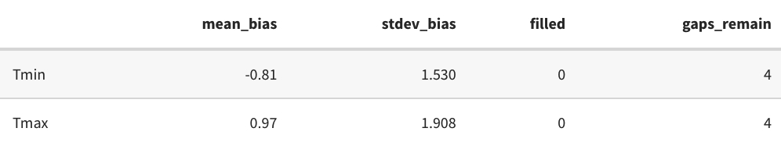
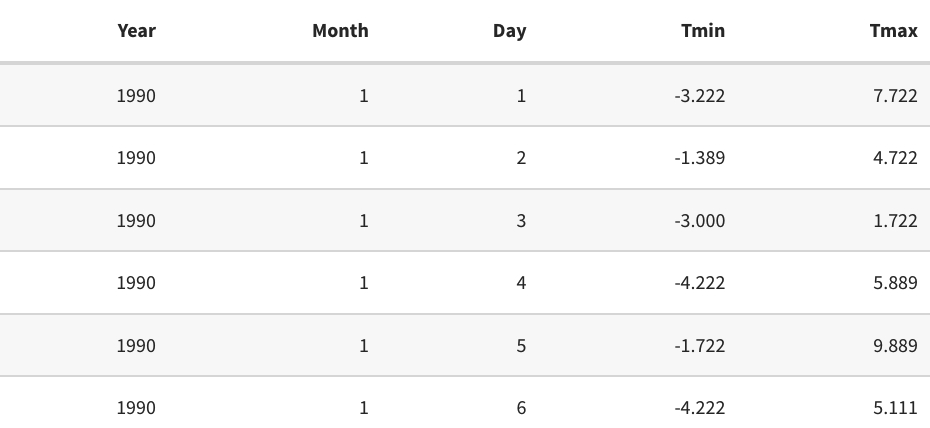
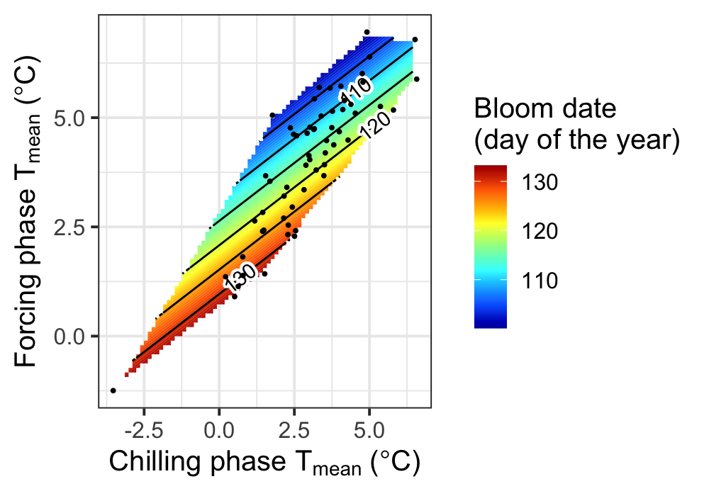

```{r setup, include=FALSE}
knitr::opts_chunk$set(
    tidy = FALSE, # cleaner code printing
    size = "small" # smaller code)
)
```


```{r Import Libraries, echo=FALSE}
library(chillR)
library(tidyverse)
library(magrittr)
library(tidyr)
library(ggplot2)
library(reshape2)
library(kableExtra)
library(RMAWGEN)
library(dplyr)
library(knitr)
library(ggpmisc)
library(patchwork)
library(purrr)
#install_github("EduardoFernandezC/dormancyR")
library(dormancyR)
library(colorRamps)
library(gganimate)
library(gifski)
library(png)
library(devtools)
library(pander)
library(leaflet)
library(Kendall)

```

# Introduction

```{r, echo=FALSE, out.width="49%",out.height="20%",fig.cap= "chillR_hexSticker", fig.show='hold',fig.align='center'}

knitr::include_graphics('KR_image/chillR_hexSticker.png')

```

This is Sang Hyo Moon's logbook for the "Tree Phenology Analysis with R" class in the winter semester of 2023/2024. My primary motivation for taking this class was to learn how to use R. However, I discovered that it offered much more than just R skills; it provided insights into utilizing data for tree phenology analysis and studying climate change using R.

Learning to use the 'chillR' package would have been challenging without this class. Although the package offers a wealth of information, running 'chillR' requires considerable effort and time due to the large datasets involved. Despite encountering difficulties and struggling with certain code segments, I found the experience of using a new R package to be enjoyable. Ultimately, perseverance paid off, and I was able to successfully execute the codes.

I created this logbook using Rmarkdown and documented exercises from each chapter of the class.

# tools

In this Class we used mainly the Package 'ChillR', Git, GitHub and Rmarkdown.

```{r, echo=FALSE, out.width="20%",out.height="10%",fig.cap= "Git, GitHub", fig.show='hold',fig.align='center'}


knitr::include_graphics('KR_image/Picture11.png')
```

```{r, echo=FALSE, out.width="20%",out.height="10%",fig.cap= "Rmarkdown & knitr", fig.show='hold',fig.align='center'}


```

# **tree dormancy**

## Put yourself in the place of a breeder who wants to calculate the temperature requirements of a newly released cultivar. Which method will you use to calculate the chilling and forcing periods? Please justify your answer.

There is two method that we can use to calculate the temperature requirements. First, there is empirical method during the winter, which use shoots, that 7 to 10 days in growth chamber stay and are evaluated about growth ability. If buds haven't grown yet, then we need to repeat this again. If buds have grown, then we have date of dormancy overcome. The second method is statistically. With long phenological data and temperature record as input data, we can analyze statistically. As results we have date of dormancy outcome.

At Endo-dormancy period ,which is before date of dormancy overcome, occurs chilling accumulation. After date of dormancy overcome, is called Eco-dormancy. At that period occurs heat accumulation.

## Which are the advantages (2) of the BBCH scale compared with earlies scales?

-   Applicable for mono- and dicotyledon species
-   worldwide standard

## Classify the following phenological stages of sweet cherry according to the BBCH scale:Phenological stages of cherry

```{r, echo=FALSE, out.width="70%", fig.cap= "Phenological stages of cherry", fig.show='hold',fig.align='center'}
knitr::include_graphics('pictures/3-1.png')

```

1.  Inflorescence enclosed by light green scales: 54
2.  full flowering: 65
3.  fruit ripe for picking: 87

# **Climate change and impact projection**

**Video 1**

-   Sun: warms Earth through solar radiation -\> recent climate change it explains only a small fraction of current climate variability.
-   Aerosols: major climate drivers in industrial centers. -\> related to human emissions.
-   Clouds: can have both cooling and heating effects, depends on the type of cloud -\> an effect is very complex
-   Ozone: Surface/tropospheric ozone (bad ozone, smog), stratospheric ozone (good ozone, blocks UV-B) however with Green House Gas -\> warming effect / Ozone was destroyed by CFCs and has been recovering since 1993
-   Surface albedo: REflection of radiation by the land surface. light surfaces cuases more reflection and dark surfaces less. Deforestration and drying raise albedo because of cooling effect.
    -   feedback loop-accelerates : warming -\> less ice/snow -\> lower albedo -\> less heat reflection -\> warming
-   Green House Gas: Major driver of climate change, atmospheric gases that absorb long-wave radiation (traps heat)-\> warming effect : CO~2~, NH~2~,N~2~O , ect.
    -   CO~2~, NH~2~,N~2~O are strong increase since industrialization.
    -   human activities like burning of fossil fuels drives climate change
    -   trends of CO2 emissions is still going up worldwide.
    -   degree of CO2 concentrations higher than ever and is rising so fast.
-   Long term drivers:
    -   trends in solar activity (star life cycle)
    -   ocean currents/continents constelltations
    -   plants vs.animals (hypothetical): imbalance of CO~2~ (heating due to higher CO~2~)-\> flipping between "Snowball Earth" and "Greenhouse Earth"
    -   volcanic (emit CO~2~: warming, dust:cooling) and meteorite (dust concentration)activity
    -   Milankovic cycles (variation Earth's orbit): axial tilt, eccentricity and precession.

**Video 2** - global warming is clearly visible - since 1901 strong warming almost all over the world - Siberia spring temperature is up to 8°C warmer than the 2003-2008 average - risk positive feedback: melting permafrost, reducing albedo -\> more heat - 2000 years temperature bar code show that last 100 years quite accumulated warm and it should be actually cooling period. Human activity like industrialization causes this scary moment. - currently global surface temperature mean: 14.5°C - +1.5C is optimistic expectation (global temperature increase), actually even 1.5°C is bad... -\> +5C would cause major global changes unseen before by mankind - Rainfall is harder to predict than temperatures (no clear trends) - Moisture deficit in Germany, 2018-2020 very dry summer.

**Video 3** - Representative Concentration Pathways (RCP): is used to project future climate scenarios and understand potential climate change impacts - RCPs are defined based on various factors such as population growth, economic development, energy use, technological advancements, and policies related to greenhouse gas emissions - RCPs are represented by specific greenhouse gas concentration pathways - General Circulation Model (GCM): all major drivers and some feedbacks are considered: 100-250km - Downscaling (Dynamical downscaling, Statistical downscaling): needed to increase resolution causes more details, large computational effort - Dynamical downscailing -\> Regional Climate Model (RCM): 10-50km, run with the boundary conditions from GCMs - Statistical downscaling -\> Impact Model: Local point scale

-   Representative Concentration Pathways (RCP)

    -   2.6, 4.5, 6.0, 8.5- additional radiative forcing; higher number -\> higher warming scenarios

**Video 4**

-   Statistical models- climate parameters & impact measure; used to explain past trends and project future impacts (e.g. Species distribution model)
    -   limitation: Statistical relationships may not remain valid, For agriculture: Crops grow where people plant them, many far outside their natural range!
-   Process-based models: computation, data, simulation to get quantitative projection of performance (e.g. crop models, phenology models, etc.)
    -   complex since need to include all relevant system components
    -   Limitation:Processes often not sufficiently understood, Uncertainties are often not well represented, Lack of balance, ect...
-   Climate analogue models: comparing similar existing climates with projected climates; adaptation options
    -   Limitation: Analogue and baseline sites may not be comparable in important non-climatic respects & may be too similar in non-climatic respects, Climate data may not be available, ect...
-   Common limitation: Climate data scarcity and quality issues, neglect of non-climatic factors, unrealistic assumptions about their stability, and inherent uncertainties in impact projections necessitate the inclusion of error estimates.

## List the main drivers of climate change at the decade to century scale, and briefly explain the mechanism through which the currently most important driver affects our climate.

-   **century scale**:

    -   Sun (solar radiation)
    -   Aerosols
    -   Clouds
    -   Ozone (tropospheric and stratospheric, destroyed by CFCs and has been recovering since 1993)
    -   Surface albedo(Reflection of radiation by the land surface)
    -   Green House Gas (atmospheric gases that absorb long-wave radiation (traps heat) - Long term drivers (solar activity, ocean currents/continents constellations, plants vs.animals, volcanic and meteorite activity, milankovic cycles)

-   **mechanism through which most important driver affects climate**

-   CO~2~, NH~2~,N~2~O are released into the atmosphere. These gases trap heat, causing the Earth's surface to warm—a process known as the greenhouse effect.

-   human activities, particularly the burning of fossil fuels and deforestation, have significantly increased the concentration of GHGs in the atmosphere, enhancing the greenhouse effect and leading to global warming and climate change.

## Explain briefly what is special about temperature dynamics of recent decades, and why we have good reasons to be concerned.

Since 100 years the global temperature is increasing sharp. The human activities particularly the burning of fossil fuels, deforestation, and industrial processes, which have led to a significant increase in greenhouse gas emissions. The significant increased and increasing global temperature underscore the urgent need for mitigation measures to reduce greenhouse gas emissions and adaptation strategies to address the challenges posed by climate change.

## What does the abbreviation ‘RCP’ stand for, how are RCPs defined, and what is their role in projecting future climates?

'RCP' stands for Representative Concentration Pathways, which are scenarios used in climate modeling to represent various future trajectories of greenhouse gas concentrations. They play a critical role in projecting future climates by providing standardized frameworks for assessing the impacts of different emission scenarios on Earth's climate.

There are four main RCP scenarios: RCP 2.6, 4.5, 6.0, 8.5, higher number -\> higher emissions

Progress: RCPs-\> GCM -\> downscaling (RCM) -\> statistical downscaling -\>Temperature, Precipitation, CO2 projections -\> Impact projection or RCPs -\>Temperature, Precipitation, CO2 projections -\> Impact projection

## Briefly describe the 4 climate impact projection methods described in the fourth video.

1.  Statistical models: These models use historical climate data and impact measures to analyze past trends and forecast future impacts. They provide insights into how climate parameters influence various aspects of the environment or society.

2.  Species distribution modelling: This method correlates climate parameters with the presence or absence of species to predict how changes in climate may impact their distribution. It helps in understanding potential shifts in ecosystems and biodiversity.

3.  Process-based models: These models utilize mathematical equations to represent the components and processes of a system affected by climate. They simulate interactions between climatic and non-climatic factors to project climate impacts. However, they are complex, resource-intensive, and require large datasets for accurate predictions.

4.  Climate analogue models: This approach compares projected climate conditions to those of existing locations (analogues) to infer potential impacts. It identifies similar climates in different geographic areas and assesses how changes may affect the target location by examining analogs.

# **Winter chill projections**

## Sketch out three data access and processing challenges that had to be overcome in order to produce chill projections with state-of-the-art methodology.

-   lack of equipment to process huge datasets like high performance computer.
-   Data Volume and Handling: Managing large, high-resolution climate datasets requires substantial storage capacity and efficient data transfer methods due to the size of individual grids and the need for multiple scenarios.
-   Data integration presents interoperability issues and requires preprocessing for accurate chill projections.

## Outline, in your understanding, the basic steps that are necessary to make such projections.

1.Logation understanding and selecting suitable climate model 2. Data Acquisition: Obtain climate data from reliable sources. 3. Data Preprocessing: Clean and integrate the data. 4. Chill Calculation: Use models to calculate chill accumulation. 5. Model Calibration and Validation: Validate the model's performance. 6. Projection Scenario Generation: Generate projection scenarios. 7. Data Storage and Handling: Implement efficient storage solutions. 8. Interpretation and Communication: Interpret and communicate the results effectively.

# **Manual chill analysis**

## Write a basic function that calculates warm hours (\>25°C)

```{r, eval=FALSE}
library(knitr)
library(pander)
library(kableExtra)
library(chillR)
library(tidyverse)
```

```{r}
 

Year<-c(2000:2010)
Temps<-c(20:30)
randomdataset<-data.frame(Year, Temps)

##function creation, assigning of threshold to variable
WarmHours<- function(randomdataset)
    {
      threshold_warm<- 25
      randomdataset[,"Warm_year"]<- randomdataset$Temps>threshold_warm
      return(randomdataset)
 }

RandomWarmHours<-WarmHours(randomdataset)

write.csv(RandomWarmHours, "KR_data/WarmHours.csv", row.names = FALSE)
```

```{r}

RandomWarmHours<-read_tab("KR_data/WarmHours.csv")
WarmHours<-read_tab("KR_data/WarmHours.csv")
kable(head(WarmHours)) %>%
kable_styling("striped", position = "center",font_size = 10)
```

## Apply this function to the Winters_hours_gaps dataset

```{r, eval=FALSE}

hourtemps<- Winters_hours_gaps[,c("Year", "Month", "Day", "Hour", "Temp")]

WarmHours2<- function(hourtemps)
    {
      threshold_warm<- 25
      hourtemps[,"Warm_Hour"]<- hourtemps$Temp>threshold_warm
      return(hourtemps)
    }

write.csv(WarmHours2(hourtemps),"KR_data/WarmHours2.csv", row.names = FALSE)
```

```{r}
WarmHours2<-read_tab("KR_data/WarmHours2.csv")
 kable(head(WarmHours2)) %>%
      kable_styling("striped", position = "left",font_size = 10)
```

### Extend this function, so that it can take start and end dates as inputs and sums up warm hours between these dates

```{r echo=TRUE}
library(chillR)


##function creation applied to Winter_hours_gaps; I made a new column that tells whether the temperatures are greater than the set threshold value: 25C
hourtemps<- Winters_hours_gaps[,c("Year", "Month", "Day", "Hour", "Temp")]

WarmHours<- function(hourtemps)
{
  threshold_warm<- 25
  hourtemps[,"Warm_Hour"]<- hourtemps$Temp>threshold_warm
  return(hourtemps)
}

WarmHours(hourtemps)[13:20,]


##sum of warm hours of start date and end year in YEARMODA

sum_WarmHours<-function(hourtemps, Start_YEARMODA, End_YEARMODA)
{
  Start_Year<-trunc(Start_YEARMODA/10000)
  Start_Month<- trunc((Start_YEARMODA-Start_Year*10000)/100)
  Start_Day<- Start_YEARMODA-Start_Year*10000-Start_Month*100
  Start_Hour<-12
  End_Year<-trunc(End_YEARMODA/10000)
  End_Month<- trunc((End_YEARMODA-End_Year*10000)/100)
  End_Day<- End_YEARMODA-End_Year*10000-End_Month*100
  End_Hour<-12
  
  Start_Date<-which(hourtemps$Year==Start_Year & hourtemps$Month==Start_Month & hourtemps$Day==Start_Day & hourtemps$Hour==Start_Hour)
  End_Date<-which(hourtemps$Year==End_Year & hourtemps$Month==End_Month & hourtemps$Day==End_Day & hourtemps$Hour==End_Hour)
  
  Warm_hours<- WarmHours(hourtemps)
  return(sum(Warm_hours$Warm_Hour[Start_Date:End_Date]))
}

```

```{r echo=TRUE}
##sample content for checking. # of warm hours in set time interval by manual counting= using sum_WarmHours function) -> no error
sum_WarmHours(hourtemps,20080517,20080518)
WarmHours(hourtemps)[1705:1719,]

```

```{r echo=TRUE}
library(kableExtra)


WarmHours_sample<-read_tab("KR_data/WarmHours.csv")
kable(WarmHours_sample[1803:1827,]) %>%
  kable_styling("striped", position = "left",font_size = 10)
```

**[1] 15**

# **Chill models**

## Run the chilling() function on the Winters_hours_gap dataset

```{r include=FALSE}
library(chillR)
chill_7_1<-chilling(make_JDay(Winters_hours_gaps),Start_JDay = 90, End_JDay = 100)

write.csv(chill_7_1, "KR_data/chill_7_1.csv", row.names = FALSE)
```

```{r}
chill_7_1<-read_tab("KR_data/chill_7_1.csv")
kable(head(chill_7_1)) %>%
  kable_styling("striped", position = "left",font_size = 10)
```

### Create your own temperature-weighting chill model using the step_model() function

```{r}
df<-data.frame(
  lower= c(-1000, 2.4, 3.5, 4.8, 6.3, 7.5, 9.1),
  upper= c(2.4, 3.5, 4.8, 6.3, 7.5,9.1, 1000),
  weight=c(0, 2, 1, 2, 1, 0.5, 0))

kable(df) %>%
  kable_styling("striped", position = "left", font_size = 10)

```

```{r}
custom<- function(x) step_model(x, df)

##sample values for first 100 rows from the Winters_hours_gaps dataset)
custom(Winters_hours_gaps$Temp)[1:100]


## save the data
write.csv(custom(Winters_hours_gaps$Temp), "KR_data/custom.csv", row.names = FALSE)

```

### Run this model on the Winters_hours_gaps dataset using the tempResponse() function.

```{r}
output<-tempResponse(make_JDay(Winters_hours_gaps),
                     Start_JDay = 90, End_JDay = 100,
                     models=list(custom=custom))

kable(output) %>%
  kable_styling("striped", position = "left", font_size = 10)
```

# **Making hourly temperatures**

## Choose a location of interest, find out its latitude and produce plots of daily sunrise, sunset and daylength

I initially attempted to work with data from Kiel, but unfortunately, suitable weather data was not available for further lectures. This may be due to the absence of an airport in Kiel. Consequently, I opted for Gwangju, the largest city in the vicinity where I resided for six years. Situated in the southeast of South Korea, Gwangju is equipped with its own airport, making it an ideal location to access comprehensive weather datasets. The Latitute of Gwangju is 35.126, which is upto 15 degree more south than Bonn. Let´s see how scenarios look like with the datasets from South Korea.

GWANGJU 35.126 126.809

```{r}
GWANGJU_Days <- daylength(latitude = 35.126, JDay = 1:365)

GWANGJU_Days_df <-
  data.frame(
    JDay = 1:365,
    Sunrise = GWANGJU_Days$Sunrise,
    Sunset = GWANGJU_Days$Sunset,
    Daylength = GWANGJU_Days$Daylength
  )

GWANGJU_Days_df <- pivot_longer(GWANGJU_Days_df,cols=c(Sunrise:Daylength))

ggplot(GWANGJU_Days_df, aes(JDay, value)) +
  geom_line(lwd = 1.5) +
  facet_grid(cols = vars(name)) +
  ylab("Time of Day / Daylength (Hours)") +
  theme_bw(base_size = 20)

```

## Produce an hourly dataset, based on idealized daily curves, for the KA_weather dataset (included in chillR)

```{r}
#require(chillR)

KA_weather_stacked <- stack_hourly_temps(KA_weather, latitude=54.32)

write.csv(KA_weather_stacked, "KR_data/KA_weather_stacked.csv", row.names = FALSE)

```

```{r}
#require(kableExtra)

KA_weather_stacked<-read_tab("KR_data/KA_weather_stacked.csv")

kable(head(KA_weather_stacked)) %>%
  kable_styling("striped", position = "left",font_size = 10)
```

### Produce empirical temperature curve parameters for the Winters_hours_gaps dataset, and use them to predict hourly values from daily temperatures (this is very similar to the example above, but please make sure you understand what’s going on)

```{r}
#library(chillR)
#library(ggplot2)

coeffs <- Empirical_daily_temperature_curve(Winters_hours_gaps)
Winters_daily <-
  make_all_day_table(Winters_hours_gaps, input_timestep = "hour")
Winters_hours <- Empirical_hourly_temperatures(Winters_daily, coeffs)


#require(reshape2)

Winters_hours <- Winters_hours[, c("Year", "Month", "Day", "Hour", "Temp")]
colnames(Winters_hours)[ncol(Winters_hours)] <- "Temp_empirical"
Winters_ideal <-
  stack_hourly_temps(Winters_daily, latitude = 35.126)$hourtemps
Winters_ideal <- Winters_ideal[, c("Year", "Month", "Day", "Hour", "Temp")]
colnames(Winters_ideal)[ncol(Winters_ideal)] <- "Temp_ideal"

```

# **Some useful tools in R**

### Based on the `Winters_hours_gaps` dataset, use `magrittr` pipes and functions of the `tidyvers`e to accomplish the following:

-   Convert the dataset into a `tibble`

```{r}
coeffs <- Empirical_daily_temperature_curve(Winters_hours_gaps)
Winters_daily <-
  make_all_day_table(Winters_hours_gaps, input_timestep = "hour")
Winters_hours <- Empirical_hourly_temperatures(Winters_daily, coeffs)
Winters_hours <- Winters_hours[, c("Year", "Month", "Day", "Hour","Temp_gaps", "Temp")]
d <- as_tibble(Winters_hours)
head(d)
```

-   Select only the top 10 rows of the dataset

```{r}
d<-as_tibble(d[1:10,])
d
```

-   Convert the `tibble` to a `long` format, with separate rows for `Temp_gaps` and `Temp`

```{r}

data_long <- d %>%
  pivot_longer(cols=Temp_gaps:Temp)
head(data_long)
```

-   Use `ggplot2` to plot `Temp_gaps` and `Temp` as facets (point or line plot)

```{r, warning=FALSE}
ggplot(data_long, aes(name,value, colour = name)) +
  
  # Add point or line plot for Temp_gaps
  geom_point(aes(name = "Temp_gaps"), size = 2) + # Use geom_line() for line plot
  
  # Add point or line plot for Temp
  geom_point(aes(name = "Temp"), size = 2) + # Use geom_line() for line plot

  
  # Customize plot labels and appearance
  labs(x = "Temp", y = "Value", color = "Temp") +
  theme_minimal()
```

-   Convert the dataset back to the wide format

```{r}

data_wide <- data_long %>% pivot_wider(names_from=name) 
data_wide
```

-   Select only the following columns: `Year`, `Month`, `Day` and `Temp`

```{r}

Select <- data_wide[, c("Year", "Month", "Day", "Temp")]
head(Select)
```

-   Sort the dataset by the `Temp` column, in descending order

```{r}

Arrange <- Select %>% arrange(Temp)

head(Arrange)

```

## For the `Winter_hours_gaps` dataset, write a `for` loop to convert all temperatures (`Temp` column) to degrees Fahrenheit

```{r}
Winters_hours1 <- Winters_hours[, c("Year", "Month", "Day", "Hour","Temp_gaps", "Temp")]


for (i in 1:nrow(Winters_hours1)) {
  Winters_hours1$Fahrenheit[i] <- (Winters_hours1$Temp[i] * 9/5) + 32
}

head(Winters_hours1)
```

## Execute the same operation with a function from the `apply` family

```{r}
Winters_hours$Fahrenheit <- sapply(Winters_hours$Temp, function(x) (x * 9/5) + 32)
head(Winters_hours)
```

## Now use the `tidyverse` function `mutate` to achieve the same outcome

```{r}
Winter_hours_gaps <- Winters_hours %>%
  mutate(Fahrenheit = (Temp * 9/5) + 32)
head(Winter_hours_gaps)
```

## Voluntary: consider taking a look at the instruction materials on all these functions, which I linked above, as well as at other sources on the internet. There’s a lot more to discover here, with ots of potential for making your coding more elegant and easier - and possibly even more fun!

# **Getting temperature data**

## Choose a location of interest and find the 25 closest weather stations using the handle_gsod function

GWANGJU location=c(126.809,35.126)

```{r}
GWANGJU_list<-handle_gsod(action="list_stations",
                          location=c(126.809, 35.126),
                          time_interval=c(1990,2020))

#require(kableExtra)

kable(head(GWANGJU_list,15)) %>%
  kable_styling("striped", position = "left", font_size = 8)

```

For my interest I looked many different stations in South Korea and while I do that I found that there is nice weather dataset from a city "KAESONG" in North Korea, which is very near to the Korean border. KAESONG KN 37.967 126.567

```{r}
KAESONG<-handle_gsod(action="list_stations",
                          location=c(126.567, 37.967),
                          time_interval=c(1990,2020))

#require(kableExtra)

kable(head(KAESONG,10)) %>%
  kable_styling("striped", position = "left", font_size = 8)
```

## Download weather data for the most promising station on the list

```{r}

weather_GWANGJU<-handle_gsod(action="download_weather",
                     location=GWANGJU_list$chillR_code[2],
                     time_interval=c(1990,2020))

kable(head(weather_GWANGJU[[1]],10)) %>%
  kable_styling("striped", position = "left", font_size = 8)
```

## Convert the weather data into chillR format

```{r}
cleaned_weather_GWANGJU<-handle_gsod(weather_GWANGJU)
cleaned_weather_GWANGJU[[1]][1:20,]


kable(cleaned_weather_GWANGJU[[1]][1:20,], caption = 'cleaned_weather_GWANGJU') %>%
  kable_styling("striped", position = "left", font_size = 10)
```

```{r,eval=FALSE}

write.csv(GWANGJU_list,"KR_data/GWANGJU_station_list.csv",row.names=FALSE)
write.csv(weather_GWANGJU[[1]],"KR_data/GWANGJU_raw_weather.csv",row.names=FALSE)
write.csv(cleaned_weather_GWANGJU[[1]],"KR_data/GWANGJU_chillR_weather.csv",row.names=FALSE)
```

# **Filling gaps in temperature records**

```{r,eval=FALSE}
#from previous data
GWANGJU<-read.csv("KR_data/GWANGJU_chillR_weather.csv")
```

## Use chillR functions to find out how many gaps you have in this dataset (even if you have none, please still follow all further steps)

```{r ,eval=FALSE}

#checking for gaps using fix_weather function
GWANGJU_QC<-fix_weather(GWANGJU)$QC
write.csv(GWANGJU_QC, "KR_data/GWANGJU_QC.csv", row.names = FALSE)

##saving and downloading the needed columns
GWANGJU_weather<-GWANGJU[,c("Year","Month", "Day", "Tmax", "Tmin")]

write.csv(GWANGJU_weather, "KR_data/GWANGJU_weather.csv", row.names = FALSE)

```

```{r,}
GWANGJU_QC<-read_tab("KR_data/GWANGJU_QC.csv")

kable(GWANGJU_QC, caption="Quality control summary produced by fix_weather(), with only winter days interpolated") %>%
kable_styling("striped", position = "left", font_size = 10)
```

5 days missing

```{r}
#library(kableExtra)
GWANGJU_weather<-read_tab("KR_data/GWANGJU_weather.csv")

kable(head(GWANGJU_weather,10)) %>%
  kable_styling("striped", position = "left", font_size = 10)
```

## Create a list of the 25 closest weather stations using the handle_gsod function

```{r}
GWANGJU_list<-handle_gsod(action="list_stations",
                          location=c(126.809, 35.126),
                          time_interval=c(1990,2020))

kable(GWANGJU_list) %>%
  kable_styling("striped", position = "left", font_size = 8)

```

## Identify suitable weather stations for patching gaps

I will work with the position 8,9 and 15 for patching gaps

**8:JEONJU 9:MOKPO 15:SUNCHEON**

## Download weather data for promising stations, convert them to chillR format and compile them in a list

```{r, eval = FALSE}
GWANGJU_patch_weather<-
      handle_gsod(action = "download_weather",
                  location = as.character(GWANGJU_list$chillR_code[c(8,9,15)]),
                  time_interval = c(1990,2020)) %>%
  handle_gsod()


```

### Use the patch_daily_temperatures function to fill gaps

```{r, eval=FALSE}
GWANGJU_patched <- patch_daily_temperatures(weather = GWANGJU,
                                    patch_weather = GWANGJU_patch_weather)


save_temperature_scenarios(GWANGJU_patched,"KR_data/", "GWANGJU_patched")

#GWANGJU_patched[[2]]

GWANGJU_patched$statistics[[1]]
GWANGJU_patched$statistics[[2]]
GWANGJU_patched$statistics[[3]]

```

```{r, echo=FALSE,out.width="70%",out.height="50%",fig.cap= "Patched statistics for JEONJU", fig.show='hold',fig.align='center'}
knitr::include_graphics('KR_image/chunk30_1.jpeg')
```

```{r, echo=FALSE,out.width="70%",out.height="50%",fig.cap= "Patched statistics for MOKPO", fig.show='hold',fig.align='center'}

```

```{r, echo=FALSE,out.width="70%",out.height="50%",fig.cap= "Patched statistics for SUNCHEON", fig.show='hold',fig.align='center'}

```

The data from all positions look good. So it is not necessary to cap the mean_bias (the mean temperature difference.) at 1 °C and the stdev_bias (the standard deviation of the daily differences)at 2°C.

By the data from JEONJU, 1 gaps for Tmin and 1 gaps for Tmax were able to be filled. There were 0 gaps remain for each of Tmin and Tmax record from Mokpo and Suncheon. There are 4 gaps remain for Tmin and Tmax.

## Investigate the results - have all gaps been filled?

```{r, eval=FALSE}
#library(chillR)

GWANGJU_patched<-read.csv("KR_data/GWANGJU_patched_1_weather.csv")

GWANGJU_post_patch_stats<-fix_weather(GWANGJU_patched)$QC

write.csv(GWANGJU_post_patch_stats, "KR_data/GWANGJU_post_patchstats.csv", row.names = FALSE)
```

```{r}
#library(kableExtra)

GWANGJU_post_patch_stats<-read_tab("KR_data/GWANGJU_post_patchstats.csv")

kable(head(GWANGJU_post_patch_stats)) %>%
 kable_styling("striped", position = "left", font_size = 10)
```

There are 4 days missing after the patching. It seems safe to use linear interpolation for such a short gap.

## If necessary, repeat until you have a dataset you can work with in further analyses

```{r, eval=FALSE}
GWANGJU_weather2<-fix_weather(GWANGJU_patched)

write.csv(GWANGJU_weather2$weather, "KR_data/GWANGJU_patched2.csv", row.names = FALSE)

GWANGJU_weather<-GWANGJU_weather2$weather[c("Year","Month", "Day", "Tmin", "Tmax")]
kable(head(GWANGJU_weather),) %>%
  kable_styling("striped", position = "left", font_size = 10)

GWANGJU_weather <- round(GWANGJU_weather, digits = 1)

write.csv(GWANGJU_weather, "KR_data/GWANGJU_weather.csv", row.names = FALSE)

```

```{r, echo=FALSE,out.width="70%",out.height="50%",fig.cap= "patched GWANGJU weather", fig.show='hold',fig.align='center'}

```

# **Generating temperature scenarios**

-   wather generator: random data (like a dice) from a virtual collection

## For the location you chose for your earlier analyses, use chillR’s weather generator to produce 100 years of synthetic temperature data.

The location where I choose location=c(126.809,35.126)

```{r, eval=FALSE}
#from the fixed weather
GWANGJU_weather<-read.csv("KR_data/GWANGJU_weather.csv")

GWANGJU_weather <- round(GWANGJU_weather, digits = 1)

GWANGJU_Temp <- temperature_generation(GWANGJU_weather,
                         years=c(1998,2005),
                         sim_years = c(2001,2100))

GWANGJU_Temperatures<-cbind(GWANGJU_weather[
       which(GWANGJU_weather$Year %in% 1998:2005),] ,Data_source="observed")
     
GWANGJU_Temperatures<-rbind(GWANGJU_Temperatures,
                         cbind(GWANGJU_Temp[[1]][,c("Year","Month","Day","Tmin","Tmax")],
                               Data_source="simulated"))

GWANGJU_Temperatures[,"Date"]<-as.Date(ISOdate(2000, GWANGJU_Temperatures$Month, GWANGJU_Temperatures$Day))

```

plots Tmin and Tmax: observated and simulated the geom_smooth function of ggplot removed much of the noise in the dataset.

```{r, eval=FALSE}
ggplot(data=GWANGJU_Temperatures,
       aes(Date,Tmin)) +
  geom_smooth(aes(colour = factor(Year))) +
  facet_wrap(vars(Data_source)) +
  theme_bw(base_size = 20) +
  theme(legend.position = "none") +
  scale_x_date(date_labels = "%b")

ggplot(data=GWANGJU_Temperatures,
       aes(Date,Tmax)) +
  geom_smooth(aes(colour = factor(Year))) +
  facet_wrap(vars(Data_source)) +
  theme_bw(base_size = 20) +
  theme(legend.position = "none") +
  scale_x_date(date_labels = "%b")
```

```{r echo=FALSE,out.width="49%",out.height="20%",fig.cap= "compare the generated data with the observed records: Tmin & Tmax", fig.show='hold',fig.align='center'}

knitr::include_graphics('KR_image/chunk38_Tmax.png')
```

## Calculate winter chill (in Chill Portions) for your synthetic weather, and illustrate your results as histograms and cumulative distributions.

```{r, eval=FALSE}


GWANGJU_chill_observed<-chilling(
   stack_hourly_temps(
     GWANGJU_Temperatures[which(GWANGJU_Temperatures$Data_source=="observed"),],
     latitude = 35.126),
    Start_JDay = 305,
    End_JDay = 59)
     
GWANGJU_chill_simulated<-chilling(
       stack_hourly_temps(
         GWANGJU_Temperatures[which(GWANGJU_Temperatures$Data_source=="simulated"),],
         latitude = 35.126),
       Start_JDay = 305,
       End_JDay = 59)
     
GWANGJU_chill_comparison<-cbind(GWANGJU_chill_observed ,Data_source="observed")
GWANGJU_chill_comparison<-rbind(GWANGJU_chill_comparison,
                             cbind(GWANGJU_chill_simulated ,Data_source="simulated"))

```

```{r echo=FALSE, fig.cap= "GWANGJU chill comparison full seasons", fig.show='hold',fig.align='center'}

```

```{r eval=FALSE, include=FALSE}

GWANGJU_chill_comparison_full_seasons<-GWANGJU_chill_comparison[
       which(GWANGJU_chill_comparison$Perc_complete==100),]

    ggplot(GWANGJU_chill_comparison_full_seasons, aes(x=Chill_portions)) + 
      geom_histogram(binwidth=1,aes(fill = factor(Data_source))) +
      theme_bw(base_size = 20) +
      labs(fill = "Data source") +
      xlab("Chill accumulation (Chill Portions)") +
      ylab("Frequency")


GWANGJU_chill_simulations<-GWANGJU_chill_comparison_full_seasons[
      which(GWANGJU_chill_comparison_full_seasons$Data_source=="simulated"),]

    ggplot(GWANGJU_chill_simulations, aes(x=Chill_portions)) +
      stat_ecdf(geom = "step",lwd=1.5,col="blue") +
      ylab("Cumulative probability") +
      xlab("Chill accumulation (in Chill Portions)") +
      theme_bw(base_size = 20)

write.csv(GWANGJU_chill_comparison_full_seasons,"KR_data/GWANGJU_chill_comparison_full_seasons.csv", row.names = FALSE)

```

```{r echo=FALSE,out.width="49%",out.height="20%",fig.cap= "plots of the Cumulative Chilling and Cumulative Probability", fig.show='hold',fig.align='center'}

knitr::include_graphics('KR_image/chunk40_CP-stat.png')
```

```{r, eval=FALSE}
#library(knitr)
#library(kableExtra)
GWANGJU_chill_comparison_full_seasons<-read_tab("KR_data/GWANGJU_chill_comparison_full_seasons.csv")

kable(head(GWANGJU_chill_comparison_full_seasons)) %>%
      kable_styling("striped", position = "left", font_size = 10)
```

```{r, eval=FALSE}
#amount of chill that is exceeded in 90% of all years
    quantile(GWANGJU_chill_simulations$Chill_portions, 0.1)
      ##  10% 
     ##   73.56582 

#chill at 50% confidence interval (25th and 75th percentile)
    quantile(GWANGJU_chill_simulations$Chill_portions, c(0.25,0.75))
       ##  25%       75% 
       ##  75.92765  78.96615
```

## Produce similar plots for the number of freezing hours (\<0°C) in April (or October, if your site is in the Southern Hemisphere) for your location of interest.

```{r, eval=FALSE}

GWANGJU_weather<-read.csv("KR_data/GWANGJU_weather.csv")

GWANGJU_weather <- round(GWANGJU_weather, digits = 1)

GWANGJU_Temp <- temperature_generation(GWANGJU_weather,
                         years=c(1998,2005),
                         sim_years = c(2001,2100))   


GWANGJU_Temperatures<-cbind(GWANGJU_weather[
       which(GWANGJU_weather$Year %in% 1998:2005),] ,Data_source="observed")
     
GWANGJU_Temperatures<-rbind(GWANGJU_Temperatures,
                         cbind(GWANGJU_Temp[[1]][,c("Year","Month","Day","Tmin","Tmax")],
                               Data_source="simulated"))

GWANGJU_Temperatures[,"Date"]<-as.Date(ISOdate(2000, GWANGJU_Temperatures$Month, GWANGJU_Temperatures$Day))


df<-data.frame(
  lower= c(-1000, 0),
  upper= c(    0, 1000),
  weight=c(    1, 0))

freezing_hours<-function(x) step_model(x,df)

freezing_hours(c(1,2,4,5,-10))

GWANGJU_chill_observed <- GWANGJU_Temperatures %>%
  filter(Data_source == "observed") %>%
  stack_hourly_temps(latitude = 35.126) %>%
  tempResponse(Start_JDay = 305,
               End_JDay = 59,
               models=list(Frost = freezing_hours,
                           Chill_portions = Dynamic_Model,
                           GDH = GDH))


GWANGJU_chill_simulated <- GWANGJU_Temperatures %>%
  filter(Data_source == "simulated") %>%
  stack_hourly_temps(latitude = 35.126) %>%
  tempResponse(Start_JDay = 305,
               End_JDay = 59,
               models=list(Frost = freezing_hours,
                           Chill_portions = Dynamic_Model,
                           GDH = GDH))

GWANGJU_chill_comparison <-
  cbind(GWANGJU_chill_observed,
        Data_source = "observed") %>%
  rbind(cbind(GWANGJU_chill_simulated,
              Data_source = "simulated"))

GWANGJU_chill_comparison_full_seasons <-
  GWANGJU_chill_comparison %>%
  filter(Perc_complete == 100)


ggplot(GWANGJU_chill_comparison_full_seasons,
       aes(x=Chill_portions)) + 
  geom_histogram(binwidth = 1,
                 aes(fill = factor(Data_source))) +
  theme_bw(base_size = 10) +
  labs(fill = "Data source") +
  xlab("Chill accumulation (Chill Portions)") +
  ylab("Frequency")

ggplot(GWANGJU_chill_comparison_full_seasons,
       aes(x=Frost)) + 
  geom_histogram(binwidth = 25,
                 aes(fill = factor(Data_source))) +
  theme_bw(base_size = 10) +
  labs(fill = "Data source") +
  xlab("Frost incidence during winter (hours)") +
  ylab("Frequency")

GWANGJU_chill_simulations <-
  GWANGJU_chill_comparison_full_seasons %>%
  filter(Data_source == "simulated")
  
ggplot(GWANGJU_chill_simulations,
       aes(x = Chill_portions)) +
  stat_ecdf(geom = "step",
            lwd = 1.5,
            col = "blue") +
  ylab("Cumulative probability") +
  xlab("Chill accumulation (in Chill Portions)") +
  theme_bw(base_size = 20)

ggplot(GWANGJU_chill_simulations,
       aes(x = Frost)) +
  stat_ecdf(geom = "step",
            lwd = 1.5,
            col = "blue") +
  ylab("Cumulative probability") +
  xlab("Frost incidence during winter (hours)") +
  theme_bw(base_size = 20)


```

```{r, echo=FALSE, out.width="49%",out.height="20%",fig.cap= "plots of the Cumulative Freezing (sum of Freezing hours <0°C) in April and Cumulative Probability", fig.show='hold',fig.align='center'}

knitr::include_graphics(c('KR_image/chunk42_chillPortion.jpeg','KR_image/chunk42_Frost.jpeg'))
knitr::include_graphics(c('KR_image/chunk42_ChillPortion-step.jpeg','KR_image/chunk42_Frost-step.jpeg'))


```

```{r,eval=FALSE}
# Here's the amount of chill that is exceeded in 90% of all years.
quantile(GWANGJU_chill_simulations$Chill_portions,0.1)
       #10% 
       #74.09957 


# and here's the 50% confidence interval (25th to 75th percentile)
quantile(GWANGJU_chill_simulations$Chill_portions, c(0.25,0.75))
  #25%      75% 
  #75.89585 79.50969 

```

# Saving and loading data

# **historic temperature scenarios**

## For the location you chose for previous exercises, produce historic temperature scenarios representing several years of the historic record (your choice).

The new station in GWANGJU is located at coordinates (126.900, 35.167), approximately 9.46 kilometers away from the previously selected station. This new station offers a greater volume of data for analysis compared to the previous station.

make a data for patching

```{r, eval=FALSE}

# download weather station list for the vicinity of Bonn
GWANGJU_list <- handle_gsod(action = "list_stations",
                            location=c(126.809,35.126))
```

MOKPO is located 51.9 kilometers away from the GWANGJU station. Despite the distance, it is the nearest station with available data.

```{r, eval=FALSE}
# download weather data for GWANGJU and convert it to chillR format
GWANGJU_weather <- handle_gsod(action = "download_weather",
                            location = GWANGJU_list$chillR_code[2],
                            time_interval = c(1973,2019)) %>%
  handle_gsod()

# check record for missing data: 15 days missing
fix_weather(GWANGJU_weather$'GWANGJU')$QC

# download weather data for the patching and convert it to chillR format
Mokpo_patch_weather<-
      handle_gsod(action = "download_weather",
                  location = as.character(GWANGJU_list$chillR_code[[8]]),
                  time_interval = c(1973,2019)) %>%
  handle_gsod()

## this data.frame is too long. So it will not show here. 
```

```{r, eval=FALSE}
# (incidentally almost all gaps are for years covered by the Mokpo_patch_weather dataset )

GWANGJU_patched_14 <- patch_daily_temperatures(
                                      weather = GWANGJU_weather$'GWANGJU',
                                      patch_weather = Mokpo_patch_weather)

fix_weather(GWANGJU_patched_14)$QC


save_temperature_scenarios(GWANGJU_patched_14,"KR_data/", "GWANGJU_patched_14")

```

```{r echo=FALSE,out.width="80%",out.height="40%",fig.cap= "pachted GWANJU weather", fig.show='hold',fig.align='center'}

#head(fix_weather(GWANGJU_patched_14)$QC)
knitr::include_graphics('KR_image/chunk50_patched.png')
```

```{r echo=FALSE,out.width="49%",out.height="20%",fig.cap= "Patch statistics for MOKPO", fig.show='hold',fig.align='center'}

#GWANGJU_patched_14$statistics
knitr::include_graphics('KR_image/chunk50_stat.png')

```

5 days are filled and there are still 10 days missing here, out of 47 years. The Data from all positions look good. So it is not necessary to cap the mean_bias (the mean temperature difference.) at 1 °C and the stdev_bias (the standard deviation of the daily differences)at 2°C.

```{r, eval=FALSE}


# let's simply interpolate these gaps now

GWANGJU<-fix_weather(GWANGJU_patched_14)

GWANGJU_temps<-GWANGJU$weather
write.csv(GWANGJU_temps,
          "KR_data/GWANGJU_temps.csv")

GWANGJU_scenario_1980 <- temperature_scenario_from_records(weather = GWANGJU_temps,
                                                   year = 1980)

GWANGJU_scenario_1980$'1980'$data


GWANGJU_temps_1980 <- temperature_generation(weather = GWANGJU_temps,
                                     years = c(1973,2019),
                                     sim_years = c(2001,2100),
                                     temperature_scenario = GWANGJU_scenario_1980)
                                     # just index... not real data.: relative time scenario. difference compare to 1996. 
                                     

GWANGJU_scenario_1996 <- temperature_scenario_from_records(weather = GWANGJU_temps,
                                                   year = 1996)
GWANGJU_scenario_1996$'1996'$data

relative_scenario <- temperature_scenario_baseline_adjustment(
  baseline = GWANGJU_scenario_1996,
  temperature_scenario = GWANGJU_scenario_1980)
# it shows the difference between 1980 & 1996
#usually for scientific works we need more than 30 years datas

GWANGJU_temps_1980<-temperature_generation(weather = GWANGJU_temps,
                                   years = c(1973,2019),
                                   sim_years = c(2001,2100),
                                   temperature_scenario = relative_scenario)


```

```{r, out.width="30%",out.height="70%",fig.cap= "GWANGJU scenario 1980", fig.show='hold',fig.align='center'}

#GWANGJU_scenario_1980
knitr::include_graphics('KR_image/chunk52_GWANGJU_scenario_1980.jpeg')
```

```{r, out.width="30%",out.height="70%",fig.cap= "GWANGJU scenario 1996", fig.show='hold',fig.align='center'}
#GWANGJU_scenario_1996
knitr::include_graphics('KR_image/chunk52_GWANGJU_scenario_1996.jpeg')

```

## Produce chill distributions for these scenarios and plot them.

```{r, eval=FALSE}
#require(chillR)
#require(ggplot2)
#require(reshape2)
#require(kableExtra)

GWANGJU_all_past_scenarios <- temperature_scenario_from_records(
  weather = GWANGJU_temps,
  year = c(1980,
           1990,
           2000,
           2010))

GWANGJU_adjusted_scenarios <- temperature_scenario_baseline_adjustment(
  baseline = GWANGJU_scenario_1996,
  temperature_scenario = GWANGJU_all_past_scenarios)

GWANGJU_all_past_scenario_temps <- temperature_generation(
  weather = GWANGJU_temps,
  years = c(1973,2019),
  sim_years = c(2001,2100),
  temperature_scenario = GWANGJU_adjusted_scenarios)


#it will save in a 4 folders but once we call the file as "GWANGJU_hist_scenarios", then all of them comes together 
save_temperature_scenarios(GWANGJU_all_past_scenario_temps, "KR_data", "GWANGJU_hist_scenarios")

frost_model <- function(x)
  step_model(x,
             data.frame(
               lower=c(-1000,0),
               upper=c(0,1000),
               weight=c(1,0)))

models1 <- list(Chill_Portions = Dynamic_Model,
               GDH = GDH,
               Frost_H = frost_model)

GWANGJU_chill_hist_scenario_list <-
  GWANGJU_all_past_scenario_temps %>%
  tempResponse_daily_list(
    latitude = 35.167,
    Start_JDay = 305,
    End_JDay = 59,
    models = models1)

GWANGJU_chill_hist_scenario_list <- lapply(GWANGJU_chill_hist_scenario_list,
                                   function(x) x %>%
                                     filter(Perc_complete == 100))

save_temperature_scenarios(GWANGJU_chill_hist_scenario_list, "KR_data","GWANGJU_hist_chill_305_59")


scenarios <- names(GWANGJU_chill_hist_scenario_list)[1:4]

GWANGJU_all_scenarios <- GWANGJU_chill_hist_scenario_list[[scenarios[1]]] %>%
  mutate(scenario = as.numeric(scenarios[1]))

for (sc in scenarios[2:4])
 GWANGJU_all_scenarios <- GWANGJU_all_scenarios %>%
  rbind(GWANGJU_chill_hist_scenario_list[[sc]] %>%
          cbind(
            scenario=as.numeric(sc))
        ) %>%
  filter(Perc_complete == 100)


# Let's compute the actual 'observed' chill for comparison
GWANGJU_actual_chill <- tempResponse_daily_list(GWANGJU_temps,
                                        latitude=35.127,
                                        Start_JDay = 305,
                                        End_JDay = 59,
                                        models=models1)[[1]] %>%
  filter(Perc_complete == 100)


ggplot(data = GWANGJU_all_scenarios,
       aes(scenario,
           Chill_Portions,
           fill = factor(scenario))) +
  geom_violin() +
  ylab("Chill accumulation (Chill Portions)") +
  xlab("Scenario year") +
  theme_bw(base_size = 15) +
  ylim(c(0,90)) +
  geom_point(data = GWANGJU_actual_chill,
             aes(End_year,
                 Chill_Portions,
                 fill = "blue"),
             col = "blue",
             show.legend = FALSE) +
  scale_fill_discrete(name = "Scenario",
                      breaks = unique(GWANGJU_all_scenarios$scenario)) 

write.csv(GWANGJU_actual_chill,"KR_data/GWANGJU_observed_chill_305_59.csv", row.names = FALSE)

GWANGJU_temperature_means <- 
  data.frame(Year = min(GWANGJU_temps$Year):max(GWANGJU_temps$Year),
             Tmin = aggregate(GWANGJU_temps$Tmin,
                              FUN = "mean",
                              by = list(GWANGJU_temps$Year))[,2],
             Tmax=aggregate(GWANGJU_temps$Tmax,
                            FUN = "mean",
                            by = list(GWANGJU_temps$Year))[,2]) %>%
  mutate(runn_mean_Tmin = runn_mean(Tmin,15),
         runn_mean_Tmax = runn_mean(Tmax,15))


GWANGJU_Tmin_regression <- lm(Tmin~Year,
                      GWANGJU_temperature_means)

GWANGJU_Tmax_regression <- lm(Tmax~Year,
                      GWANGJU_temperature_means)

GWANGJU_temperature_means <- GWANGJU_temperature_means %>%
  mutate(regression_Tmin = GWANGJU_Tmin_regression$coefficients[1]+
           GWANGJU_Tmin_regression$coefficients[2]*GWANGJU_temperature_means$Year,
         regression_Tmax = GWANGJU_Tmax_regression$coefficients[1]+
           GWANGJU_Tmax_regression$coefficients[2]*GWANGJU_temperature_means$Year
  )


ggplot(GWANGJU_temperature_means,
       aes(Year,
           Tmin)) + 
  geom_point() + 
  geom_line(data = GWANGJU_temperature_means,
            aes(Year,
                runn_mean_Tmin),
            lwd = 2,
            col = "blue") + 
  geom_line(data = GWANGJU_temperature_means,
            aes(Year,
                regression_Tmin),
            lwd = 2,
            col = "red") +
  theme_bw(base_size = 15) +
  ylab("Mean monthly minimum temperature (°C)")

ggplot(GWANGJU_temperature_means,
       aes(Year,
           Tmax)) + 
  geom_point() + 
  geom_line(data = GWANGJU_temperature_means,
            aes(Year,
                runn_mean_Tmax),
            lwd = 2,
            col = "blue") + 
  geom_line(data = GWANGJU_temperature_means,
            aes(Year, 
                regression_Tmax),
            lwd = 2,
            col = "red") +
  theme_bw(base_size = 15) +
  ylab("Mean monthly maximum temperature (°C)")


```

```{r, out.width="49%",out.height="20%",fig.cap= "chill distribution scenarios representing the years 1980, 1990, 2000 and 2010", fig.show='hold',fig.align='center'}
knitr::include_graphics('KR_image/chunk51_GWANGJU_all_scenarios.png')

```

```{r, out.width="49%",out.height="20%",fig.cap= "linear regression of past temperatures for a particular historic scenario", fig.show='hold',fig.align='center'}
knitr::include_graphics('KR_image/chunk51_regression_Tmin.png')
knitr::include_graphics('KR_image/chunk51_regression_Tmax.png')
```

the running mean function (blue) and the linear regression line (red).

# **future temperature scenarios**

CMIP6: lastly updated - they are came from scenarios contained in the Special Report on Emission Scenarios (SRES) (2000): used not that much anymore - Representative Concentration Pathways (RCPs): currently recommended, technically used - Shared Socioeconomic Pathways (SSPs). (2021)

## Briefly describe the differences between the RCPs and the SSPs (you may have to follow some of the links provided above).

1.  **RCPs (Representative Concentration Pathways)**:
    -   RCPs focus on future greenhouse gas emissions and concentrations.
    -   They describe different trajectories of future emissions, leading to various levels of radiative forcing by the end of the 21st century.
    -   The four main RCP scenarios range from low emissions (RCP2.6) to high emissions (RCP8.5), representing a spectrum of possible future climate outcomes.
2.  **SSPs (Shared Socioeconomic Pathways)**:
    -   SSPs focus on future socioeconomic development and global challenges.
    -   They describe different plausible futures based on assumptions about population growth, economic development, governance, technological advancements, and environmental policies.
    -   The five main SSP scenarios represent different combinations of challenges and pathways, ranging from sustainability-focused (SSP1) to inequality and fossil fuel-dependent (SSP5).

# **Making CMPI6 scenario**

## Analyze the historic and future impact of climate change on two agroclimatic metrics of your choice, for the location you’ve chosen for your earlier analyses.

Creating change scenarios from our climate data

```{r, eval=FALSE}
#library(chillR)
#library(kableExtra)
#library(tidyverse)
#library(ecmwfr)
#library(RMAWGEN)


GWANGJU_temps <- read_tab("KR_data/GWANGJU_temps.csv")

location=c(126.900,35.167)

area <- c(37, 126, 35, 127)

#user: user ID from Copernicus climate 
#key: from the ID I will get
#ecmwfr: European Centre for Medium-Range Weather Forecasts
#we can only start from 2015, which it started before
#inthe cmip6_downloaded file there is blacklist.txt, which shows scenarios not is not working

download_cmip6_ecmwfr(
  scenarios = 'ssp126',
  area =  area,
  user = '269601',
  key = '0b082782-deda-4eab-87e0-06d7f2c7fa4f',
  model = 'default',
  frequency = 'monthly',
  variable = c('Tmin', 'Tmax'),
  year_start = 2015,
  year_end = 2100,
  path_download = "cmip6_downloaded"
  )


#ssp scenario 2.6, 4.5, 7.0, 8.5

download_cmip6_ecmwfr(
  scenarios = c("historical", "ssp126", "ssp245", "ssp370", "ssp585"),
  area = area,
  user = '269601',
  key = '0b082782-deda-4eab-87e0-06d7f2c7fa4f',
  model = 'default',
  frequency = 'monthly',
  variable = c('Tmin', 'Tmax'),
  year_start = 2015,
  year_end = 2100,
  path_download = "cmip6_downloaded"
  )

#2015 all simulated data. it will give us the data is not changed and shows past data too. 


download_baseline_cmip6_ecmwfr(
  area = area,
  user = '269601',
  key = '0b082782-deda-4eab-87e0-06d7f2c7fa4f',
  model = 'match_downloaded',
  frequency = 'monthly',
  variable = c('Tmin', 'Tmax'),
  year_start = 1986,
  year_end = 2014,
  month = 1:12,
  path_download = "cmip6_downloaded"
  )


#1986is baseline 
```

```{r, eval=FALSE}

GWANGJU_station <- data.frame(
  station_name = c("GWANGJU"),
  longitude = c(126.900),
  latitude = c(35.167))


GWANGJU_extracted <- extract_cmip6_data(stations = GWANGJU_station,
                                     variable = c("Tmin", "Tmax"),
                                     download_path = "cmip6_downloaded/37_126_35_127",
                                     keep_downloaded = TRUE)


head(GWANGJU_extracted$`ssp126_AWI-CM-1-1-MR`)


GWANGJU_change_scenarios <- gen_rel_change_scenario(GWANGJU_extracted) #if the temperature changed from the baseline
head(GWANGJU_change_scenarios)


write.csv(GWANGJU_change_scenarios, "KR_data/GWANGJU_all_change_scenarios.csv", row.names = FALSE)
#save this is important! that we don't have to runs all again. 

GWANGJU_change_scenarios <- read.csv("KR_data/GWANGJU_all_change_scenarios.csv")
#2000 reference year.: 2050 compare to 2000
head(GWANGJU_change_scenarios)


GWANGJU_temps_1996 <- temperature_scenario_from_records(GWANGJU_temps,1996)
GWANGJU_temps_2000 <- temperature_scenario_from_records(GWANGJU_temps,2000)
GWANGJU_temps_1996
GWANGJU_temps_2000


base <- temperature_scenario_baseline_adjustment(GWANGJU_temps_1996,GWANGJU_temps_2000)

base

#scenario list


GWANGJU_scen_list <- convert_scen_information(GWANGJU_change_scenarios, 
                                      give_structure = FALSE)
scen_frame <- convert_scen_information(GWANGJU_scen_list)


GWANGJU_adjusted_list <- temperature_scenario_baseline_adjustment(base,GWANGJU_scen_list,
                                              temperature_check_args=
                                                list(scenario_check_thresholds = c(-5, 15)))

#more that 5 degree cooling or 15 degree warmer than it will find it 


```

temperature generation process: this takes very long time to run.

```{r, eval=FALSE}

GWANGJU_temps<-read_tab("KR_data/GWANGJU_temps.csv")

temps_GWANGJU <- temperature_generation(GWANGJU_temps, years = c(1973, 2019), 
                                sim_years = c(2001, 2100), 
                                temperature_scenario = GWANGJU_adjusted_list, 
                                temperature_check_args=list(
                                  scenario_check_thresholds = c(-5, 15)))

# important the baseline download


save_temperature_scenarios(temps_GWANGJU,"KR_data/GWANGJU_future_climate",
                           "GWANGJU_futuretemps")

```

```{r, eval=FALSE}
#library(kableExtra)
#library(chillR)
#library(tidyverse)
#library(ggpmisc)
#library(patchwork)

temps_GWANGJU <- load_temperature_scenarios("KR_data/GWANGJU_future_climate",
                                                  "GWANGJU_futuretemps_")


# now we have temepratrue scenarios
frost_model <- function(x)
  step_model(x,
             data.frame(
               lower=c(-1000,0),
               upper=c(0,1000),
               weight=c(1,0)))

models <- list(Chill_Portions = Dynamic_Model,
               GDH = GDH,
               Frost_H = frost_model)


chill_future_scenario_list_GWANGJU <- tempResponse_daily_list(
                                                    temps_GWANGJU,
                                                    latitude =  35.167,
                                                    Start_JDay = 305,
                                                    End_JDay = 59,
                                                    models = models)

chill_future_scenario_list_GWANGJU <- lapply(chill_future_scenario_list_GWANGJU,
                                       function(x) x %>%
                                         filter(Perc_complete == 100))


save_temperature_scenarios(chill_future_scenario_list_GWANGJU,
                           "KR_data/GWANGJU_future_climate",
                           "GWANGJU_futurechill_305_59")


```

```{r, eval=FALSE}
chill_future_scenario_list_GWANGJU <- load_temperature_scenarios("KR_data/GWANGJU_future_climate","GWANGJU_futurechill_305_59")


chill_hist_scenario_list_GWANGJU<-load_temperature_scenarios("KR_data","GWANGJU_hist_chill_305_59")
observed_chill_GWANGJU <- read_tab("KR_data/GWANGJU_observed_chill_305_59.csv")

# prepare for plotting 
chills_GWANGJU <- make_climate_scenario(
  chill_hist_scenario_list_GWANGJU,
  caption = "Historic",
  historic_data = observed_chill_GWANGJU,
  time_series = TRUE)

plot_climate_scenarios(
  climate_scenario_list = chills_GWANGJU,
  metric = "Chill_Portions",
  metric_label = "Chill (Chill Portions)")


SSPs <- c("ssp126", "ssp245", "ssp585")
Times <- c(2050, 2085)

list_ssp <- 
  strsplit(names(chill_future_scenario_list_GWANGJU), '\\.') %>%
  map(2) %>%
  unlist()

list_gcm <-
  strsplit(names(chill_future_scenario_list_GWANGJU), '\\.') %>%
  map(3) %>%
  unlist()

list_time <-
  strsplit(names(chill_future_scenario_list_GWANGJU), '\\.') %>%
  map(4) %>%
  unlist()


for(SSP in SSPs)
  for(Time in Times)
    {
    
    # find all scenarios for the ssp and time
    GWANGJU_chill <- chill_future_scenario_list_GWANGJU[list_ssp == SSP & list_time == Time]
    names(GWANGJU_chill) <- list_gcm[list_ssp == SSP & list_time == Time]
    if(SSP == "ssp126") SSPcaption <- "SSP1"
    if(SSP == "ssp245") SSPcaption <- "SSP2"
    if(SSP == "ssp585") SSPcaption <- "SSP5"    
    if(Time == "2050") Time_caption <- "2050"
    if(Time == "2085") Time_caption <- "2085"
    chills_GWANGJU <- GWANGJU_chill %>% 
      make_climate_scenario(
        caption = c(SSPcaption,
                    Time_caption),
        add_to = chills_GWANGJU)
}


info_chill <-
  plot_climate_scenarios(
    climate_scenario_list = chills_GWANGJU,
    metric = "Chill_Portions",
    metric_label = "Chill (Chill Portions)",
    texcex = 1.5)

info_heat <-
  plot_climate_scenarios(
    climate_scenario_list = chills_GWANGJU,
    metric = "GDH",
    metric_label = "Heat (Growing Degree Hours)",
    texcex = 1.5)

 info_frost <- 
   plot_climate_scenarios(  
     climate_scenario_list = chills_GWANGJU,
     metric="Frost_H",
     metric_label="Frost incidence (hours)",
     texcex=1.5)


## info_chill[[2]]

kable(info_chill[[2]])  %>%
  kable_styling("striped", position = "left",font_size = 10)

```

```{r,echo=FALSE, out.width="49%",out.height="20%", fig.align='center', fig.cap= "Historic temperature scenarios", fig.show='hold'}
knitr::include_graphics('KR_image/chunk58_Historic.png')
```

```{r,echo=FALSE, fig.align='center', fig.cap= "plot of chill accumulation", fig.show='hold'}
knitr::include_graphics('KR_image/chunk58_CP.png')
```

```{r,echo=FALSE, fig.align='center', fig.cap= "plot of heat accumulation", fig.show='hold'}
knitr::include_graphics('KR_image/chunk58_GDH.png')
```

```{r,echo=FALSE, fig.align='center', fig.cap= "plot of frost hour accumulation", fig.show='hold'}

```

```{r,echo=FALSE, out.width="20%",out.height="50%", fig.align='center', fig.cap= "time series labels", fig.show='hold'}
knitr::include_graphics('KR_image/chunk58_info_chilll.jpeg')
```

-   Chill Portions:Even with RCP8.5 projection shows there is no worries to grow trees up to 2085
-   Heat (GDH): the projection with RCP8.5 in 2085 shows higher GDH
-   Frost hours: frost hours decrease, which means less frost damage to flowers and good for farmer.

# **Plotting future scenario**

## Produce similar plots for the weather station you selected for earlier exercises.

```{r, eval=FALSE}
chill_future_scenario_list_GWANGJU <- load_temperature_scenarios("KR_data/GWANGJU_future_climate","GWANGJU_futurechill_305")


chill_hist_scenario_list_GWANGJU<-load_temperature_scenarios("KR_data","GWANGJU_hist_chill_305_59")
observed_chill_GWANGJU <- read_tab("KR_data/GWANGJU_observed_chill_305_59.csv")
#observed chill = actual chill


chills_GWANGJU <- make_climate_scenario(
  chill_hist_scenario_list_GWANGJU,
  caption = "Historic",
  historic_data = observed_chill_GWANGJU,
  time_series = TRUE)


SSPs <- c("ssp126", "ssp245", "ssp585")
Times <- c(2050, 2085)

list_ssp <- 
  strsplit(names(chill_future_scenario_list_GWANGJU), '\\.') %>%
  map(2) %>%
  unlist()

list_gcm <-
  strsplit(names(chill_future_scenario_list_GWANGJU), '\\.') %>%
  map(3) %>%
  unlist()

list_time <-
  strsplit(names(chill_future_scenario_list_GWANGJU), '\\.') %>%
  map(4) %>%
  unlist()


for(SSP in SSPs)
  for(Time in Times)
    {
    
    # find all scenarios for the ssp and time
    GWANGJU_chill <- chill_future_scenario_list_GWANGJU[list_ssp == SSP & list_time == Time]
    names(GWANGJU_chill) <- list_gcm[list_ssp == SSP & list_time == Time]
    if(SSP == "ssp126") SSPcaption <- "SSP1"
    if(SSP == "ssp245") SSPcaption <- "SSP2"
    if(SSP == "ssp585") SSPcaption <- "SSP5"    
    if(Time == "2050") Time_caption <- "2050"
    if(Time == "2085") Time_caption <- "2085"
    chills_GWANGJU <- GWANGJU_chill %>% 
      make_climate_scenario(
        caption = c(SSPcaption,
                    Time_caption),
        add_to = chills_GWANGJU)
}

plot_climate_scenarios(
  climate_scenario_list = chills_GWANGJU,
  metric = "Chill_Portions",
  metric_label = "Chill (Chill Portions)",
  texcex = 1)


# We'll first process the past scenarios (element 1 of the chills list).
# Within the data element, we have a list of multiple data.frames for
# the various past scenarios.
# Using a 'for' loop, we cycle through all these data.frames.

for(nam in names(chills_GWANGJU[[1]]$data))
  {
   # Extract the data frame.
   ch <- chills_GWANGJU[[1]]$data[[nam]]
   # Add columns for the new information we have to add and fill them.
   ch[,"GCM"] <- "none"
   ch[,"SSP"] <- "none"
   ch[,"Year"] <- as.numeric(nam)
   
   # Now check if this is the first time we've gone through this loop.
   # If this is the first time, the ch data.frame becomes the output
   # object (past_simulated).
   # If it is not the first time ('else'), we add the current data.frame
   # to the 'past_simulated' object
  if(nam == names(chills_GWANGJU[[1]]$data)[1])
    past_simulated <- ch else
      past_simulated <- rbind(past_simulated,
                              ch)
  }

# We add another column called 'Scenario' and label all rows as 'Historic' 
past_simulated["Scenario"] <- "Historic"

head(past_simulated)

# We'll want to add the historic observation too, so let's simplify the
# pointer to this information for easier use later

past_observed <- chills_GWANGJU[[1]][["historic_data"]]


head(past_observed)


# Extract future data


for(i in 2:length(chills_GWANGJU))
  for(nam in names(chills_GWANGJU[[i]]$data))
    {ch <- chills_GWANGJU[[i]]$data[[nam]]
     ch[,"GCM"] <- nam
     ch[,"SSP"] <- chills_GWANGJU[[i]]$caption[1]
     ch[,"Year"] <- chills_GWANGJU[[i]]$caption[2]
     if(i == 2 & nam == names(chills_GWANGJU[[i]]$data)[1])
       future_data <- ch else
         future_data <- rbind(future_data,ch)
    
  }

for(i in 2:length(chills_GWANGJU)) {
  for(nam in names(chills_GWANGJU[[i]]$data)[!is.na(names(chills_GWANGJU[[i]]$data))]) {
    ch <- chills_GWANGJU[[i]]$data[[nam]]
    ch[,"GCM"] <- nam
    ch[,"SSP"] <- chills_GWANGJU[[i]]$caption[1]
    ch[,"Year"] <- chills_GWANGJU[[i]]$caption[2]
    if(i == 2 & nam == names(chills_GWANGJU[[i]]$data)[1])
      future_data <- ch else
        future_data <- rbind(future_data,ch)
  }
}


head(future_data) #long dataset


metric <- "GDH" #this can be changed to what I want to see (like Chill_Portions,Frost_H ect.)
axis_label <- "Heat (in GDH)"

```

```{r,echo=FALSE, fig.align='center', fig.cap= "plot of chill accumulation", fig.show='hold'}
knitr::include_graphics('KR_image/chunk60_CP.png')
```

```{r, eval=FALSE}
plot_scenarios_gg <- function(past_observed,
                              past_simulated,
                              future_data,
                              metric,
                              axis_label)
{
  rng <- range(past_observed[[metric]], #get extreme values for the axis scale
               past_simulated[[metric]],
               future_data[[metric]])  
  past_plot <- ggplot() +
    geom_boxplot(data = past_simulated,
                 aes_string("as.numeric(Year)",
                            metric,
                            group="Year"),
                 fill="skyblue") +
    scale_y_continuous(limits = c(0, 
                                  round(round(1.1*rng[2])))) +
    labs(x = "Year", y = axis_label) +
    facet_grid(~ Scenario) +
    theme_bw(base_size = 15) +  
    theme(strip.background = element_blank(),
          strip.text = element_text(face = "bold"),
          axis.text.x = element_text(angle=45, 
                                     hjust=1)) +
    geom_point(data = past_observed,
               aes_string("End_year",
                          metric),
               col="blue")
  
  future_plot_list <- list()
  
  for(y in c(2050,
             2085))
  {
    future_plot_list[[which(y == c(2050,2085))]] <-
      ggplot(data = future_data[which(future_data$Year==y),]) +
      geom_boxplot(aes_string("GCM", 
                              metric, 
                              fill="GCM")) +
      facet_wrap(vars(SSP)) +
      scale_x_discrete(labels = NULL,
                       expand = expansion(add = 1)) +
      scale_y_continuous(limits = c(0, 
                                    round(round(1.1*rng[2])))) +
      geom_text_npc(aes(npcx = "center",
                        npcy = "top",
                        label = Year),
                    size = 5) +
      theme_bw(base_size = 15) +
      theme(axis.ticks.y = element_blank(),
            axis.text = element_blank(),
            axis.title = element_blank(),
            legend.position = "bottom",
            legend.margin = margin(0,
                                   0, 
                                   0, 
                                   0, 
                                   "cm"),
            legend.background = element_rect(),
            strip.background = element_blank(),
            strip.text = element_text(face = "bold"),
            legend.box.spacing = unit(0, "cm"),
            plot.subtitle = element_text(hjust = 0.5,
                                         vjust = -1,
                                         size = 15 * 1.05,
                                         face = "bold")) 
  }
  
  plot <- (past_plot +
             future_plot_list +
             plot_layout(guides = "collect",
                         widths = c(1,rep(1.8,length(future_plot_list))))
           ) & theme(legend.position = "bottom",
                     legend.text = element_text(size=8),
                     legend.title = element_text(size=10),
                     axis.title.x=element_blank())
  plot
  
}


plot_scenarios_gg(past_observed=past_observed,
                  past_simulated=past_simulated,
                  future_data=future_data,
                  metric="GDH",
                  axis_label="Heat (in Growing Degree Hours)")
plot_scenarios_gg(past_observed=past_observed,
                  past_simulated=past_simulated,
                  future_data=future_data,
                  metric="Chill_Portions",
                  axis_label="Chill (in Chill Portions)")
plot_scenarios_gg(past_observed=past_observed,
                  past_simulated=past_simulated,
                  future_data=future_data,
                  metric="Frost_H",
                  axis_label="Frost duration (in hours)")


# use ggsave for the adjustable format for a paper 
#ggsave("data/__, width= 10, height =5, dpi = 600) # dpi resolution 

```

plots of chill, heat and frost hour accumulation with time series labels

```{r, echo=FALSE,echo=FALSE, fig.align='center', fig.cap= "plot of chill accumulation", fig.show='hold'}
knitr::include_graphics('KR_image/chunk61_CP.png')
```

```{r, echo=FALSE,echo=FALSE, fig.align='center', fig.cap= "plot of heat accumulation", fig.show='hold'}
knitr::include_graphics('KR_image/chunk61_GDH.png')
```

```{r, echo=FALSE,echo=FALSE, fig.align='center', fig.cap= "plot of frost hour accumulation", fig.show='hold'}
knitr::include_graphics('KR_image/chunk61_Frost_H.png')
```

# **Chill model comparison**

## Perform a similar analysis for the location you’ve chosen for your exercises.

the past and future temperature scenarios for GWANGJU 35.167 GWANGJU_Temps

```{r, eval=FALSE}

SSPs <- c("ssp126", "ssp245", "ssp585")
Times <- c(2050, 2085)

hourly_models <- list(Chilling_units = chilling_units,
     Low_chill = low_chill_model,
     Modified_Utah = modified_utah_model,
     North_Carolina = north_carolina_model,
     Positive_Utah = positive_utah_model,
     Chilling_Hours = Chilling_Hours,
     Utah_Chill_Units = Utah_Model,
     Chill_Portions = Dynamic_Model)

daily_models <- list(Rate_of_Chill = rate_of_chill,
                     Chill_Days = chill_days,
                     Exponential_Chill = exponential_chill,
                     Triangular_Chill_Haninnen = triangular_chill_1,
                     Triangular_Chill_Legave = triangular_chill_2)

metrics <- c(names(daily_models),
             names(hourly_models))

model_labels = c("Rate of Chill",
                 "Chill Days",
                 "Exponential Chill",
                 "Triangular Chill (Häninnen)",
                 "Triangular Chill (Legave)",
                 "Chilling Units",
                 "Low-Chill Chill Units",
                 "Modified Utah Chill Units",
                 "North Carolina Chill Units",
                 "Positive Utah Chill Units",
                 "Chilling Hours",
                 "Utah Chill Units",
                 "Chill Portions")

data.frame(Metric=model_labels,'Function name'=metrics)


GWANGJU_temps <- read_tab("KR_data/GWANGJU_temps.csv")

GWANGJU_Temps <- load_temperature_scenarios("KR_data",
                                    "GWANGJU_hist_scenarios")
```

```{r, eval=FALSE}
Start_JDay <- 305
End_JDay <- 59

daily_models_past_scenarios <- 
  tempResponse_list_daily(GWANGJU_Temps,
                          Start_JDay = Start_JDay,
                          End_JDay = End_JDay,
                          models=daily_models)

daily_models_past_scenarios <- lapply(
  daily_models_past_scenarios,
  function(x) x[which(x$Perc_complete>90),])

hourly_models_past_scenarios<-
  tempResponse_daily_list(GWANGJU_Temps,
                          latitude = 35.167,
                          Start_JDay = Start_JDay,
                          End_JDay = End_JDay,
                          models = hourly_models,
                          misstolerance = 10)

past_scenarios <- daily_models_past_scenarios

past_scenarios <- lapply(
  names(past_scenarios),
  function(x)
    cbind(past_scenarios[[x]],
          hourly_models_past_scenarios[[x]][,names(hourly_models)]))

names(past_scenarios) <- names(daily_models_past_scenarios)

daily_models_observed <- 
  tempResponse_daily(GWANGJU_temps,
                     Start_JDay = Start_JDay,
                     End_JDay = End_JDay,
                     models = daily_models)

daily_models_observed <-
  daily_models_observed[which(daily_models_observed$Perc_complete>90),]

hourly_models_observed <- 
  tempResponse_daily_list(GWANGJU_temps,
                          latitude=35.167,
                          Start_JDay = Start_JDay,
                          End_JDay = End_JDay,
                          models = hourly_models,
                          misstolerance = 10)

past_observed <- cbind(
  daily_models_observed,
  hourly_models_observed[[1]][,names(hourly_models)])

save_temperature_scenarios(past_scenarios,
                           "KR_data/GWANGJU_future_climate",
                           "GWANGJU_multichill_305_59_historic")
write.csv(past_observed,
          "KR_data/GWANGJU_future_climate/GWANGJU_multichill_305_59_observed.csv",
          row.names=FALSE)
```

```{r}
knitr::include_graphics('KR_image/chunk65_past_observed.jpeg')
```

```{r, eval=FALSE}
GWANGJU_future_temps <- load_temperature_scenarios("KR_data/GWANGJU_future_climate","GWANGJU_future_")

SSPs <- c("ssp126", "ssp245", "ssp585")
Times <- c(2050, 2085)


list_ssp <- 
  strsplit(names(GWANGJU_future_temps), '\\.') %>%
  map(2) %>%
  unlist()

list_gcm <-
  strsplit(names(GWANGJU_future_temps), '\\.') %>%
  map(3) %>%
  unlist()

list_time <-
  strsplit(names(GWANGJU_future_temps), '\\.') %>%
  map(4) %>%
  unlist()


for(SSP in SSPs)
  for(Time in Times)
    {
    GWANGJU_Temps <- GWANGJU_future_temps[list_ssp == SSP & list_time == Time]
    names(GWANGJU_Temps) <- list_gcm[list_ssp == SSP & list_time == Time]
    daily_models_future_scenarios <- tempResponse_list_daily(
      GWANGJU_Temps,
      Start_JDay = Start_JDay,
      End_JDay = End_JDay,
      models = daily_models)
    daily_models_future_scenarios<-lapply(
      daily_models_future_scenarios,
      function(x) x[which(x$Perc_complete>90),])
    hourly_models_future_scenarios<-
      tempResponse_daily_list(
        GWANGJU_Temps,
        latitude = 35.167,
        Start_JDay = Start_JDay,
        End_JDay = End_JDay,
        models=hourly_models,
        misstolerance = 10)

    future_scenarios <- daily_models_future_scenarios
    
    future_scenarios <- lapply(
      names(future_scenarios),
      function(x)
        cbind(future_scenarios[[x]],
              hourly_models_future_scenarios[[x]][,names(hourly_models)]))
    names(future_scenarios)<-names(daily_models_future_scenarios)
    
    chill<-future_scenarios
    
    save_temperature_scenarios(
      chill,
      "KR_data/GWANGJU_future_climate",
      paste0("GWANGJU_multichill_305_59_",Time,"_",SSP))
}


```

produce chill scenarios

```{r,eval=FALSE}
chill_past_scenarios <- load_temperature_scenarios(
  "KR_data/GWANGJU_future_climate",
  "GWANGJU_multichill_305_59_historic")

chill_observed <- read_tab("KR_data/GWANGJU_future_climate/GWANGJU_multichill_305_59_observed.csv")


chills <- make_climate_scenario(chill_past_scenarios,
                                caption = "Historic",
                                historic_data = chill_observed,
                                time_series = TRUE)

for(SSP in SSPs)
  for(Time in Times)
    {
    chill <- load_temperature_scenarios(
      "KR_data/GWANGJU_future_climate",
      paste0("GWANGJU_multichill_305_59_",Time,"_",SSP))
    if(SSP == "ssp126") SSPcaption <- "SSP1"
    if(SSP == "ssp245") SSPcaption <- "SSP2"
    if(SSP == "ssp585") SSPcaption <- "SSP5"    
    if(Time == "2050") Time_caption <- "2050"
    if(Time == "2085") Time_caption <- "2085"
    chills <- make_climate_scenario(chill,
                                    caption = c(SSPcaption,
                                                Time_caption),
                                    add_to = chills)
}
```

make a heat map of Safe Winter Chill

```{r,eval=FALSE}
for(i in 1:length(chills))
   {ch <- chills[[i]]
   if(ch$caption[1] == "Historic")
     {GCMs <- rep("none",length(names(ch$data)))
      SSPs <- rep("none",length(names(ch$data)))
      Years <- as.numeric(ch$labels)
      Scenario <- rep("Historic",
                      length(names(ch$data)))} else
                        {GCMs <- names(ch$data)
                        SSPs <- rep(ch$caption[1],
                                    length(names(ch$data)))
                        Years <- rep(as.numeric(ch$caption[2]),
                                     length(names(ch$data)))
                        Scenario <- rep("Future",
                                        length(names(ch$data)))}
   for(nam in names(ch$data))
     {for(met in metrics)
       {temp_res <-
         data.frame(Metric = met,
                    GCM = GCMs[which(nam == names(ch$data))],
                    SSP = SSPs[which(nam == names(ch$data))],
                    Year = Years[which(nam == names(ch$data))],
                    Result = quantile(ch$data[[nam]][,met],0.1), 
                    Scenario = Scenario[which(nam == names(ch$data))])
       if(i == 1 & nam == names(ch$data)[1] & met == metrics[1])
         results <- temp_res else
           results <- rbind(results,
                            temp_res)
         }
     }
   }

for(met in metrics)
  results[which(results$Metric == met),"SWC"] <-
    results[which(results$Metric == met),"Result"]/
      results[which(results$Metric == met & results$Year == 1980),
              "Result"]-1
```

### Make a heat map illustrating past and future changes in Safe Winter Chill, relative to a past scenario, for the 13 chill models used here

capture the full range of Safe Winter Chill change values to make a first heat map plot

```{r, eval=FALSE}
rng = range(results$SWC)

p_future <- ggplot(results[which(!results$GCM == "none"),],
                   aes(GCM,
                       y = factor(Metric,
                                  levels = metrics),
                       fill = SWC)) +
  geom_tile()

p_future

p_future <-
  p_future +
  facet_grid(SSP ~ Year) 

p_future
```

```{r, echo=FALSE,echo=FALSE, fig.align='center', fig.cap= "Safe Winter Chill across all the GCMs", fig.show='hold'}
knitr::include_graphics('KR_image/chunk70_p_future1.png')
```

```{r, echo=FALSE,echo=FALSE, fig.align='center', fig.cap= "Safe Winter Chill across all the GCMs & SSPs", fig.show='hold'}
knitr::include_graphics('KR_image/chunk70_p_future2.png')

```

add diferent color

```{r, eval=FALSE}
library(colorRamps)
p_future <-
  p_future +
  scale_fill_gradientn(colours = matlab.like(15),
                       labels = scales::percent,
                       limits = rng)

p_future

p_future <-
  p_future  +
  theme(axis.text.x = element_text(angle = 75, 
                                   hjust = 1,
                                   vjust = 1)) +
  labs(fill = "Change in\nSafe Winter Chill\nsince 1975") +
  scale_y_discrete(labels = model_labels) +
  ylab("Chill metric")

p_future
```

```{r, echo=FALSE,echo=FALSE, fig.align='center', fig.cap= "Safe Winter Chill across all the GCMs & SSPs with colorRamps", fig.show='hold'}

```

```{r, echo=FALSE,echo=FALSE, fig.align='center', fig.cap= "Safe Winter Chill across all the GCMs & SSPs with colorRamps & the x-axis labels to 75°", fig.show='hold'}

knitr::include_graphics('KR_image/chunk71_p_future2.png')
```

the plot of past scenarios

```{r, eval=FALSE}
p_past<-
  ggplot(results[which(results$GCM == "none"),],
         aes(Year,
             y = factor(Metric, 
                        levels=metrics),
             fill = SWC)) +
  geom_tile()

p_past<-
  p_past +
  theme_bw(base_size = 15) +
  theme(axis.text = element_text(size = 8))

p_past<-
  p_past +
  scale_fill_gradientn(colours = matlab.like(15),
                       labels = scales::percent,
                       limits = rng)

p_past<-
  p_past +
  scale_x_continuous(position = "top") 

p_past<-
  p_past +
  labs(fill = "Change in\nSafe Winter Chill\nsince 1975") +
  scale_y_discrete(labels = model_labels) +
  ylab("Chill metric")

p_past
```

```{r, echo=FALSE,echo=FALSE, fig.align='center', fig.cap= "the plot of past scenarios", fig.show='hold'}

```

combine the plots

```{r, eval=FALSE}
chill_comp_plot<-
  (p_past +
     p_future +
     plot_layout(guides = "collect",
                 nrow = 2,
                 heights = c(1,3))) &
  theme(legend.position = "right",
        strip.background = element_blank(),
        strip.text = element_text(face = "bold"))

chill_comp_plot
```

```{r, echo=FALSE,echo=FALSE, fig.align='center', fig.cap= "the combined plot", fig.show='hold'}
knitr::include_graphics('KR_image/chunk73_chill_comp_plot.png')
```

### Produce an animated line plot of your results (summarizing Safe Winter Chill across all the GCMs).

```{r,eval = FALSE, warning=FALSE, message=FALSE}

#how the different metrics is changing over time. 
#summarize all the climate model

hist_results <- results[which(results$GCM == "none"),] #GCM is none
hist_results$SSP <- "SSP1"
hist_results_2 <- hist_results
hist_results_2$SSP <- "SSP2"
hist_results_3 <- hist_results
hist_results_3$SSP <- "SSP5"
hist_results <- rbind(hist_results,
                      hist_results_2,
                      hist_results_3) #bind all together 

future_results <- results[which(!results$GCM == "none"),]

GCM_aggregate <- aggregate( #aggregate: look all values, average, 
  #(SWC value, and the list, which contains metric, ssp and each years)
  future_results$SWC,
  by=list(future_results$Metric,
          future_results$SSP,
          future_results$Year),
  FUN=mean) 

colnames(GCM_aggregate) <- c("Metric",
                             "SSP",
                             "Year",
                             "SWC") #change the col names

SSP_Time_series<-rbind(hist_results[,c("Metric",
                                       "SSP",
                                       "Year",
                                       "SWC")],
                       GCM_aggregate) # bind the colname and hist results


SSP_Time_series$Year <- as.numeric(SSP_Time_series$Year) #put as a number

chill_change_plot<-
  ggplot(data = SSP_Time_series,
         aes(x = Year,
             y = SWC,
             col = factor(Metric,
                          levels = metrics))) +
  geom_line(lwd = 1.3) +
  facet_wrap(~SSP,
             nrow = 3) +
  theme_bw(base_size = 15) +
  labs(col = "Change in\nSafe Winter Chill\nsince 1975") +
  scale_color_discrete(labels = model_labels) +
  scale_y_continuous(labels = scales::percent) +
  theme(strip.background = element_blank(),
        strip.text = element_text(face = "bold")) +
  ylab("Safe Winter Chill")

chill_change_plot


#for a presentation is cool 
#library(gganimate) #animate a ggplot
#library(gifski) #save gif
#library(png)
ccp <- chill_change_plot + transition_reveal(Year) 
  animate(ccp, fps = 20, duration = 5) #+ #reveal the year

anim_save("data/chill_comparison_animation_fps_20_duration_5.gif",
          animation = last_animation())


```

# **Simple phenology analysis**

## Provide a brief narrative describing what p-hacking is, and why this is a problematic approach to data analysis.

P-hacking involves manipulating or selectively reporting data analysis results to achieve statistical significance (usually indicated by a p-value below a certain threshold, such as 0.05) without regard for validity. It's problematic because it leads to unreliable findings, undermines scientific integrity, and can contribute to a replication crisis.

## Provide a sketch of your causal understanding of the relationship between temperature and bloom dates.

The relationship between bloom dates and temperature, particularly chilling and forcing, is temperature-dependent. Increased heating reduces chilling and enhances forcing, resulting in earlier bloom.

## What do we need to know to build a process-based model from this?

To build a process-based model, lot of parameters are considered. Expanding the complexity of a model beyond what's realistically warranted increases the risk of overfitting.

# **Delineating temperature response phases with PLS regression**

-   PLS (projection to latent structures): the damage level is correlated with the reflection.
-   21.3: correlation with a flowering. higher temp earlier blooming date.
-   approx method.
-   the dataset from different cultivars show the same patterns
-   with datasets, we don't have to visit in orchard. but modeling...
-   Important: always keep in mind that we’re using PLS with a very small dataset and we should not place too much emphasis on individual characteristics of the emerging model coefficient patterns#

## Briefly explain why you shouldn’t take the results of a PLS regression analysis between temperature and phenology at face value. What do you need in addition in order to make sense of such outputs?

PLS regression results between temperature and phenology shouldn't be taken at face value due to potential issues like multicollinearity and overfitting. To properly interpret such outputs, it's essential to conduct cross-validation, perform variable selection, validate the model, interpret results using domain knowledge, and conduct sensitivity analysis.

## Replicate the PLS analysis for the Roter Boskoop dataset that you used in a previous lesson.

```{r, eval=FALSE}
Roter<-read_tab("KR_data/Roter_Boskoop_bloom_1958_2019.csv")
  Roter_first<-Roter[,1:2]
  Roter_first[,"Year"]<-substr(Roter_first$First_bloom,1,4)
  Roter_first[,"Month"]<-substr(Roter_first$First_bloom,5,6)
  Roter_first[,"Day"]<-substr(Roter_first$First_bloom,7,8)
  Roter_first<-make_JDay(Roter_first)
  Roter_first<-Roter_first[,c("Pheno_year","JDay")]
  colnames(Roter_first)<-c("Year","pheno")
  
  KA_temps <- read_tab("data/TMaxTMin1958-2019_patched.csv") %>%
    make_JDay()

  PLS_results <- PLS_pheno(KA_temps,
                           Roter_first)

  
  plot_PLS(PLS_results,
           PLS_results_path = "PLS_out_1")

ggplot_PLS <- function(PLS_results)
  {
    library(ggplot2)
    PLS_gg <- PLS_results$PLS_summary %>%
      mutate(Month = trunc(Date / 100),
             Day = Date - Month * 100,
             Date = NULL) 
    
    PLS_gg$Date <- ISOdate(2002, 
                           PLS_gg$Month, 
                           PLS_gg$Day)
    
    PLS_gg$Date[PLS_gg$JDay <= 0] <-
      ISOdate(2001, 
              PLS_gg$Month[PLS_gg$JDay <= 0], 
              PLS_gg$Day[PLS_gg$JDay <= 0])
    
    PLS_gg <- PLS_gg %>%
      mutate(VIP_importance = VIP >= 0.8,
             VIP_Coeff = factor(sign(Coef) * VIP_importance))
    
    VIP_plot<- ggplot(PLS_gg,aes(x=Date,y=VIP)) +
      geom_bar(stat='identity',aes(fill=VIP>0.8)) 
    
    VIP_plot <- VIP_plot +
      scale_fill_manual(name="VIP", 
                        labels = c("<0.8", ">0.8"), 
                        values = c("FALSE"="grey", "TRUE"="blue")) +
      theme_bw(base_size=15) +
      theme(axis.text.x = element_blank(),
            axis.ticks.x = element_blank(),
            axis.title.x = element_blank())
    
    coeff_plot <- ggplot(PLS_gg,
                         aes(x = Date,
                             y = Coef)) +
      geom_bar(stat ='identity',
               aes(fill = VIP_Coeff)) +
      scale_fill_manual(name = "Effect direction", 
                        labels = c("Advancing",
                                   "Unimportant",
                                   "Delaying"), 
                        values = c("-1" = "red", 
                                   "0" = "grey",
                                   "1" = "dark green")) +
      theme_bw(base_size = 15) +
      ylab("PLS coefficient") +
      theme(axis.text.x = element_blank(),
            axis.ticks.x = element_blank(),
            axis.title.x = element_blank())
    
    
    temp_plot <- ggplot(PLS_gg) +
      #ribbon: different starting as bar plot like from upper side. 
      geom_ribbon(aes(x = Date,
                      ymin = Tmean - Tstdev,
                      ymax = Tmean + Tstdev),
                  fill = "grey") +
      #two more rebbon
      geom_ribbon(aes(x = Date,
                      ymin = Tmean - Tstdev * (VIP_Coeff == -1), #if coeff = -1: lower part of ribbon
                      ymax = Tmean + Tstdev * (VIP_Coeff == -1)), #upper part of ribbon
                  fill = "red") +
      geom_ribbon(aes(x = Date,
                      ymin = Tmean - Tstdev * (VIP_Coeff == 1), # if coecc = 1
                      ymax = Tmean + Tstdev * (VIP_Coeff == 1)),
                  fill = "dark green") +
      #add mean line 
      geom_line(aes(x = Date,
                    y = Tmean)) +
      theme_bw(base_size = 15) +
      ylab(expression(paste(T[mean]," (°C)")))
    
    library(patchwork)
    
    plot<- (VIP_plot +
              coeff_plot +
              temp_plot +
              plot_layout(ncol=1, #the layout 1 column
                          guides = "collect")
    ) & theme(legend.position = "right",
              legend.text = element_text(size = 8),
              legend.title = element_text(size = 10),
              axis.title.x = element_blank())
    
    plot}


ggplot_PLS(PLS_results)
  
```

```{r,echo=FALSE, out.width="49%",out.height="50%", fig.align='center', fig.cap= "chill and heat accumulation", fig.show='hold'}


```

## Write down your thoughts on why we’re not seeing the temperature response pattern we may have expected. What happened to the chill response?

Based on the plot, we observed advancing bloom dates from mid-February to April, which aligns with high heat accumulation during this period, indicative of a clear forcing period. This trend closely resembles the example provided in this chapter. However, the chilling period is less apparent, unlike what was observed in the Alexander Lucas pear dataset in Klein-Altendorf. One possible reason for this unclear chilling response is the cooler climatic conditions experienced in the location where the data was collected. Cooler temperatures can blur the relationship between temperature changes and chill accumulation. Klein-Altendorf, known for its cold climate, serves as an example of such a location, and it's possible that the Roter-Boskoop data was also captured in a relatively cooler environment.

# **Successes and limitations of PLS regression analysis**

## Briefly explain in what climatic settings we can expect PLS regression to detect the chilling phase - and in what settings this probably won’t work.

Differences in temperature-chill accumulation relationships emerge across Klein-Altendorf, Beijing, and Davis. Klein-Altendorf and Beijing often fall within the effective chill range, while Davis encounters warmer temperatures unsuitable for chill accumulation. Warm temperatures likely reduce chill accumulation in Davis, while in cooler settings like Klein-Altendorf and Beijing, the relationship is more complex. This non-monotonic relationship may challenge PLS regression's effectiveness in cooler locations.

## How could we overcome this problem?

To convert temperature data into to daily rate of chill accumulation. better use the chill models particularly with Dynamic Model

# **PLS regression with agroclimatic metrics**

## Repeat the PLS_chill_force procedure for the ‘Roter Boskoop’ dataset. Include plots of daily chill and heat accumulation.

```{r, eval=FALSE}

  
Roter<-read_tab("KR_data/Roter_Boskoop_bloom_1958_2019.csv")
Roter_first<-Roter[,1:2]
Roter_first[,"Year"]<-substr(Roter_first$First_bloom,1,4)
Roter_first[,"Month"]<-substr(Roter_first$First_bloom,5,6)
Roter_first[,"Day"]<-substr(Roter_first$First_bloom,7,8)
Roter_first<-make_JDay(Roter_first)
Roter_first<-Roter_first[,c("Pheno_year","JDay")]
colnames(Roter_first)<-c("Year","pheno")
  

temps_hourly <- read_tab("data/TMaxTMin1958-2019_patched.csv") %>%
  stack_hourly_temps(latitude = 50.6)


head(temps_hourly$hourtemps)
  
daychill <- daily_chill(hourtemps = temps_hourly,
                          running_mean = 1,
                          models = list(
                            Chilling_Hours = Chilling_Hours,
                            Utah_Chill_Units = Utah_Model,
                            Chill_Portions = Dynamic_Model,
                            GDH = GDH)
  )
  
  ##extracting PLS results table for CP
plscf <- PLS_chill_force(daily_chill_obj = daychill,
                           bio_data_frame = Roter_first,
                           split_month = 6,
                           chill_models = "Chill_Portions", #we can add multiple models
                           heat_models = "GDH") #name of heat model 
  
  
plot_PLS(plscf,
           PLS_results_path = "KR_data/plscf_outputs_11days")
  
  ##extracting PLS results table for CU
plscf <- PLS_chill_force(daily_chill_obj = daychill,
                           bio_data_frame = Roter_first,
                           split_month = 6,
                           chill_models = "Utah_Chill_Units", #we can add multiple models
                           heat_models = "GDH") #name of heat model 
  
  
plot_PLS(plscf,
           PLS_results_path = "KR_data/plscf_outputs_11days")
  
  
  ##extracting PLS results table for CH
plscf <- PLS_chill_force(daily_chill_obj = daychill,
                           bio_data_frame = Roter_first,
                           split_month = 6,
                           chill_models = "Chilling_Hours", #we can add multiple models
                           heat_models = "GDH") #name of heat model 
  
  
plot_PLS(plscf,
           PLS_results_path = "KR_data/plscf_outputs_11days")
  
```

```{r echo=FALSE, out.width="100%", fig.align='center', fig.show='hold', fig.cap= "chill and heat accumulation (CP)"}


#daily chill and heat accumulation
knitr::include_graphics('KR_data/plscf_outputs_11days_Chill_Portions_GDH.png')
```

```{r echo=FALSE, out.width="100%", fig.align='center', fig.show='hold', fig.cap= "chill and heat accumulation (CU)"}
knitr::include_graphics('KR_data/plscf_outputs_11days_Utah_Chill_Units_GDH.png')
```

```{r echo=FALSE, out.width="100%", fig.align='center', fig.show='hold', fig.cap= "chill and heat accumulation (CH)"}

```

## Run PLS_chill_force analyses for all three major chill models. Delineate your best estimates of chilling and forcing phases for all of them.

The chilling period in the chilling hours model appears vague and relatively insignificant, with difficulties in delineation. However, the forcing period spans from Julian Day 7 (January 7) to Julian Day 105 (April 15).

In the case of Utah Chilling Units, the chilling period likely extends from Julian Days -15 (December 16) to 66 (March 7), while the forcing period is expected between Julian Days 10 (January 10) and 106 (April 16).

Regarding the Chilling Portions model, the chilling period is estimated to range from Julian Days -25 (December 7) to 62 (March 3), albeit with a weaker relationship observed. Conversely, the forcing period is more easily identifiable, spanning from Julian Days 8 (January 8) to 105.5 (April 15).

```{r, eval=FALSE}


Roter<-read_tab("KR_data/Roter_Boskoop_bloom_1958_2019.csv")
Roter_first<-Roter[,1:2]
Roter_first[,"Year"]<-substr(Roter_first$First_bloom,1,4)
Roter_first[,"Month"]<-substr(Roter_first$First_bloom,5,6)
Roter_first[,"Day"]<-substr(Roter_first$First_bloom,7,8)
Roter_first<-make_JDay(Roter_first)
Roter_first<-Roter_first[,c("Pheno_year","JDay")]
colnames(Roter_first)<-c("Year","pheno")
  

temps_hourly <- read_tab("data/TMaxTMin1958-2019_patched.csv") %>%
  stack_hourly_temps(latitude = 50.6)

  
daychill <- daily_chill(hourtemps = temps_hourly,
                          running_mean = 1,
                          models = list(
                            Chilling_Hours = Chilling_Hours,
                            Utah_Chill_Units = Utah_Model,
                            Chill_Portions = Dynamic_Model,
                            GDH = GDH)
  )
  
  
plscf <- PLS_chill_force(daily_chill_obj = daychill,
                           bio_data_frame = Roter_first,
                           split_month = 6,
                           chill_models = "Chill_Portions", #we can add multiple models
                           heat_models = "GDH") #name of heat model 
  
  
plot_PLS(plscf,
           PLS_results_path = "KR_data/plscf_outputs_11days")
  
plot_PLS_chill_force <- function(plscf,
                                   chill_metric = "Chill_Portions",
                                   heat_metric = "GDH",
                                   chill_label = "CP",
                                   heat_label = "GDH",
                                   chill_phase = c(-48, 62),
                                   heat_phase = c(-5, 105.5)) #they are the only input 
  {
    # and we need to chagne the chill metric so that we can use flexiable 
    PLS_gg <- plscf[[chill_metric]][[heat_metric]]$PLS_summary %>%
      mutate(Month = trunc(Date/100),
             Day = Date - Month * 100,
             Date = ISOdate(2002,
                            Month,
                            Day))
    
    PLS_gg[PLS_gg$JDay <= 0,"Date"]<-
      ISOdate(2001,
              PLS_gg$Month[PLS_gg$JDay <= 0],
              PLS_gg$Day[PLS_gg$JDay <= 0])
    
    PLS_gg <- PLS_gg %>%
      mutate(VIP_importance = VIP >= 0.8,
             VIP_Coeff = factor(sign(Coef) * VIP_importance))
    
    #and we need to change the chill date and ... 
    chill_start_date <- ISOdate(2001,
                                12,
                                31) + chill_phase[1] * 24 * 3600
    chill_end_date <- ISOdate(2001,
                              12,
                              31) + chill_phase[2] * 24 * 3600
    heat_start_date <- ISOdate(2001,
                               12,
                               31) + heat_phase[1] * 24 * 3600
    heat_end_date <- ISOdate(2001,
                             12,
                             31) + heat_phase[2] * 24 * 3600
    
    
    
    
    temp_plot <- ggplot(PLS_gg) +
      annotate("rect",
               xmin = chill_start_date,
               xmax = chill_end_date,
               ymin = -Inf,
               ymax = Inf,
               alpha = .1,
               fill = "blue") +
      annotate("rect",
               xmin = heat_start_date,
               xmax = heat_end_date,
               ymin = -Inf,
               ymax = Inf,
               alpha = .1,
               fill = "red") +
      annotate("rect",
               xmin = ISOdate(2001,
                              12,
                              31) +
                 min(plscf$pheno$pheno,
                     na.rm = TRUE) * 24 * 3600,
               xmax = ISOdate(2001,
                              12,
                              31) +
                 max(plscf$pheno$pheno,
                     na.rm = TRUE) * 24 * 3600,
               ymin = -Inf,
               ymax = Inf,
               alpha = .1,
               fill = "black") +
      geom_vline(xintercept = ISOdate(2001,
                                      12,
                                      31) +
                   median(plscf$pheno$pheno,
                          na.rm=TRUE) * 24 * 3600,
                 linetype = "dashed") +
      geom_ribbon(aes(x = Date,
                      ymin = MetricMean - MetricStdev ,
                      ymax = MetricMean + MetricStdev ),
                  fill = "grey") +
      geom_ribbon(aes(x = Date,
                      ymin = MetricMean - MetricStdev * (VIP_Coeff == -1),
                      ymax = MetricMean + MetricStdev * (VIP_Coeff == -1)),
                  fill = "red") +
      geom_ribbon(aes(x = Date,
                      ymin = MetricMean - MetricStdev * (VIP_Coeff == 1),
                      ymax = MetricMean + MetricStdev * (VIP_Coeff == 1)),
                  fill = "dark green") +
      geom_line(aes(x = Date,
                    y = MetricMean)) +
      facet_wrap(vars(Type),
                 scales = "free_y",
                 strip.position = "left",
                 labeller = 
                   labeller(
                     Type =
                       as_labeller(c(Chill = paste0("Chill (",
                                                    chill_label,
                                                    ")"),
                                     Heat = paste0("Heat (",
                                                   heat_label,
                                                   ")"))))) +
      ggtitle("Daily chill and heat accumulation rates") +
      theme_bw(base_size = 15) + 
      theme(strip.background = element_blank(),
            strip.placement = "outside",
            strip.text.y = element_text(size = 12),
            plot.title = element_text(hjust = 0.5),
            axis.title.y = element_blank()
      )
    
    VIP_plot <- ggplot(PLS_gg,
                       aes(x = Date,
                           y = VIP)) +
      annotate("rect",
               xmin = chill_start_date,
               xmax = chill_end_date,
               ymin = -Inf,
               ymax = Inf,
               alpha = .1,
               fill = "blue") +
      annotate("rect",
               xmin = heat_start_date,
               xmax = heat_end_date,
               ymin = -Inf,
               ymax = Inf,
               alpha = .1,
               fill = "red") +
      annotate("rect",
               xmin = ISOdate(2001,
                              12,
                              31) + min(plscf$pheno$pheno,
                                        na.rm = TRUE) * 24 * 3600,
               xmax = ISOdate(2001,
                              12,
                              31) + max(plscf$pheno$pheno,
                                        na.rm = TRUE) * 24 * 3600,
               ymin = -Inf,
               ymax = Inf,
               alpha = .1,
               fill = "black") +
      geom_vline(xintercept = ISOdate(2001,
                                      12,
                                      31) + median(plscf$pheno$pheno,
                                                   na.rm = TRUE) * 24 * 3600,
                 linetype = "dashed") +
      geom_bar(stat = 'identity',
               aes(fill = VIP>0.8)) +
      facet_wrap(vars(Type), 
                 scales = "free",
                 strip.position = "left",
                 labeller = 
                   labeller(
                     Type = as_labeller(c(Chill="VIP for chill",
                                          Heat="VIP for heat")))) +
      scale_y_continuous(
        limits=c(0,
                 max(plscf[[chill_metric]][[heat_metric]]$PLS_summary$VIP))) +
      ggtitle("Variable Importance in the Projection (VIP) scores") +
      theme_bw(base_size = 15) + 
      theme(strip.background = element_blank(),
            strip.placement = "outside",
            strip.text.y = element_text(size = 12),
            plot.title = element_text(hjust = 0.5),
            axis.title.y = element_blank()
      ) +
      scale_fill_manual(name = "VIP", 
                        labels = c("<0.8", ">0.8"), 
                        values = c("FALSE" = "grey",
                                   "TRUE" = "blue")) +
      theme(axis.text.x = element_blank(),
            axis.ticks.x = element_blank(),
            axis.title.x = element_blank(),
            axis.title.y = element_blank())
    
    coeff_plot <- ggplot(PLS_gg,
                         aes(x = Date,
                             y = Coef)) +
      annotate("rect",
               xmin = chill_start_date,
               xmax = chill_end_date,
               ymin = -Inf,
               ymax = Inf,
               alpha = .1,
               fill = "blue") +
      annotate("rect",
               xmin = heat_start_date,
               xmax = heat_end_date,
               ymin = -Inf,
               ymax = Inf,
               alpha = .1,
               fill = "red") +
      annotate("rect",
               xmin = ISOdate(2001,
                              12,
                              31) + min(plscf$pheno$pheno,
                                        na.rm = TRUE) * 24 * 3600,
               xmax = ISOdate(2001,
                              12,
                              31) + max(plscf$pheno$pheno,
                                        na.rm = TRUE) * 24 * 3600,
               ymin = -Inf,
               ymax = Inf,
               alpha = .1,
               fill = "black") +
      geom_vline(xintercept = ISOdate(2001,
                                      12,
                                      31) + median(plscf$pheno$pheno,
                                                   na.rm = TRUE) * 24 * 3600,
                 linetype = "dashed") +
      geom_bar(stat = 'identity',
               aes(fill = VIP_Coeff)) +
      facet_wrap(vars(Type),
                 scales = "free",
                 strip.position = "left",
                 labeller =
                   labeller(
                     Type = as_labeller(c(Chill = "MC for chill",
                                          Heat = "MC for heat")))) +
      scale_y_continuous(
        limits = c(min(plscf[[chill_metric]][[heat_metric]]$PLS_summary$Coef),
                   max(plscf[[chill_metric]][[heat_metric]]$PLS_summary$Coef))) +
      ggtitle("Model coefficients (MC)") +
      theme_bw(base_size = 15) + 
      theme(strip.background = element_blank(),
            strip.placement = "outside",
            strip.text.y = element_text(size = 12),
            plot.title = element_text(hjust = 0.5),
            axis.title.y = element_blank()
      ) +
      scale_fill_manual(name="Effect direction", 
                        labels = c("Advancing",
                                   "Unimportant",
                                   "Delaying"), 
                        values = c("-1" = "red",
                                   "0" = "grey",
                                   "1" = "dark green")) +
      ylab("PLS coefficient") +
      theme(axis.text.x = element_blank(),
            axis.ticks.x = element_blank(),
            axis.title.x = element_blank(),
            axis.title.y = element_blank())
    
    library(patchwork)
    
    plot <- (VIP_plot +
               coeff_plot +
               temp_plot +
               plot_layout(ncol=1,
                           guides = "collect")
    ) & theme(legend.position = "right",
              legend.text = element_text(size = 8),
              legend.title = element_text(size = 10),
              axis.title.x = element_blank())
    
    plot
    
  }
  


plscf <- PLS_chill_force(daily_chill_obj = daychill,
                         bio_data_frame = Roter_first,
                         split_month = 6,
                         chill_models = c("Chilling_Hours",
                                          "Utah_Chill_Units",
                                          "Chill_Portions"),
                       heat_models = c("GDH"))

#chill metric: different model 

##shaded plot (CH)
plot_PLS_chill_force(plscf,
                     chill_metric = "Chilling_Hours",
                     heat_metric = "GDH",
                     chill_label = "CH",
                     heat_label = "GDH",
                     chill_phase = c(0,0),
                     heat_phase = c(7,105))
##shaded plot (CU)
plot_PLS_chill_force(plscf,
                     chill_metric = "Utah_Chill_Units",
                     heat_metric = "GDH",
                     chill_label = "CU",
                     heat_label = "GDH",
                     chill_phase = c(-15,66),
                     heat_phase = c(10,106))
##shaded plot (CP)
plot_PLS_chill_force(plscf,
                     chill_metric = "Chilling_Hours",
                     heat_metric = "GDH",
                     chill_label = "CP",
                     heat_label = "GDH",
                     chill_phase = c(-25,62),
                     heat_phase = c(8,105))
```

## Plot results for all three analyses, including shaded plot areas for the chilling and forcing periods you estimated.

```{r,echo=FALSE, out.width="100%", fig.align='center', fig.show='hold', fig.cap= "heat and chill accumulation (CH)"}
#shaded plot (CH)
knitr::include_graphics('KR_image/chunk111_CH.png')
```
```{r,echo=FALSE, out.width="100%", fig.align='center', fig.show='hold', fig.cap= "heat and chill accumulation (CU)"}
#shaded plot (CU)
knitr::include_graphics('KR_image/chunk111_CU.png')
```
```{r,echo=FALSE, out.width="100%", fig.align='center', fig.show='hold', fig.cap= "heat and chill accumulation (CP)"}
#shaded plot (CP)
knitr::include_graphics('KR_image/chunk111_CP.png')
```


# **Examples of PLS regression with agroclimatic metrics**

### Look across all the PLS results presented above. Can you detect a pattern in where chilling and forcing periods could be delineated clearly, and where this attempt failed?

In extremely cold conditions, such as in Beijing, distinguishing the chilling period from the graphs proves challenging, although the forcing period is discernible.

In slightly warmer conditions, as observed in Klein-Altendorf, identifying the chilling period remains difficult.

Conversely, in warmer climates, identifying the chilling period becomes more manageable due to strong relationships (high VIP and consistently low model coefficients). However, these results may extend beyond the expected range of dates. As temperatures rise, chilling periods become more apparent and prolonged, while delineating the forcing period becomes increasingly challenging.

From this observation, it appears that PLS may have limited utility in extreme climate conditions, both very cold and very warm. Graphs often yield perplexing trends and occasionally produce unexpected results. In colder climates, spotting chilling periods proves arduous, while in warmer settings, delineating forcing periods becomes challenging.

## Think about possible reasons for the success or failure of PLS analysis based on agroclimatic metrics. Write down your thoughts.

In moderate climates (adequate heat and chill during the right time), the chilling and forcing pperiods are easy to delineate using PLS analysis. This might be because they just get enough chill and hit to fulfill in their development stages, so the trends look clear (hits dates we expect based on theory). I think extreme cold and warm settings tend to make things uninterpretable for PLS analysis because there are many possible significant processes, effects ,and relationships arising which are not considered in the models.

# **Why PLS doesn’t always work**

## Produce chill and heat model sensitivity plots for the location you focused on in previous exercises.

```{r, eval=FALSE}
#library(chillR)
#library(dplyr)
#library(purrr)

#make a function first: particular temp condition. how much chilling we get. 
#how much variation we pick up in the model

#run with function 

Chill_model_sensitivity<-
  function(latitude,
           temp_models = list(Dynamic_Model = Dynamic_Model,
                              GDH = GDH),
           month_range = c(10, 11, 12, 1, 2, 3),
           Tmins = c(-10:20),
           Tmaxs = c(-5:30))
  {
  mins <- NA
  maxs <- NA
  metrics <- as.list(rep(NA,
                         length(temp_models)))
  names(metrics) <- names(temp_models)
  month <- NA
 
  for(mon in month_range)
    {
    days_month <-
      as.numeric(difftime( ISOdate(2002,
                                   mon+1,
                                   1),
                           ISOdate(2002,
                                   mon,
                                   1) ))
    if(mon == 12) days_month <- 31
    weather <- 
      make_all_day_table(data.frame(Year = c(2001, 2002),
                                    Month = c(mon, mon),
                                    Day = c(1, days_month),
                                    Tmin = c(0, 0),
                                    Tmax = c(0, 0)))

    
    for(tmin in Tmins)
      for(tmax in Tmaxs)
        if(tmax >= tmin)
          {
          hourtemps <- weather %>%
            mutate(Tmin = tmin,
                   Tmax = tmax) %>%
            stack_hourly_temps(
              latitude = latitude) %>%
            pluck("hourtemps",
                  "Temp")
          
          for(tm in 1:length(temp_models))
            metrics[[tm]] <- 
              c(metrics[[tm]],
                do.call(temp_models[[tm]],
                        list(hourtemps))[length(hourtemps)]/
                              (length(hourtemps)/24))
          
          mins <- c(mins, tmin)
          maxs <- c(maxs, tmax)
          month <- c(month, mon)
        }
    }
  results <- cbind(data.frame(Month = month,
                              Tmin = mins,
                              Tmax = maxs),
                   as.data.frame(metrics))
  
  results <- results[!is.na(results$Month),]
}


Chill_sensitivity_temps <-
  function(chill_model_sensitivity_table,
           temperatures,
           temp_model,
           month_range = c(10, 11, 12, 1, 2, 3),
           Tmins = c(-10:20),
           Tmaxs = c(-5:30),
           legend_label = "Chill/day (CP)")
{
#  library(ggplot2)
#  library(colorRamps)

  cmst <- chill_model_sensitivity_table
  cmst <- cmst[which(cmst$Month %in% month_range),]
  cmst$Month_names <- factor(cmst$Month,
                             levels = month_range,
                             labels = month.name[month_range])  
  
  DM_sensitivity<-
    ggplot(cmst,
           aes_string(x = "Tmin",
                      y = "Tmax",
                      fill = temp_model)) +
    geom_tile() +
    scale_fill_gradientn(colours = alpha(matlab.like(15),
                                         alpha = .5),
                         name = legend_label) +
    xlim(Tmins[1],
         Tmins[length(Tmins)]) +
    ylim(Tmaxs[1],
         Tmaxs[length(Tmaxs)])
  
  temperatures<-
    temperatures[which(temperatures$Month %in% month_range),]
  
  temperatures[which(temperatures$Tmax < temperatures$Tmin),
               c("Tmax", 
                 "Tmin")] <- NA
  
  temperatures$Month_names <-
    factor(temperatures$Month,
           levels = month_range,
           labels = month.name[month_range])  
  
  DM_sensitivity +
    geom_point(data = temperatures,
               aes(x = Tmin,
                   y = Tmax,
                   fill = NULL,
                   color = "Temperature"),
               size = 0.2) +
    facet_wrap(vars(Month_names)) +
    scale_color_manual(values = "black",
                       labels = "Daily temperature \nextremes (°C)",
                       name = "Observed at site" ) +
    guides(fill = guide_colorbar(order = 1),
           color = guide_legend(order = 2)) +
    ylab("Tmax (°C)") +
    xlab("Tmin (°C)") + 
    theme_bw(base_size = 15)

}
  


Model_sensitivities_GWANGJU <-
  Chill_model_sensitivity(latitude = 35.167,
                          temp_models = list(Dynamic_Model = Dynamic_Model,
                                             GDH = GDH),
                          month_range = c(10:12, 1:5))

write.csv(Model_sensitivities_GWANGJU,
          "KR_data/Model_sensitivities_GWANGJU.csv",
          row.names = FALSE)


Model_sensitivities_GWANGJU <- read.csv("KR_data/Model_sensitivities_GWANGJU.csv")
GWANGJU_weather<-read_tab("KR_data/GWANGJU_weather.csv")


Chill_sensitivity_temps(Model_sensitivities_GWANGJU,
                        GWANGJU_weather,
                        temp_model = "Dynamic_Model",
                        month_range = c(10, 11, 12, 1, 2, 3),
                        legend_label = "Chill per day \n(Chill Portions)") +
  ggtitle("Chill model sensitivity at GWANGJU, South Korea")


Chill_sensitivity_temps(Model_sensitivities_GWANGJU,
                        GWANGJU_weather,
                        temp_model = "GDH",
                        month_range = c(12, 1:5),
                        legend_label = "Heat per day \n(GDH)") +
  ggtitle("Heat model sensitivity at GWANGJU, South Korea")

```

```{r echo=FALSE, out.width="100%", fig.align='center', fig.show='hold', fig.cap= "Chill model sensitivity at Gwangju, South Korea", fig.cap='plots of daily chill and heat accumulation'}
knitr::include_graphics('KR_image/chunk75_chill_modell_sensitivity.png')
```

December and February exhibit the greatest variability, rendering them suitable for PLS analysis. However, all other months predominantly feature days within optimal chilling conditions. The GDH model sensitivity plot depicted above illustrates significant variation, explaining why identifying the forcing period in the PLS analysis was straightforward.

# **Evaluating PLS outputs**

## Reproduce the analysis for the ‘Roter Boskoop’ dataset.

```{r, eval=FALSE}

  Roter<-read_tab("KR_data/Roter_Boskoop_bloom_1958_2019.csv")
  Roter_first<-Roter[,1:2]
  Roter_first[,"Year"]<-substr(Roter_first$First_bloom,1,4)
  Roter_first[,"Month"]<-substr(Roter_first$First_bloom,5,6)
  Roter_first[,"Day"]<-substr(Roter_first$First_bloom,7,8)
  Roter_first<-make_JDay(Roter_first)
  Roter_first<-Roter_first[,c("Pheno_year","JDay")]
  colnames(Roter_first)<-c("Year","pheno")
  
  
  temps <- read_tab("KR_data/TMaxTMin1958-2019_patched.csv")
  
  temps_hourly <- temps %>%
    stack_hourly_temps(latitude = 50.6)
  
  daychill <- daily_chill(hourtemps = temps_hourly,
                          running_mean = 1,
                          models = list(Chilling_Hours = Chilling_Hours,
                                        Utah_Chill_Units = Utah_Model,
                                        Chill_Portions = Dynamic_Model,
                                        GDH = GDH)
  )
  plscf <- PLS_chill_force(daily_chill_obj = daychill,
                           bio_data_frame = Roter_first,
                           split_month = 6,
                           chill_models = "Chill_Portions",
                           heat_models = "GDH",
                           runn_means = 11)
  
  
  chill_phase <- c(317, 62)
  heat_phase <- c(360, 105.5)
  
  chill <- tempResponse(hourtemps = temps_hourly,
                        Start_JDay = chill_phase[1],
                        End_JDay = chill_phase[2],
                        models = list(Chill_Portions = Dynamic_Model),
                        misstolerance = 10)
  
  heat <- tempResponse(hourtemps = temps_hourly,
                       Start_JDay = heat_phase[1],
                       End_JDay = heat_phase[2],
                       models = list(GDH = GDH))
  
  
  ggplot(data = chill,
         aes(x = Chill_Portions)) +
    geom_histogram() +
    ggtitle("Chill accumulation during endodormancy (Chill Portions)") +
    xlab("Chill accumulation (Chill Portions)") +
    ylab("Frequency between 1958 and 2019") +
    theme_bw(base_size = 12) 
  #-> not normal distribution. but for normal distribution we can add quantile to have
  
  ggplot(data = heat,
         aes(x = GDH)) +
    geom_histogram() +
    ggtitle("Heat accumulation during ecodormancy (GDH)") +
    xlab("Heat accumulation (Growing Degree Hours)") +
    ylab("Frequency between 1958 and 2019") +
    theme_bw(base_size = 12)
  #-> maybe normal distribution. 
  
  
  chill_requirement <- mean(chill$Chill_Portions)
  chill_req_error <- sd(chill$Chill_Portions) #calculate error, 
  
  ##chiling requirement: 72 ± 7.7
  chill_nonpara <- quantile(chill$Chill_Portions, c(0.05, 0.5, 0.95)) #quantile
  

  ## heat requirement: 3513 ± 1419
  heat_requirement <- mean(heat$GDH) #usually 4 numbers not good to use as a scientist so: 3.5*10^3
  heat_req_error <- sd(heat$GDH)
  
  
  pheno_trend_ggplot <- function(temps,
                                 pheno,
                                 chill_phase,
                                 heat_phase,
                                 phenology_stage = "Bloom")
  {
    library(fields)
    library(reshape2)
    library(metR)
    library(ggplot2)
    library(colorRamps)
    
    # first, a sub-function (function defined within a function) to
    # compute the temperature means
    
    mean_temp_period <- function(temps,
                                 start_JDay,
                                 end_JDay, 
                                 end_season = end_JDay)
    { temps_JDay <- make_JDay(temps) %>%
      mutate(Season = Year)
    
    if(start_JDay > end_season)
      temps_JDay$Season[which(temps_JDay$JDay >= start_JDay)] <-
        temps_JDay$Year[which(temps_JDay$JDay >= start_JDay)]+1
    
    if(start_JDay > end_season)
      sub_temps <- subset(temps_JDay,
                          JDay <= end_JDay | JDay >= start_JDay)
    
    if(start_JDay <= end_JDay)
      sub_temps <- subset(temps_JDay,
                          JDay <= end_JDay & JDay >= start_JDay)
    
    mean_temps <- aggregate(sub_temps[,
                                      c("Tmin",
                                        "Tmax")],
                            by = list(sub_temps$Season),
                            FUN = function(x) mean(x,
                                                   na.rm = TRUE))
    mean_temps[, "n_days"] <- aggregate(sub_temps[,
                                                  "Tmin"],
                                        by = list(sub_temps$Season),
                                        FUN = length)[,2]
    
    mean_temps[,"Tmean"] <- (mean_temps$Tmin + mean_temps$Tmax) / 2
    mean_temps <- mean_temps[, c(1, 4, 2, 3, 5)]
    colnames(mean_temps)[1] <- "End_year"
    return(mean_temps)
    }
    
    mean_temp_chill <- mean_temp_period(temps = temps,
                                        start_JDay = chill_phase[1],
                                        end_JDay = chill_phase[2],
                                        end_season = heat_phase[2])
    
    mean_temp_heat <- mean_temp_period(temps = temps,
                                       start_JDay = heat_phase[1],
                                       end_JDay = heat_phase[2],
                                       end_season = heat_phase[2])
    
    mean_temp_chill <-
      mean_temp_chill[which(mean_temp_chill$n_days >= 
                              max(mean_temp_chill$n_days)-1),]
    mean_temp_heat <-
      mean_temp_heat[which(mean_temp_heat$n_days >= 
                             max(mean_temp_heat$n_days)-1),]
    mean_chill <- mean_temp_chill[, c("End_year",
                                      "Tmean")]
    colnames(mean_chill)[2] <- "Tmean_chill"
    mean_heat<-mean_temp_heat[,c("End_year",
                                 "Tmean")]
    colnames(mean_heat)[2] <- "Tmean_heat"
    phase_Tmeans <- merge(mean_chill,
                          mean_heat,
                          by = "End_year")
    
    colnames(pheno) <- c("End_year",
                         "pheno")
    Tmeans_pheno <- merge(phase_Tmeans,
                          pheno, 
                          by="End_year")
    
    # Kriging interpolation
    k <- Krig(x = as.matrix(Tmeans_pheno[,c("Tmean_chill",
                                            "Tmean_heat")]),
              Y = Tmeans_pheno$pheno)
    pred <- predictSurface(k)
    colnames(pred$z) <- pred$y
    rownames(pred$z) <- pred$x
    melted <- melt(pred$z)
    colnames(melted) <- c("Tmean_chill",
                          "Tmean_heat",
                          "value")
    
    ggplot(melted,
           aes(x = Tmean_chill,
               y = Tmean_heat,
               z = value)) +
      geom_contour_fill(bins = 60) +
      scale_fill_gradientn(colours = alpha(matlab.like(15)),
                           name = paste(phenology_stage,
                                        "date \n(day of the year)")) +
      geom_contour(col = "black") + #contour labels 
      geom_text_contour(stroke = 0.2) +
      geom_point(data = Tmeans_pheno,
                 aes(x = Tmean_chill,
                     y = Tmean_heat,
                     z = NULL),
                 size = 0.7)  +
      ylab(expression(paste("Forcing phase ", #labels
                            T[mean],
                            " (",
                            degree,
                            "C)"))) +
      xlab(expression(paste("Chilling phase ",
                            T[mean],
                            " (",
                            degree,
                            "C)"))) +
      theme_bw(base_size = 15)
  }
  
  
  
  chill_phase <- c(317, 62)
  heat_phase <- c(360, 105.5)
  
  pheno_trend_ggplot(temps = temps,
                     pheno = Roter_first,
                     chill_phase = chill_phase,
                     heat_phase = heat_phase,
                     phenology_stage = "Bloom")
  
```

```{r,echo=FALSE, out.width="49%",out.height="50%", fig.align='center', fig.cap= "Chill accumulation during endodormancy (Chill Portions)", fig.show='hold'}

knitr::include_graphics('KR_image/chunk114_1.png')

```

```{r,echo=FALSE, out.width="49%",out.height="50%", fig.align='center', fig.cap= "Heat accumulation during endodormancy (GDH)", fig.show='hold'}

knitr::include_graphics('KR_image/chunk114_2.png')

```

```{r,echo=FALSE, out.width="70%",out.height="70%", fig.align='center', fig.cap= "Pheno trend", fig.show='hold'}



```

**Chilling & Heating** From the analysis, the following values were obtained: chilling requirement (`chill_requirement`) is around 72 CP with an estimated error (`chill_req_error`) of 7.7 CP. The heat requirement (`heat_requirement`) is approximately 3513 GDH, with an estimated error (`heat_req_error`) of 1419 GDH.

## We’ve looked at data from a number of locations so far. How would you expect this surface plot to look like in Beijing? And how should it look in Tunisia?

In Beijing, characterized by very cold winters, we might expect a more extreme version of the thin, diagonal plot observed in Klein-Altendorf. Anticipating a delay in bloom due to a cool forcing phase (more dominant in cold conditions), warmer forcing phases could lead to earlier bloom. Consequently, we would likely observe blue hues in the upper right side and reds in the lower left side.

In Tunisia, known for its warm climate, we can anticipate a broader surface plot, akin to the example observed in relatively warm conditions like Davis. Given Tunisia's hotter climate, extremes may be more pronounced. A warm chilling phase combined with a cool forcing phase would likely delay bloom dates (indicating red hues on the lower right side), while the opposite scenario could result in earlier bloom (with blue hues appearing at the top left).

# **The relative importance of chill and heat**

**lecture**

Bloom dates of apricots in five locations in China, as a function of mean temperatures during the chilling and forcing phases (Guo et al., 2015a): here we are reading how the chilling and forcing period impact to blooming date, flat line(horizon): bloooming date only response to forcing period. in cold region we can see this pattern earlier spring phases

Temperature response of foreign almond cultivars in Sfax, Tunisia (Benmoussa et al., 2017a) Tunisia: both are influencing for blooming date warming temperature can influence / this direction in Mazzetto

Temperature response of pistachios in Sfax, Tunisia, to temperatures during the chilling and forcing phases (Benmoussa et al., 2017b) - forcing temp has less influence - the local citizen are growing the tree as a main income.

## Describe the temperature response hypothesis outlined in this chapter.

In Tuono Taronto, a stronger vertical impact is observed, particularly in the response of blooming dates to chilling dates.

During the ecodormancy stage, bud break occurs upon reaching the target heat accumulation. Endodormancy release occurs when the target chill requirement is met. According to the temperature response theory, shorter dormancy periods result from sufficient chill exposure during endodormancy and adequate heat during ecodormancy.

-   In cold conditions, only heating during ecodormancy (forcing) matters.
-   Under increasing endodormancy temperatures, the warmer the temperature during this stage, the stronger the delaying effect. Eventually, very warm temperatures may delay budbreak.

# Experimentally enhanced PLS

Exercises on experimental PLS

No exercises. Maybe you can work on cleaning up your logbook.

# **Making valid tree phenology models**

## Explain the difference between output validation and process validation.

In output validation, we assess whether our model predicts observed data accurately using metrics like Root Mean Square Error. However, this approach may overlook the underlying reasoning behind the model's performance, potentially leading to accurate results for the wrong reasons.

Process validation, which requires a deep understanding of the system's processes, lacks formal procedures. The aim is to compare our knowledge of biological processes with those included in the model.

## Explain what a validity domain is and why it is important to consider this whenever we want to use our model to forecast something.

The validity domain refers to the range of conditions within which a model can provide accurate and reliable predictions.

## What is validation for purpose?

Validation for purpose begins by reflecting on the intended objectives of the model and assessing its potential utility within the specific context.

## How can we ensure that our model is suitable for the predictions we want to make?

Before applying the model, it's crucial to assess whether the conditions fall within its validity domain. If the conditions do not meet the criteria, it's advisable not to use the model in its current form.

# **The PhenoFlex model**

### Parameterize the PhenoFlex model for \`Roter Boskoop’ apples.

```{r, eval=FALSE}
library(chillR)
library(ggplot2)
library(kableExtra)
  
CKA_weather<-read_tab("KR_data/TMaxTMin1958-2019_patched.csv")
Roter<-read_tab("KR_data/Roter_Boskoop_bloom_1958_2019.csv")
Roter_first<-Roter[,1:2]
Roter_first[,"Year"]<-substr(Roter_first$First_bloom,1,4)
Roter_first[,"Month"]<-substr(Roter_first$First_bloom,5,6)
Roter_first[,"Day"]<-substr(Roter_first$First_bloom,7,8)
Roter_first<-make_JDay(Roter_first)
Roter_first<-Roter_first[,c("Pheno_year","JDay")]
colnames(Roter_first)<-c("Year","pheno")
hourtemps <- stack_hourly_temps(CKA_weather, latitude=50.6)
  
  
# here's the order of the parameters (from the helpfile of the
# PhenoFlex_GDHwrapper function)
#          yc,  zc,  s1, Tu,    E0,      E1,     A0,         A1,   Tf, Tc, Tb,  slope
par <-   c(40, 190, 0.5, 25, 3372.8,  9900.3, 6319.5, 5.939917e13,  4, 36,  4,  1.60)
upper <- c(41, 200, 1.0, 30, 4000.0, 10000.0, 7000.0,       6.e13, 10, 40, 10, 50.00)
lower <- c(38, 180, 0.1, 0 , 3000.0,  9000.0, 6000.0,       5.e13,  0,  0,  0,  0.05)
  
  
  
SeasonList <- genSeasonList(hourtemps$hourtemps, mrange = c(8, 6), years=c(1959:2018))
  
Fit_res <- phenologyFitter(par.guess=par,
                             modelfn = PhenoFlex_GDHwrapper,
                             bloomJDays=Roter_first$pheno[which(Roter_first$Year>1958)],
                             SeasonList=SeasonList,
                             lower=lower,
                             upper=upper,
                             control=list(smooth=FALSE, verbose=FALSE, maxit=1000,
                                          nb.stop.improvement=5))
  
  
Roter_par<-Fit_res$par
  
write.csv(Roter_par,"KR_data/PhenoFlex_parameters_Roter_Boskoop.csv")

```

```{r}
library(kableExtra)
  
pheno_for_Roter<-read.table("KR_data/PhenoFlex_parameters_Roter_Boskoop.csv")
  
kable(head(pheno_for_Roter)) %>%
    kable_styling("striped", position = "left", font_size = 10)
```

### Produce plots of predicted vs. observed bloom dates and distribution of prediction errors.

```{r, eval=FALSE}
 
Roter_par <- 
    read_tab("KR_data/PhenoFlex_parameters_Roter_Boskoop.csv")[,2]
  
SeasonList <- genSeasonList(hourtemps$hourtemps, 
                              mrange = c(8, 6),
                              years = c(1959:2019))
  
Roter_PhenoFlex_predictions <- Roter_first[which(Roter_first$Year > 1958),]
  
 for(y in 1:length(Roter_PhenoFlex_predictions$Year))
    Roter_PhenoFlex_predictions$predicted[y] <-
    PhenoFlex_GDHwrapper(SeasonList[[y]],
                         Roter_par)
  
Roter_PhenoFlex_predictions$Error <- 
    Roter_PhenoFlex_predictions$predicted - 
    Roter_PhenoFlex_predictions$pheno
  
RMSEP(Roter_PhenoFlex_predictions$predicted,
        Roter_PhenoFlex_predictions$pheno)
  
mean(Roter_PhenoFlex_predictions$Error)
  
mean(abs(Roter_PhenoFlex_predictions$Error))
  
ggplot(Roter_PhenoFlex_predictions,
         aes(x = pheno,
             y = predicted)) +
    geom_point() +
    geom_abline(intercept = 0,
                slope = 1) +
    theme_bw(base_size = 15) +
    xlab("Observed bloom date (Day of the year)") +
    ylab("Predicted bloom date (Day of the year)") +
    ggtitle("Predicted vs. observed bloom dates")
  
ggplot(Roter_PhenoFlex_predictions,
         aes(Error)) +
    geom_histogram() +
    ggtitle("Distribution of prediction errors")
  
```

```{r}


```

## Compute the model performance metrics RMSEP, mean error and mean absolute error.

```{r, eval=FALSE}
#library(chillR)
#library(ggplot2)


Roter_par<-read_tab("KR_data/PhenoFlex_parameters_Roter_Boskoop.csv")[,2]

SeasonList <- genSeasonList(hourtemps$hourtemps, mrange = c(8, 6), years=c(1959:2018))

Roter_PhenoFlex_predictions<-Roter_first[which(Roter_first$Year>1958),]

for(y in 1:length(Roter_PhenoFlex_predictions$Year))
       Roter_PhenoFlex_predictions$predicted[y]<-PhenoFlex_GDHwrapper(SeasonList[[y]],Roter_par)

Roter_PhenoFlex_predictions$Error<-
      Roter_PhenoFlex_predictions$predicted-Roter_PhenoFlex_predictions$pheno

 RMSEP(Roter_PhenoFlex_predictions$predicted,Roter_PhenoFlex_predictions$pheno)
    ##[1] 4.690369

RPIQ(Roter_PhenoFlex_predictions$predicted,Roter_PhenoFlex_predictions$pheno)
    ##[1] 3.03814

mean(Roter_PhenoFlex_predictions$Error)
    ##[1] -1.915972

mean(abs(Roter_PhenoFlex_predictions$Error))
    ##[1] 3.340972


```

RMSEP is 4.70, mean error is -1.92, and mean absolute error is 3.34.

# **The PhenoFlex model - a second look**

## Make chill and heat response plots for the \`Roter Boskoop’ PhenoFlex model(from lecture 30) for the location you did the earlier analyses for.

```{r, eval=FALSE}

library(ggplot2)
library(tidyr)
require(reshape2)
library(chillR)

apply_const_temp <- function(temp, A0, A1, E0, E1, Tf, slope, portions=1200, deg_celsius=TRUE)
{
  temp_vector <- rep(temp, times=portions)
  res <- chillR::DynModel_driver(temp=temp_vector,
                                 A0=A0, A1=A1,
                                 E0=E0, E1=E1,
                                 Tf=Tf,
                                 slope=slope,
                                 deg_celsius=deg_celsius)
  return(res$y[length(res$y)])
}

gen_bell <- function(par, temp_values=seq(-5, 20, 0.1)) {
  E0 <- par[5]
  E1 <- par[6]
  A0 <- par[7]
  A1 <- par[8]
  Tf <- par[9]
  slope <- par[12]
  
  y <- c()
  for(i in seq_along(temp_values)) {
    y[i] <- apply_const_temp(temp=temp_values[i],
                             A0=A0, A1=A1, E0=E0, E1=E1, Tf=Tf, slope=slope)
  }
  return(invisible(y))
}

GDH_response<-function(T, par)
{Tb<-par[11]
Tu<-par[4]
Tc<-par[10]
GDH_weight <- rep(0, length(T))
GDH_weight[which(T >= Tb & T <= Tu)] <-
  1/2 * (1 + cos(pi + pi * (T[which(T >= Tb & T <= Tu)] - Tb)/(Tu - Tb)))
GDH_weight[which(T > Tu & T <= Tc)] <-
  (1 + cos(pi/2 + pi/2 * (T[which(T >  Tu & T <= Tc)] -Tu)/(Tc - Tu)))
return(GDH_weight)
}


Roter_par<-read_tab("KR_data/PhenoFlex_parameters_Roter_Boskoop.csv")[,2]

temp_values=seq(-5, 30, 0.1)

temp_response<-data.frame(Temperature=temp_values,
                          Chill_response=gen_bell(Roter_par, temp_values),
                          Heat_response=GDH_response(temp_values,Roter_par))

melted_response<-melt(temp_response,id.vars="Temperature")


##for chill and heat efficiency
latitude<-48.5

month_range<-c(10,11,12,1,2,3)

Tmins=c(-20:20)
Tmaxs=c(-15:30)

mins<-NA
maxs<-NA
chill_eff<-NA
heat_eff<-NA
month<-NA

simulation_par<-Roter_par

library(lubridate)

for(mon in month_range)
{
  weather<-make_all_day_table(data.frame(Year=c(2001,2001),
                                         Month=c(mon,mon),
                                         Day=c(1,days_in_month(mon)),
                                         Tmin=c(0,0),
                                         Tmax=c(0,0)))
  for(tmin in Tmins)
    for(tmax in Tmaxs)
      if(tmax>=tmin)
      {
        weather$Tmin<-tmin
        weather$Tmax<-tmax
        hourtemps<-stack_hourly_temps(weather,
                                      latitude=latitude)$hourtemps$Temp
        chill_eff<-c(chill_eff,
                     tail(PhenoFlex(temp=hourtemps,
                                    times=c(1: length(hourtemps)),
                                    A0=simulation_par[7],
                                    A1=simulation_par[8],
                                    E0=simulation_par[5],
                                    E1=simulation_par[6],
                                    Tf=simulation_par[9],
                                    slope=simulation_par[12],
                                    deg_celsius=TRUE,
                                    basic_output=FALSE)$y,1)/
                       days_in_month(mon))
        
        heat_eff<-c(heat_eff,
                    tail(cumsum(GDH_response(hourtemps,
                                             simulation_par)),1)/
                      days_in_month(mon))
        mins<-c(mins,tmin)
        maxs<-c(maxs,tmax)
        month<-c(month,mon)
      }
}
results<-data.frame(Month=month,Tmin=mins,Tmax=maxs,Chill_eff=chill_eff,Heat_eff=heat_eff)
results<-results[!is.na(results$Month),]


write.csv(results,"KR_data/model_sensitivity_PhenoFlex.csv")


Chill_sensitivity_temps<-function(chill_model_sensitivity_table,
                                  temperatures,
                                  temp_model,
                                  month_range=c(10,11,12,1,2,3),
                                  Tmins=c(-20:20),
                                  Tmaxs=c(-15:30),
                                  legend_label="Chill/day (CP)")
{
  library(ggplot2)
  library(colorRamps)
  
  cmst<-chill_model_sensitivity_table
  cmst<-cmst[which(cmst$Month %in% month_range),]
  cmst$Month_names<- factor(cmst$Month, levels=month_range,
                            labels=month.name[month_range])  
  
  DM_sensitivity<-ggplot(cmst,aes(x=Tmin,y=Tmax,fill=.data[[temp_model]])) +
    geom_tile() +
    scale_fill_gradientn(colours=alpha(matlab.like(15), alpha = .5),
                         name=legend_label) +
    xlim(Tmins[1],Tmins[length(Tmins)]) +
    ylim(Tmaxs[1],Tmaxs[length(Tmaxs)])
  
  temperatures<-
    temperatures[which(temperatures$Month %in% month_range),]
  temperatures[which(temperatures$Tmax<temperatures$Tmin),
               c("Tmax","Tmin")]<-NA
  temperatures$Month_names <- factor(temperatures$Month,
                                     levels=month_range, labels=month.name[month_range])  
  
  DM_sensitivity +
    geom_point(data=temperatures,
               aes(x=Tmin,y=Tmax,fill=NULL,color="Temperature"),
               size=0.2) +
    facet_wrap(vars(Month_names)) +
    scale_color_manual(values = "black",
                       labels = "Daily temperature \nextremes (°C)",
                       name="Observed at site" ) +
    guides(fill = guide_colorbar(order = 1),
           color = guide_legend(order = 2)) +
    ylab("Tmax (°C)") +
    xlab("Tmin (°C)") + 
    theme_bw(base_size=15)
  
}


Model_sensitivities_PhenoFlex<-
  read.csv("KR_data/model_sensitivity_PhenoFlex.csv")
GWANGJU_weather<-read_tab("KR_data/GWANGJU_weather.csv")


Chill_sensitivity_temps(Model_sensitivities_PhenoFlex,
                        GWANGJU_weather,
                        temp_model="Chill_eff",
                        month_range=c(10,11,12,1,2,3),
                        Tmins=c(-20:20),
                        Tmaxs=c(-15:30),
                        legend_label="Chill per day \n(arbitrary)") +
  ggtitle("PhenoFlex chill efficiency ('Alexander Lucas')")


Chill_sensitivity_temps(Model_sensitivities_PhenoFlex,
                        GWANGJU_weather,
                        temp_model="Heat_eff",
                        month_range=c(10,11,12,1,2,3),
                        Tmins=c(-20:20),
                        Tmaxs=c(-15:30),
                        legend_label="Heat per day \n(arbitrary)") +
  ggtitle("PhenoFlex heat efficiency ('Alexander Lucas')")


```

```{r,echo=FALSE, out.width="70%",out.height="70%", fig.align='center', fig.cap= "PhenoFlex model of Roter Boskooop with Gwangju weather", fig.show='hold'}


```

# **Can we improve the performance of PhenoFlex?**

just checked light To test and recalibrate parameters of Phenoflex under different conditions.

## What was the objective of this work?

To test Phenoflex under different condition.

## What was the main conclusion?

The main conclusion is that Phenoflex, like all models, has limitations, particularly under extreme temperature conditions. Further testing is needed to understand its validity domains.

## What experiments could we conduct to test the hypothesis that emerged at the end of the conclusion?

To test the hypothesis, Phenoflex should be evaluated with observed data from extreme and moderate climates to define its limitations accurately.

# **Frost risk analysis**

## Download the phenology dataset for the apple cultivar Roter Boskoop from Klein-Altendorf.

```{r}
library(kableExtra)

Roter<-read.table("KR_data/Roter_Boskoop_bloom_1958_2019.csv")

kable(head(Roter)) %>%
  kable_styling("striped", position = "left", font_size = 10)

```

## Illustrate the development of the bloom period over the duration of the weather record. Use multiple ways to show this - feel free to be creative.

```{r, eval=FALSE}
library(chillR)
library(leaflet)
library(dplyr)
library(reshape2)
library(kableExtra)
library(ggplot2)
library(Kendall)


CKA_Roter<-read_tab("KR_data/Roter_Boskoop_bloom_1958_2019.csv")
CKA_weather <- read_tab("KR_data/TMaxTMin1958-2019_patched.csv")

Roter<-melt(CKA_Roter,
            id.vars = "Pheno_year",
            value.name="YEARMODA")
Roter$Year<-as.numeric(substr(Roter$YEARMODA,1,4))
Roter$Month<-as.numeric(substr(Roter$YEARMODA,5,6))
Roter$Day<-as.numeric(substr(Roter$YEARMODA,7,8))
Roter<-make_JDay(Roter)

ggplot(data=Roter,aes(Pheno_year,JDay,col=variable)) +
  geom_line() +
  theme_bw(base_size=15) +
  scale_color_discrete(
    name="Phenological event",
    labels=c("First bloom", "Full bloom", "Last bloom")) +
  xlab("Phenological year") +
  ylab("Julian date (day of the year)")


ggplot(data=Roter,aes(Pheno_year,JDay,col=variable)) +
  geom_line() +
  theme_bw(base_size=15) +
  scale_color_discrete(name="Phenological event", labels=c("First bloom", "Full bloom", "Last bloom")) +
  xlab("Phenological year") +
  ylab("Julian date (day of the year)") +
  geom_smooth(method = "lm")

ggplot(data=Roter,aes(Pheno_year,JDay,col=variable)) +
  geom_smooth() +
  theme_bw(base_size=15) +
  scale_color_discrete(
    name="Phenological event",
    labels=c("First bloom", "Full bloom", "Last bloom")) +
  xlab("Phenological year") +
  ylab("Julian date (day of the year)") 
```

```{r,echo=FALSE, out.width="49%",out.height="50%", fig.align='center', fig.cap= "JDay & Phenological event", fig.show='hold'}
knitr::include_graphics('KR_image/chunk126_1.png')

knitr::include_graphics('KR_image/chunk126_3.png')
```

## Evaluate the occurrence of frost events at Klein-Altendorf since 1958. Illustrate this in a plot.

```{r, eval=FALSE}
library(chillR)
library(leaflet)
library(dplyr)
library(reshape2)
library(kableExtra)
library(ggplot2)
library(Kendall)


CKA_weather<-read.csv("data/TMaxTMin1958-2019_patched.csv")

frost_df=data.frame(
  lower=c(-1000,0),
  upper=c(0,1000),
  weight=c(1,0))

frost_model<-function(x) step_model(x,frost_df)

hourly<-stack_hourly_temps(CKA_weather,latitude=50.625)
frost<-tempResponse(hourly,models=c(frost=frost_model))

frost_model_no_summ<-function(x) step_model(x, frost_df, summ=FALSE)

hourly$hourtemps[,"frost"]<-frost_model_no_summ(hourly$hourtemps$Temp)

Daily_frost_hours<-aggregate(hourly$hourtemps$frost,
                             by=list(hourly$hourtemps$YEARMODA),
                             FUN=sum)

Daily_frost<-make_JDay(CKA_weather)

Daily_frost[,"Frost_hours"]<-Daily_frost_hours$x


Daily_frost$Frost_hours[which(Daily_frost$Frost_hours==0)]<-NA

ggplot(data=Daily_frost,aes(Year,JDay,size=Frost_hours)) +
  geom_point(col="light blue",alpha = 0.8) + 
  scale_size(range = c(0, 3),
             breaks = c(1, 5, 10, 15, 20),
             labels = c("1", "5", "10", "15", "20"),
             name="Frost hours") +
  theme_bw(base_size=15)


```

```{r,echo=FALSE, out.width="70%",out.height="70%", fig.align='center', fig.cap= "Frost hour", fig.show='hold'}

```

## Produce an illustration of the relationship between spring frost events and the bloom period of ‘Roter Boskoop’.

```{r, eval=FALSE}

library(chillR)
library(leaflet)
library(dplyr)
library(reshape2)
library(kableExtra)
library(ggplot2)
library(Kendall)


CKA_Roter<-read_tab("KR_data/Roter_Boskoop_bloom_1958_2019.csv")
CKA_weather<-read_tab("KR_data/TMaxTMin1958-2019_patched.csv")

#bloom
Roter<-melt(CKA_Roter,
            id.vars = "Pheno_year",
            value.name="YEARMODA")
Roter$Year<-as.numeric(substr(Roter$YEARMODA,1,4))
Roter$Month<-as.numeric(substr(Roter$YEARMODA,5,6))
Roter$Day<-as.numeric(substr(Roter$YEARMODA,7,8))
Roter<-make_JDay(Roter)

##frost
frost_df=data.frame(
  lower=c(-1000,0),
  upper=c(0,1000),
  weight=c(1,0))

frost_model<-function(x) step_model(x,frost_df)

hourly<-stack_hourly_temps(CKA_weather,latitude=50.625)
frost<-tempResponse(hourly,models=c(frost=frost_model))

frost_model_no_summ<-function(x) step_model(x, frost_df, summ=FALSE)

hourly$hourtemps[,"frost"]<-frost_model_no_summ(hourly$hourtemps$Temp)

Daily_frost_hours<-aggregate(hourly$hourtemps$frost,
                             by=list(hourly$hourtemps$YEARMODA),
                             FUN=sum)

Daily_frost<-make_JDay(CKA_weather)

Daily_frost[,"Frost_hours"]<-Daily_frost_hours$x


Daily_frost$Frost_hours[which(Daily_frost$Frost_hours==0)]<-NA

ggplot(data=Roter,
       aes(Pheno_year,JDay,col=variable)) +
  geom_line() +
  theme_bw(base_size=15) +
  scale_color_discrete(
    name="Phenological event",
    labels=c("First bloom", "Full bloom", "Last bloom")) +
  xlab("Phenological year") +
  ylab("Julian date (day of the year)") +
  geom_point(data=Daily_frost,
             aes(Year,JDay,size=Frost_hours),
             col="light blue",alpha = 0.8) + 
  scale_size(range = c(0, 3),
             breaks = c(1, 5, 10, 15, 20),
             labels = c("1", "5", "10", "15", "20"),
             name="Frost hours") +
  theme_bw(base_size=15)


ggplot(data=Roter,
       aes(Pheno_year,JDay,col=variable)) +
  geom_line() +
  theme_bw(base_size=15) +
  scale_color_discrete(
    name="Phenological event",
    labels=c("First bloom", "Full bloom", "Last bloom")) +
  xlab("Phenological year") +
  ylab("Julian date (day of the year)") +
  geom_point(data=Daily_frost,
             aes(Year,JDay,size=Frost_hours),
             col="light blue",
             alpha = 0.8) + 
  scale_size(range = c(0, 3),
             breaks = c(1, 5, 10, 15, 20),
             labels = c("1", "5", "10", "15", "20"),
             name="Frost hours") +
  theme_bw(base_size=15) +
  ylim(c(77,140))


Ribbon_Roter<-dcast(
  Roter,Pheno_year ~ variable, value.var = "JDay")

ggplot(data=Ribbon_Roter,aes(Pheno_year)) +
  geom_ribbon(aes(ymin = First_bloom, ymax = Last_bloom),
              fill = "light gray") +
  geom_line(aes(y = Full_bloom)) +
  theme_bw(base_size=15) +
  xlab("Phenological year") +
  ylab("Julian date (day of the year)") +
  geom_point(data=Daily_frost,
             aes(Year,JDay,size=Frost_hours),
             col="light blue",
             alpha = 0.8) + 
  scale_size(range = c(0, 3),
             breaks = c(1, 5, 10, 15, 20),
             labels = c("1", "5", "10", "15", "20"),
             name="Frost hours") +
  theme_bw(base_size=15) +
  ylim(c(77,140))

# identify frost events that overlap with bloom
lookup_dates<-Ribbon_Roter
row.names(lookup_dates)<-lookup_dates$Pheno_year

Daily_frost[,"First_bloom"]<-
  lookup_dates[as.character(Daily_frost$Year),"First_bloom"]
Daily_frost[,"Last_bloom"]<-
  lookup_dates[as.character(Daily_frost$Year),"Last_bloom"]

Daily_frost[
  which(!is.na(Daily_frost$Frost_hours)),"Bloom_frost"]<-
  "Before bloom"
Daily_frost[
  which(Daily_frost$JDay>=Daily_frost$First_bloom),"Bloom_frost"]<-
  "During bloom"
Daily_frost[
  which(Daily_frost$JDay>Daily_frost$Last_bloom),"Bloom_frost"]<-
  "After bloom"
Daily_frost[
  which(Daily_frost$JDay>180),"Bloom_frost"]<-
  "Before bloom"

ggplot(data=Ribbon_Roter,aes(Pheno_year)) +
  geom_ribbon(aes(ymin = First_bloom, ymax = Last_bloom),
              fill = "light gray") +
  geom_line(aes(y = Full_bloom)) +
  theme_bw(base_size=15) +
  xlab("Phenological year") +
  ylab("Julian date (day of the year)") +
  geom_point(data=Daily_frost,
             aes(Year,JDay,size=Frost_hours,col=Bloom_frost),
             alpha = 0.8) + 
  scale_size(range = c(0, 5),
             breaks = c(1, 5, 10, 15, 20),
             labels = c("1", "5", "10", "15", "20"),
             name="Frost hours") +
  scale_color_manual(
    breaks=c("Before bloom", "During bloom", "After bloom"),
    values=c("light green","red","light blue"),
    name="Frost timing") +
  theme_bw(base_size=15) +
  ylim(c(77,140))


```

```{r, echo=FALSE, out.width="70%",out.height="70%", fig.align='center', fig.cap= "Frost hour & Frost timing", fig.show='hold'}

```

## Evaluate how the risk of spring frost for this cultivar has changed over time. Has there been a significant trend?

```{r, eval=FALSE}

library(chillR)
library(leaflet)
library(dplyr)
library(reshape2)
library(kableExtra)
library(ggplot2)
library(Kendall)

CKA_Roter<-read_tab("KR_data/Roter_Boskoop_bloom_1958_2019.csv")
CKA_weather<-read_tab("KR_data/TMaxTMin1958-2019_patched.csv")

#bloom
Roter<-melt(CKA_Roter,
            id.vars = "Pheno_year",
            value.name="YEARMODA")
Roter$Year<-as.numeric(substr(Roter$YEARMODA,1,4))
Roter$Month<-as.numeric(substr(Roter$YEARMODA,5,6))
Roter$Day<-as.numeric(substr(Roter$YEARMODA,7,8))
Roter<-make_JDay(Roter)

##frost
frost_df=data.frame(
  lower=c(-1000,0),
  upper=c(0,1000),
  weight=c(1,0))

frost_model<-function(x) step_model(x,frost_df)

hourly<-stack_hourly_temps(CKA_weather,latitude=50.625)
frost<-tempResponse(hourly,models=c(frost=frost_model))

frost_model_no_summ<-function(x) step_model(x, frost_df, summ=FALSE)

hourly$hourtemps[,"frost"]<-frost_model_no_summ(hourly$hourtemps$Temp)

Daily_frost_hours<-aggregate(hourly$hourtemps$frost,
                             by=list(hourly$hourtemps$YEARMODA),
                             FUN=sum)

Daily_frost<-make_JDay(CKA_weather)

Daily_frost[,"Frost_hours"]<-Daily_frost_hours$x


Daily_frost$Frost_hours[which(Daily_frost$Frost_hours==0)]<-NA

# identify frost events that overlap with bloom
lookup_dates<-Ribbon_Roter
row.names(lookup_dates)<-lookup_dates$Pheno_year

Daily_frost[,"First_bloom"]<-
  lookup_dates[as.character(Daily_frost$Year),"First_bloom"]
Daily_frost[,"Last_bloom"]<-
  lookup_dates[as.character(Daily_frost$Year),"Last_bloom"]

Daily_frost[
  which(!is.na(Daily_frost$Frost_hours)),"Bloom_frost"]<-
  "Before bloom"
Daily_frost[
  which(Daily_frost$JDay>=Daily_frost$First_bloom),"Bloom_frost"]<-
  "During bloom"
Daily_frost[
  which(Daily_frost$JDay>Daily_frost$Last_bloom),"Bloom_frost"]<-
  "After bloom"
Daily_frost[
  which(Daily_frost$JDay>180),"Bloom_frost"]<-
  "Before bloom"

##checking for bloom trends
Bloom_frost_trend<-aggregate(
  Daily_frost$Frost_hours,
  by=list(Daily_frost$Year,Daily_frost$Bloom_frost),
  FUN=function(x) sum(x,na.rm=TRUE))
colnames(Bloom_frost_trend)<-c("Year","Frost_timing","Frost_hours")

DuringBloom<-
  Bloom_frost_trend[which(Bloom_frost_trend$Frost_timing=="During bloom"),]

ggplot(data=DuringBloom,aes(Year,Frost_hours)) +
  geom_col() +
  ylab("Frost hours")


Kendall(x=DuringBloom$Year,y=DuringBloom$Frost_hours)
##tau = 0.0333, 2-sided pvalue =0.74038

lm(DuringBloom$Frost_hours~DuringBloom$Year)
#Call:
#lm(formula = DuringBloom$Frost_hours ~ DuringBloom$Year)

#Coefficients:
## Intercept)  DuringBloom$Year  
##     -91.48652           0.04786 


```

```{r, echo=FALSE, out.width="70%",out.height="50%", fig.align='center', fig.cap= "the number of frost hours during bloom", fig.show='hold'}
knitr::include_graphics('KR_image/chunk132_1.png')

```

Following examination through the Kendall test, it was determined that the trend is statistically insignificant (p-value \> 0.05).

# **End of the Assignment**

I am pleased to complete my logbook.

I thoroughly enjoyed generating future temperature data, despite encountering challenges with a particular code. Eventually, I successfully resolved the issue.

Regarding the PhenoFlex model, I aimed to utilize data from Korea, specifically from the city of Naju, renowned for its pear production. I reached out to both the agricultural technical center and the Korean pear institute in Naju to request phenological data for the Shingo pear. However, it became apparent that many institutes in Korea record BBCH10 and BBCH65 rather than BBCH61, 65, and 69. Consequently, I was unable to utilize the data obtained from Korea. As an alternative, I began using weather datasets from Gwangju for the PhenoFlex model.

Before and during classes, I utilized the provided datasets. However, midway through the classes, I realized the importance of running my own dataset to actively participate and contribute to the discussions.
